## 从一个功能开始，而不是从布局开始

着手设计一个新产品时，你会先设计什么？如果你先动手的是页面顶部的导航栏，那就错了。

做新设计时，最容易让自己陷入挫败和卡壳的做法，就是一上来就试图“设计整个应用”。大多数人说的“设计应用”，其实想的是它的*外壳*。

*顶部导航还是侧边栏？*

*导航项放在左边还是右边？*

*页面内容要放进容器里，还是通栏铺满？*

*logo 该放在哪里？*

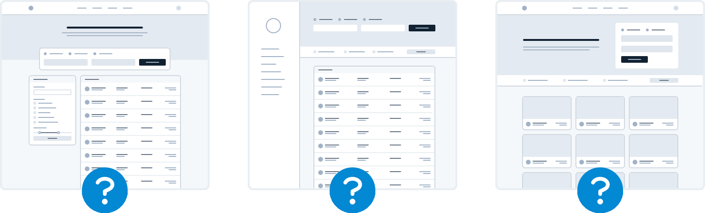

问题在于，一个“应用”其实是一堆*功能*的集合。在你设计出几个功能之前，你根本不掌握判断导航该怎么做的信息。难怪会让人抓狂。

别从外壳开始，从一个真实的功能开始。

比如你要做一个机票预订服务，可以先从“搜索航班”这个功能做起。

你的界面需要：

- 出发城市的输入框
- 到达城市的输入框
- 出发日期的输入框
- 返程日期的输入框
- 一个执行搜索的按钮

就先从它开始。

说真的，其他那些东西你说不定根本用不上——Google 就是这么做的。

## 细节留到后面

在设计一个新功能的早期阶段，别纠结字体、阴影、图标这类底层细节，这点很重要。

这些东西最终都会有意义，但现在不重要。

如果你在浏览器或惯用的设计工具这种高保真环境里工作时，总是忍不住去抠细节，可以试试 Basecamp 的 Jason Fried 爱用的一个办法：拿一支粗头 Sharpie 马克笔，在纸上画。

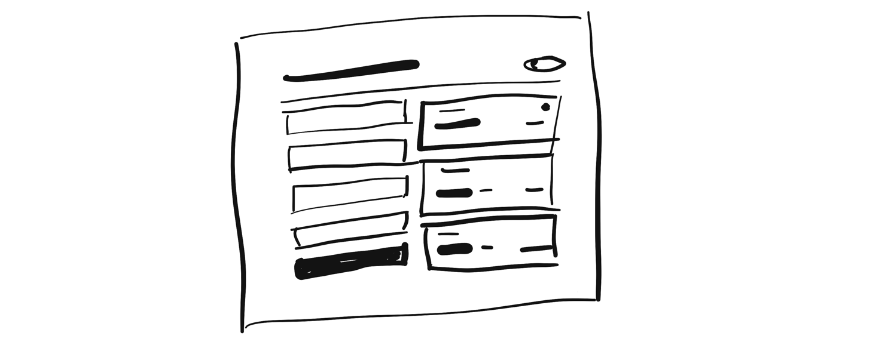

拿着 Sharpie，你根本没法在小细节上钻牛角尖，所以这是快速探索多种布局方案的好办法。

### 先别上色

即使你已经准备好在更高保真度下细化方案，也要忍住立刻引入颜色的冲动。

用灰度来设计，你就只能靠间距、对比度和大小来撑起整个画面。

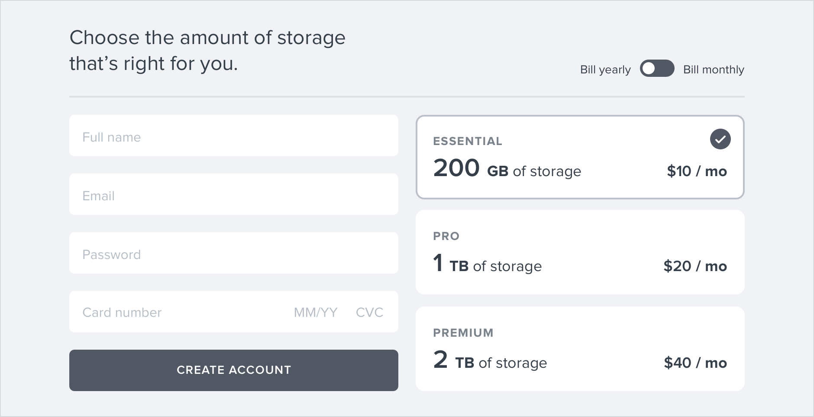

这样会难一点，但你会得到一个更清爽、层级分明的界面，之后加颜色也很容易。

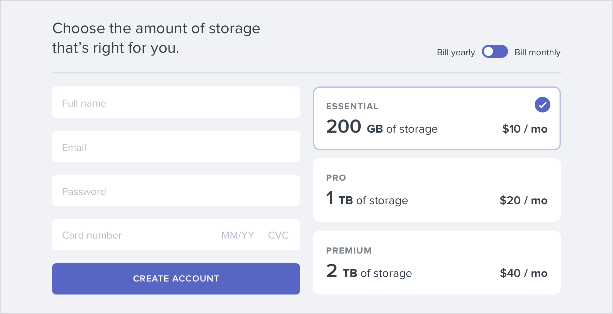

### 别投入过多

低保真设计的全部意义就在于快，好让你尽快开始做真正的东西。

草图和线框图都是一次性的——静态效果图对用户毫无价值。用它们来探索想法，做出决定之后就把它们丢掉。

## 别设计太多

你不需要在设计阶段把应用里的每个功能都设计完再动手实现；事实上，不这么做反而更好。

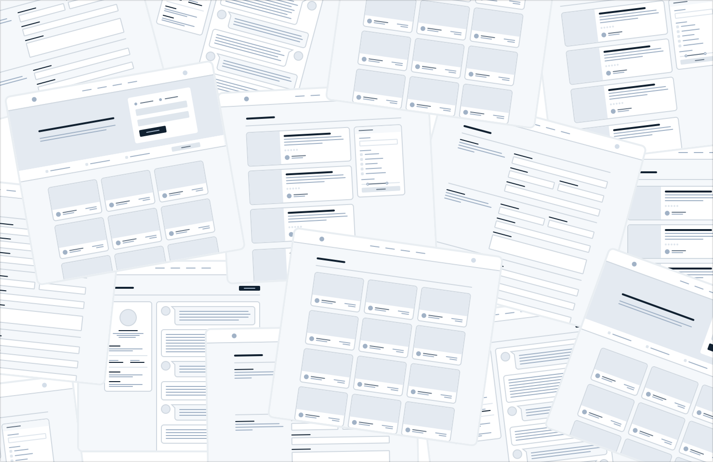

想清楚产品里每个功能之间如何交互、每个边界情况该长什么样，是极其困难的事，尤其是凭空想象的时候。

*如果用户有 2000 个联系人，这个界面该长什么样？*

*这个表单里的错误提示该放在哪？*

*当有两个会议安排在同一时间时，这个日历该怎么显示？* 只靠设计工具和想象力去琢磨这些事，你就是在给自己找罪受。

### 小步循环

别一次性把所有东西都设计完，而是以短周期推进。先把下一个要做的功能设计成一个简单版本。

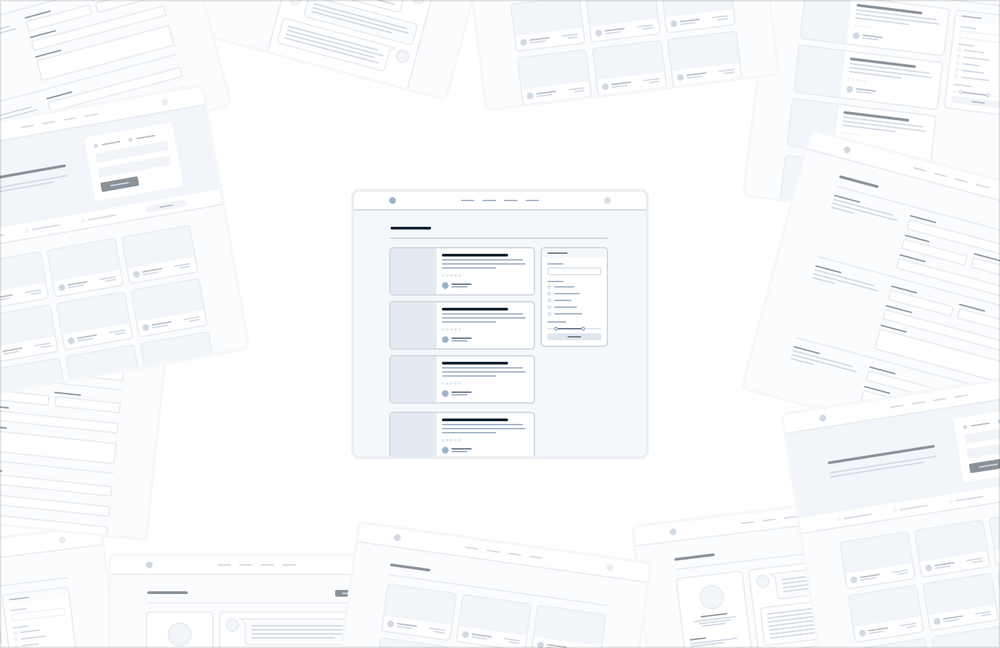

基本设计让你满意之后，就*把它做出来*。

过程中你多半会遇到意料之外的复杂性，但这正是重点——在一个能实际使用的界面里修设计问题，比提前想象每一个边界情况容易得多。

在这个能跑的版本上反复迭代，直到再也找不出问题，然后再切回设计模式，开始做下一个功能。

别在抽象层面把自己淹没。尽早做出真东西，这样就不用全凭想象力硬扛。

### 当个悲观派

别在设计里暗示你还没准备好实现的功能。

比如你正在给一个项目管理工具做评论系统。你知道总有一天用户应该能给评论附上文件，于是你在设计里加了一个附件区。

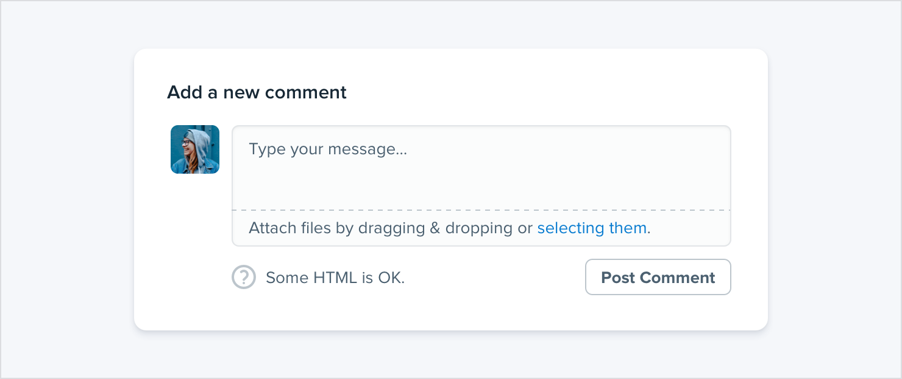

等你深入实现之后才发现，支持附件的工作量比你预想的*大得多*。你现在根本抽不出时间做完，于是整个评论系统都被搁置，你转身去处理别的更优先的事。

问题在于，没有附件的评论系统也比完全没有评论系统强，但因为你在第一天就把它算了进去，结果什么都交付不了。

设计新功能时，**要默认它很难做。** 只设计一个能交付的最小可用版本，能大幅降低这种风险。

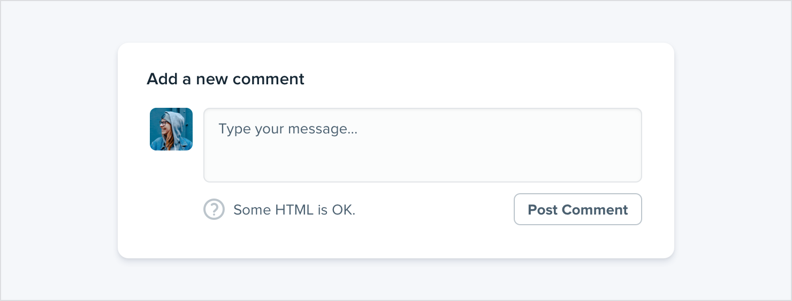

如果某个功能里有一部分只是“锦上添花”，**那就晚点再设计**。先把简单版本做出来，你永远都有退路。

## 选择一种个性

每个设计都有某种个性。银行网站想传达的可能是*安全*和*专业*，而一家新潮创业公司的设计则可能让人觉得*有趣*、*好玩*。

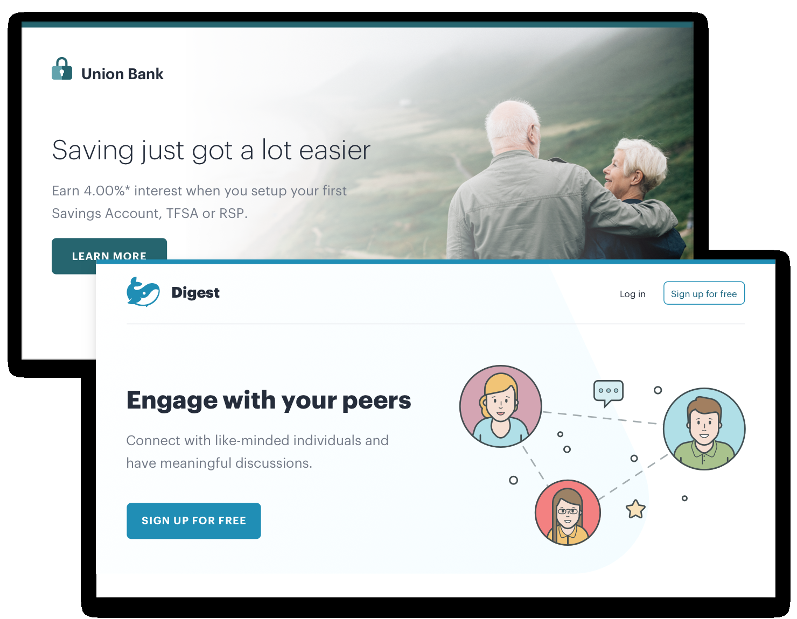

表面上，给设计赋予某种个性听起来很抽象、很虚，但它在很大程度上由几个实实在在的因素决定。

### 字体选择

字体排版在很大程度上决定了一个设计给人的感觉。

如果你想要优雅或经典的观感，可以在设计里用衬线字体：

想要活泼一点，可以用圆润的无衬线字体：

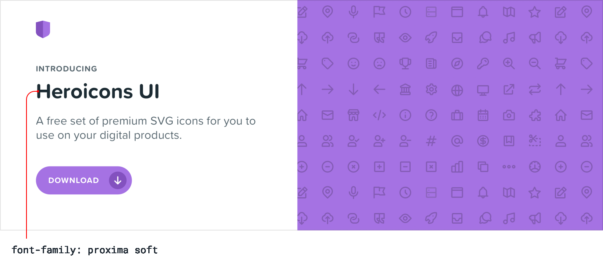

如果你想要更朴素的观感，或者想让其他元素来提供个性，中性的无衬线字体是非常好的选择：

### 颜色

关于色彩心理学的科学理论有很多，但实践中你真正要做的，就是留意不同颜色给你的感受。

蓝色安全、熟悉——从来没人抱怨过蓝色：

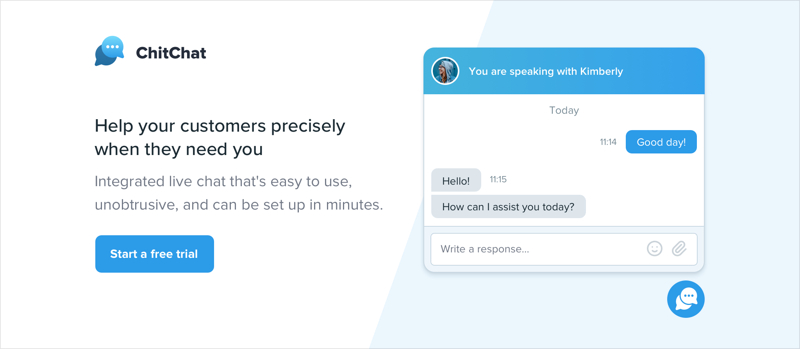

金色可能在说“昂贵”和“精致”：

粉色更有趣一点，没那么严肃：

仅仅*依靠*心理学来选颜色并不太实际——很多时候就是看你自己的眼睛觉得好不好看——但当你想要弄明白*为什么*自己觉得某个颜色合适时，想一想色彩心理学还是有帮助的。

### 圆角

听起来是个很小的细节，但你要不要做圆角、圆角做多大，会对整体感觉产生很大影响。

小圆角相当中性，本身传达不出多少个性：

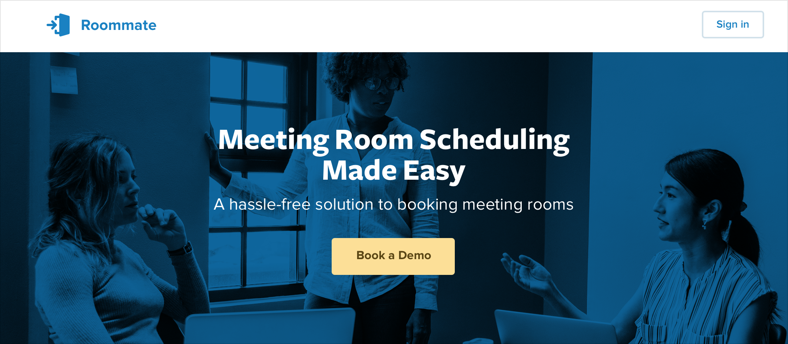

大圆角开始显得更活泼：

……而完全不用圆角，则显得严肃、正式得多：

无论你选哪种，保持一致都很重要。在同一个界面里混用直角和圆角，几乎总是比坚持用其中一种更难看。

### 语言

这本身不算视觉设计手法，但界面里用的措辞对整体个性影响巨大。

用不那么亲切的语气，会显得更官方、更专业：

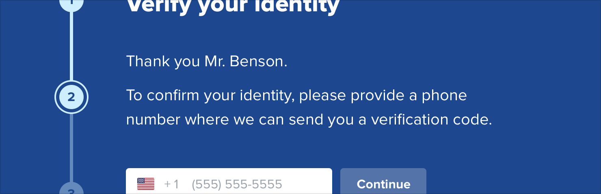

……而更友好、更随意的措辞，会让网站感觉……嗯，更友好：

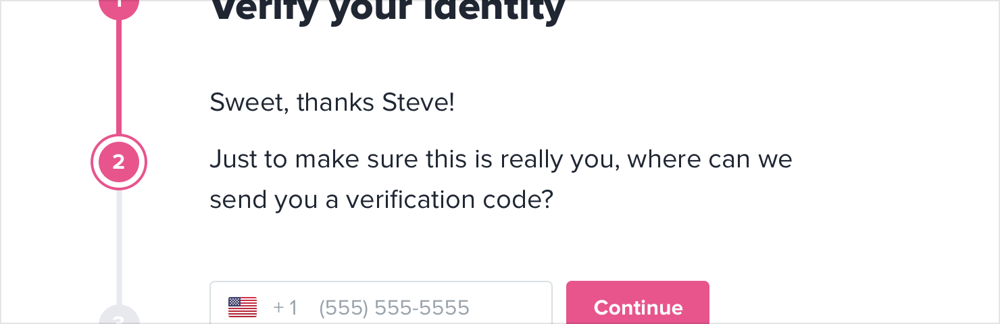

用户界面里到处都是文字，选对措辞的重要程度不亚于（甚至高于）选对颜色或字体。

### 想清楚你到底要什么

大多数时候，你对想要的个性会有直觉。但如果没有，一个简单的办法是去看看你想触达的那群人还在用哪些网站。

如果他们大多是那种“正经生意”的样子，那你的网站也许就该长这样。如果他们更活泼、带点幽默感，也许那才是更好的方向。

只是别从直接竞争对手那里借鉴太多，你总不想看起来像别人的低配版。

## 限制你的选项

有几百万种颜色和几千款字体可选，理论上听起来不错，但实践中这通常是个让人动弹不得的诅咒。

而且不只是字体和颜色——几乎任何一个小设计决定，都能让你白白纠结半天。

*这段文字该是 12px 还是 13px？*

*这个阴影的不透明度该是 10% 还是 15%？*

*这个头像该是 24px 还是 25px 高？*

*这个按钮的字重用 medium 还是 semibold？*

*这个标题的下外边距该是 18px 还是 20px？*

没有约束地做设计时，做决定是一种折磨，因为正确的选择永远不止一个。

比如这几个按钮的背景色各不相同，但光靠看，你几乎分辨不出它们的差别。

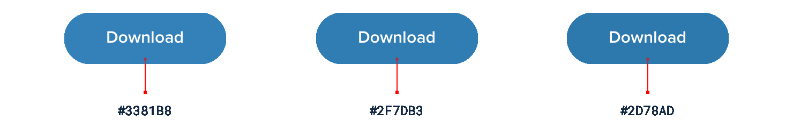

如果这些选项其实都不算差，你凭什么能果断做出决定？

### 提前定好体系

别每次做决定都从一个无限大的池子里手动挑值，而是*先准备好一组较小的选项*。

别每次要挑一个新的蓝色色阶就去打开取色器——从提前选好的 8 到 10 个色阶里挑。

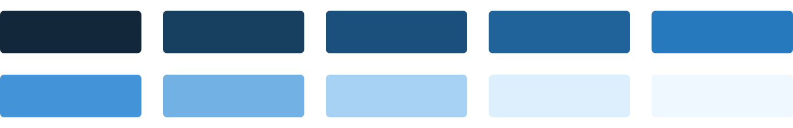

同理，别一像素一像素地调字号，直到看着完美为止。提前定好一套受限的字号阶梯，以后所有字号决定都从它里面选。

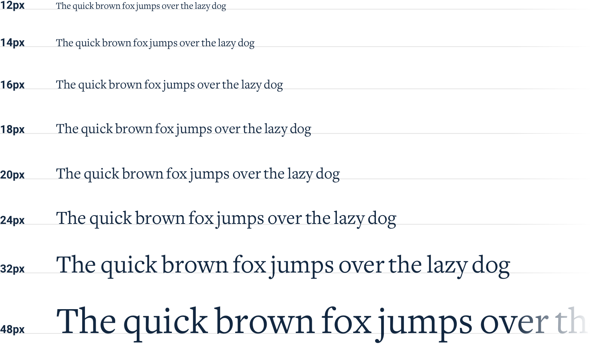

建好这样的体系之后，那些挑初始值的苦活你只需要做*一次*，而不是每设计一个新界面都重来一遍。前期是多花点工夫，但很值——它会在之后为你省下大量的决策疲劳。

### 用排除法做设计

用受限的一组值做设计时，做决定会容易得多，因为“正确”的选项少了很多。

比如你要给一个图标选尺寸。你提前定好了一套尺寸阶梯，中小号只有 12px、16px、24px 和 32px 四个选项。

想挑出最好的那个，先猜一个你觉得最合适的，比如 16px。然后把它两侧的值（12px 和 24px）也摆出来对比。

很可能其中两个选项*一眼*就不行。如果出局的是两侧的那两个，那你就选完了——中间那个是唯一的好选择。

如果某一侧的那个反而最好，就把它当作“中间值”再做一轮对比，确认没有更好的选择。

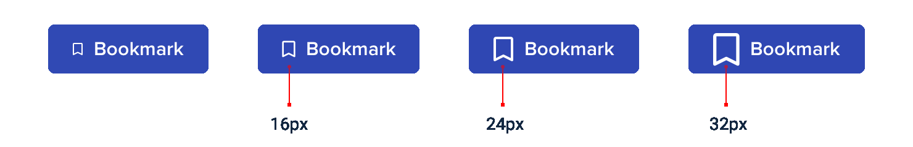

只要你有体系，这个方法对任何东西都适用。当选项被限制在一组彼此差异明显的值里，挑出最好的那个轻而易举。

### 把一切体系化

你建立的体系越多，工作速度就越快，对自己的决定也越少反复怀疑。

你需要给这些东西建立体系：

- 字号
- 字重
- 行高
- 颜色
- 外边距
- 内边距
- 宽度
- 高度
- 盒阴影

- 圆角
- 边框宽度
- 不透明度

……以及任何其他让你觉得在底层设计决定上费劲的东西。

你不必提前把所有这些都定好，只要确保自己做设计时始终带着体系化的思路。每做一个新决定，都留意有没有机会引入新体系，并且尽量避免同一个小事决定做两次。

用体系做设计会是贯穿本书的主题，后面的章节里我们会更细致地讲怎么搭建这些体系。
