## 不是所有元素都同等重要

如果你把视觉设计理解成“把东西修饰得好看”，那就不难理解为啥没有天生的艺术细胞就做不好它。但事实上，让一个东西“好看”的最大因素之一，和表面的修饰毫无关系。

*视觉层级*指的是界面里的各个元素相比之下显得有多重要，而它是你手里最有效的工具，能让一个东西看起来“是设计过的”。

当界面里的所有东西都在抢夺注意力，整个界面就会显得嘈杂混乱，像一整面内容糊在墙上，根本看不出什么才是重点：

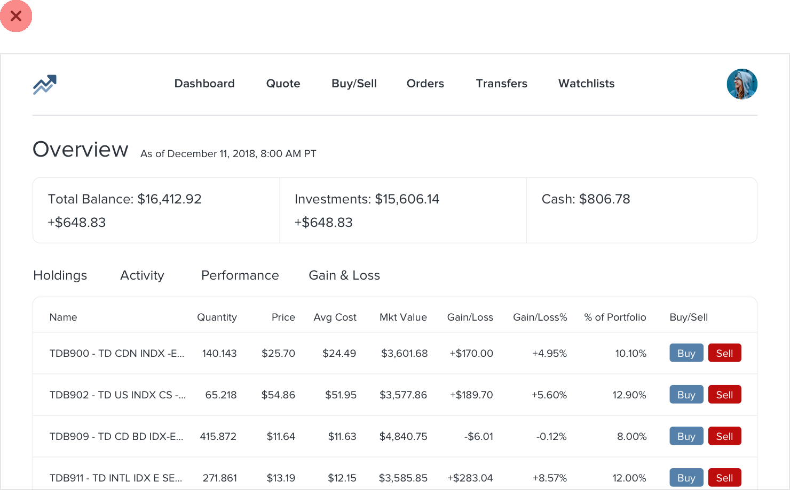

当你刻意弱化次要和第三级信息，并且努力突出最重要的元素时，结果会立刻顺眼很多——哪怕配色方案、字体选择和布局都没变：

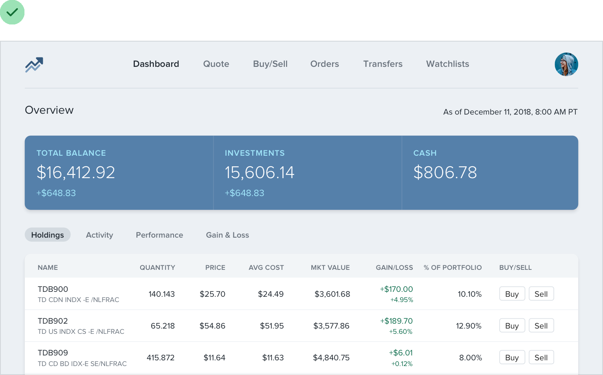

那具体该怎么做？接下来的几章里，我们会介绍一系列具体策略，帮你把层级引入自己的设计。

## 大小不是一切

过度依赖字号来控制层级是个错误——它常常导致主要内容的字太大，次要内容的字又太小。

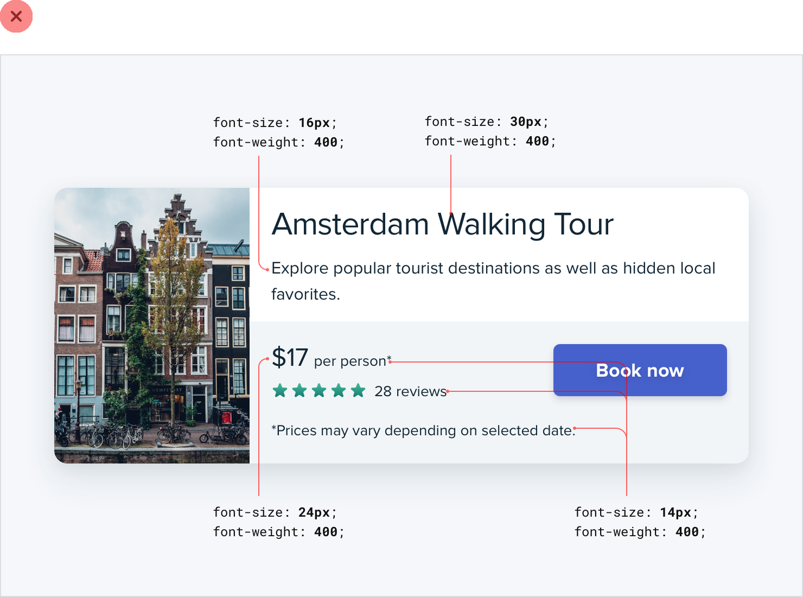

别把重活全交给字号，试着用字重或颜色来达到同样的效果。

比如把主要元素加粗，你就能用一个更合理的字号，而且往往能更好地传达它的重要性：

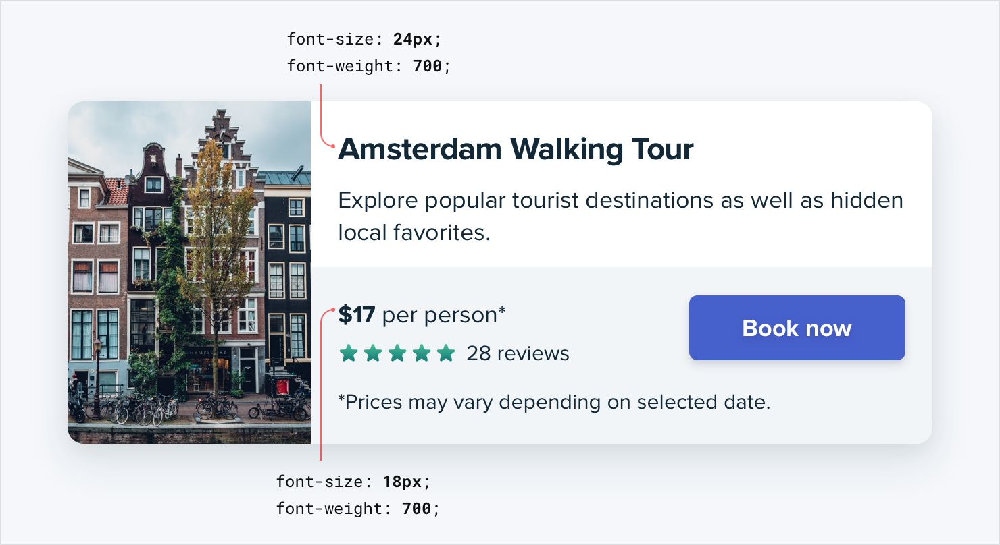

同理，给辅助文字用一个更柔和的颜色而不是极小的字号，既能明确它是次要的，又不怎么牺牲可读性：

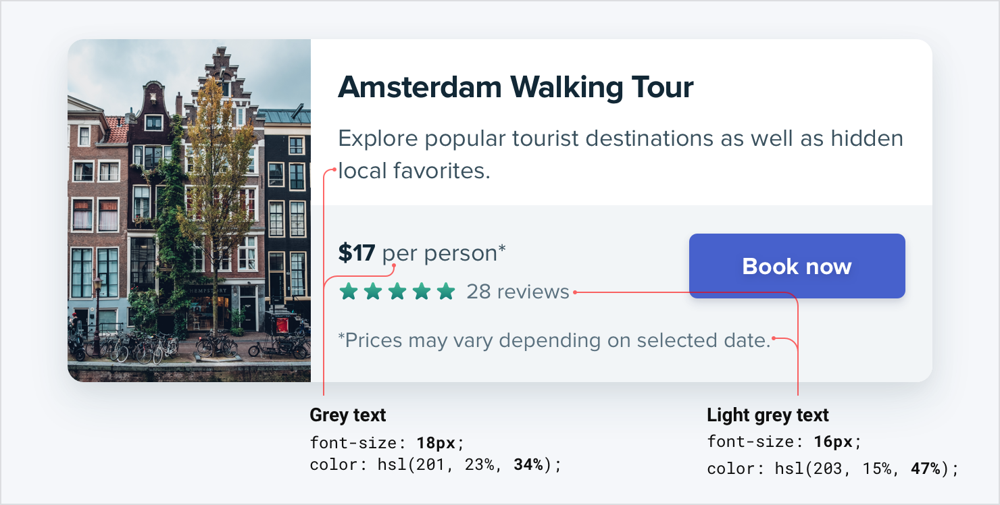

尽量只保留两到三种颜色：

- 一种深色，用于主要内容（比如文章标题）
- 一种灰色，用于次要内容（比如文章的发布日期）
- 一种更浅的灰色，用于第三级内容（比如页脚的版权声明）

同理，做界面时通常两种字重就够了：

- 一种常规字重（视字体而定，400 或 500），用于大部分文字
- 一种更重的字重（600 或 700），用于你想强调的文字

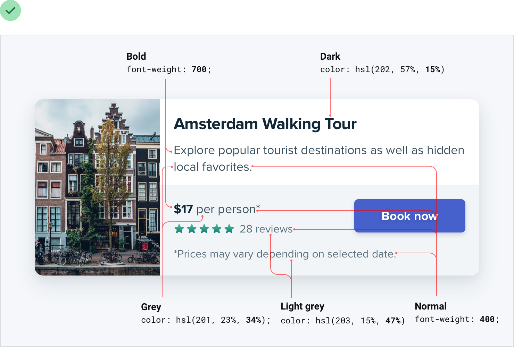

做界面时避开 400 以下的字重——它们在大标题上还行，但字号一小就太难读了。如果你想用更轻的字重来弱化某些文字，不如改用更浅的颜色或更小的字号。

## 不要在彩色背景上用灰色文字

把文字调成浅灰是在白色背景上弱化它的好办法，但放在彩色背景上就很难看。

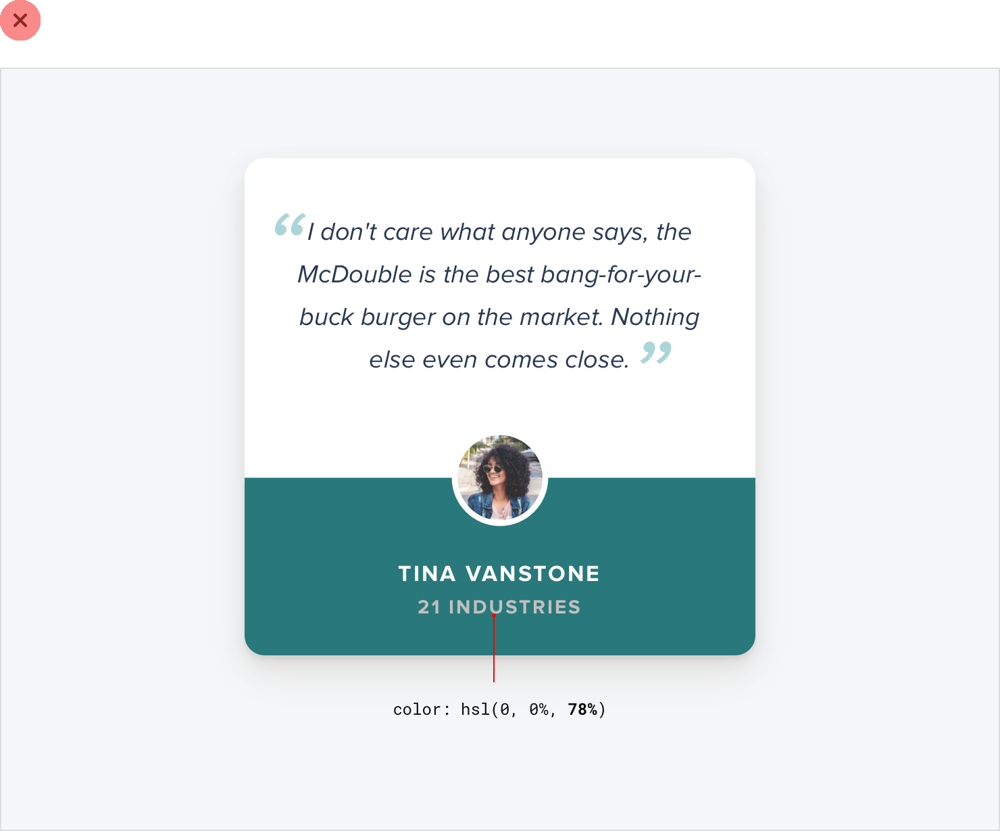

因为在白底上用灰色，我们真正看到的效果是*对比度降低*。

真正有助于建立层级的是让文字颜色更接近背景色，而不是把它变成浅灰。

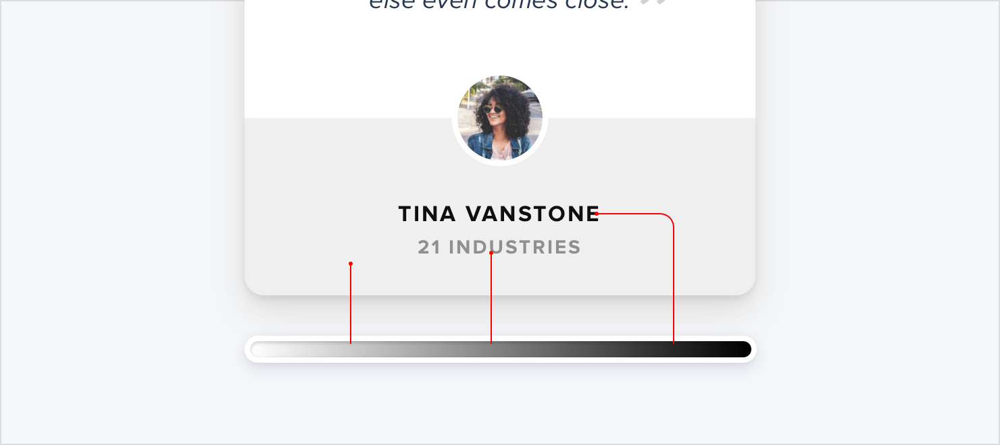

你可能会觉得，最简单的做法是用白色文字再降低不透明度：

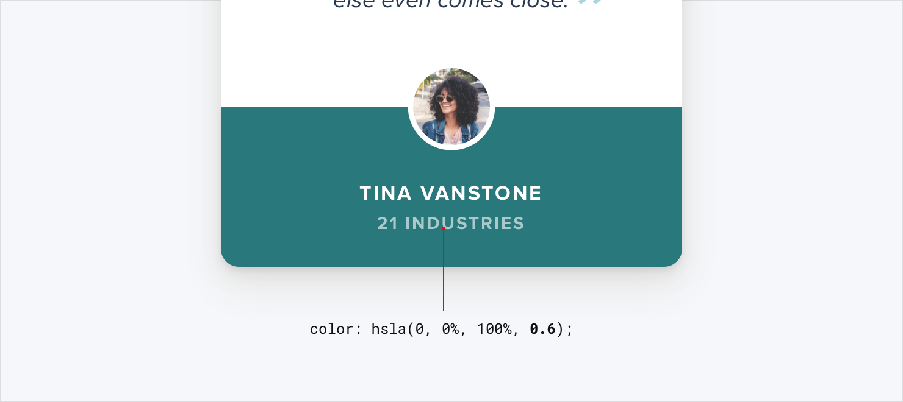

这*确实*降低了对比度，但结果往往是文字显得发闷、发白，有时候甚至像被禁用了一样。

更糟的是，如果把这种办法用在图片或图案上，背景会透过文字显出来：

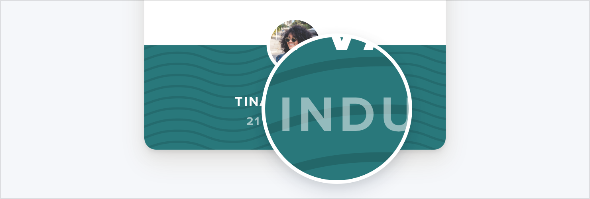

更好的做法是基于背景色*手动挑一个新颜色*。

选一个色相相同的颜色，然后调饱和度和明度，直到你自己看着顺眼：

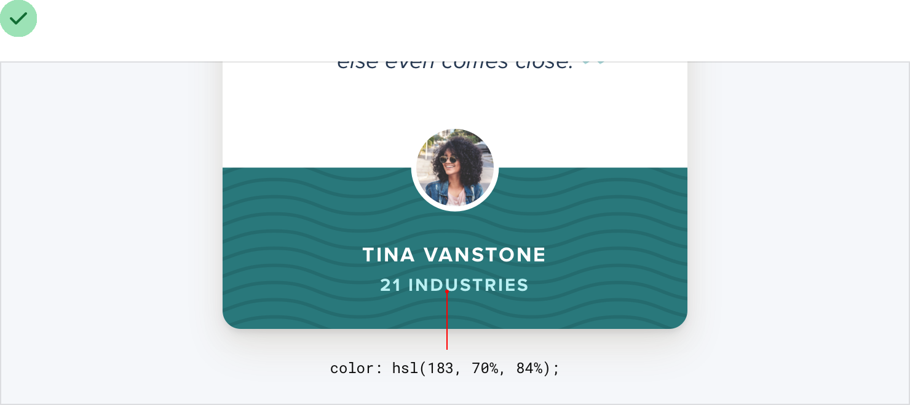

这样手动挑颜色，就能轻松降低对比度，同时不显得文字褪色。

## 用弱化来强调

有时候你会遇到这种情况：界面里的主要内容不够突出，但又没什么能加上去让它更醒目的东西。

比如这个处于激活状态的导航项，尽管你换了种颜色想让它“跳出来”，但和未激活的项比起来，它还是不够突出：

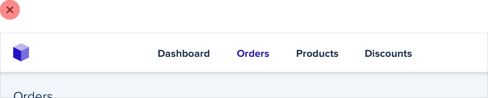

遇到这种情况时，别再去想办法强调那个你想突出的元素，而是想想怎么*弱化*和它抢注意力的那些元素。

在这个例子里，你可以给未激活的项一个更柔和的颜色，让它们更往后退：

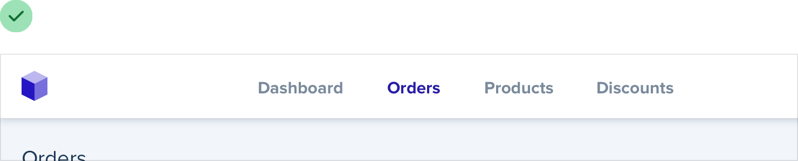

这个思路也可以用在界面里更大的区块上。比如侧边栏让你觉得在跟主内容区抢戏，那就别给它背景色——让内容直接落在页面背景上：

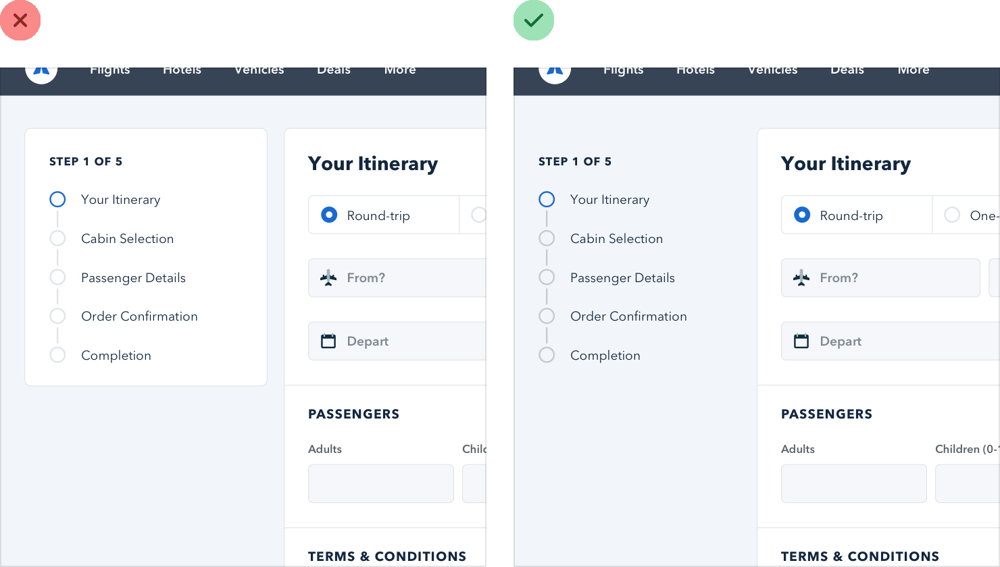

## 标签是万不得已的选择

先别急着替无障碍出头——这里说的不是表单。

向用户展示数据时（尤其是来自数据库的数据），很容易掉进一个陷阱：用最朴素的*标签：值*格式把它摆出来。

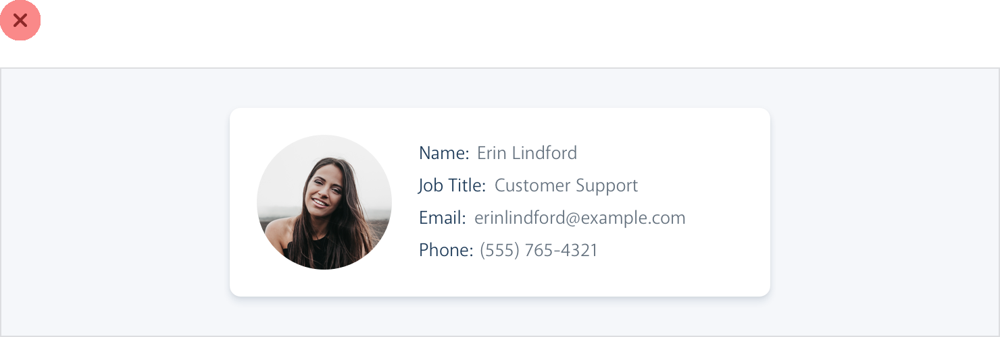

这种做法的问题在于，它让数据很难呈现出任何层级，每一处数据都被赋予了同样的分量。

### 你可能根本不需要标签

很多时候，光看格式就能知道一条数据是什么。

比如 *janedoe@example.com* 是邮箱地址，*(555) 765-4321* 是电话号码，*$19.99* 是价格。

格式不够用的时候，上下文往往够了。在员工名录里看到某个人名字下方写着*“Customer Support”*，你不需要任何标签就能反应过来，那是他所在的部门。

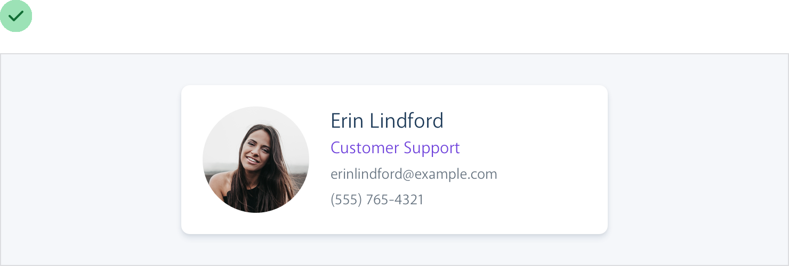

当你不用标签也能展示数据时，强调重要信息或身份信息就变得容易多了，界面既更好用，也更有“设计感”。

### 把标签和值合起来

即使某条数据不加标签就说不清楚，你也常常可以通过给值本身补上说明文字，来避免多加一个标签。

比如在电商界面里展示库存，别写“In stock: 12”，试试“12 left in stock”这种写法。

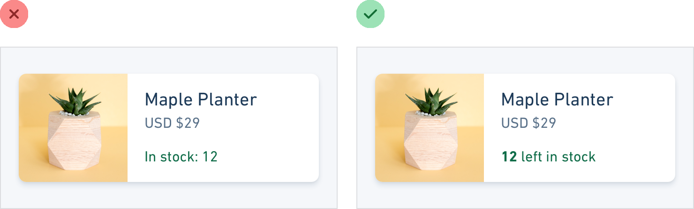

如果你在做一个房产应用，“Bedrooms: 3”可以直接变成“3 bedrooms”。

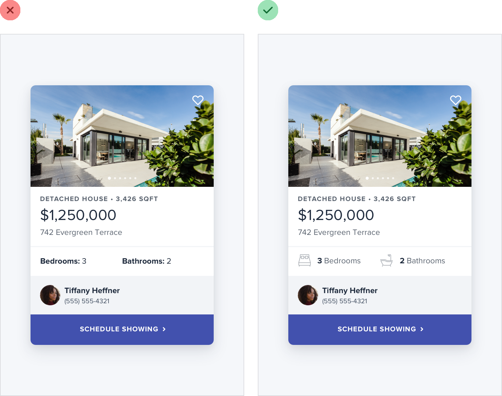

当你能把标签和值合成一个整体时，给每条数据赋予有意义的样式就变得容易得多，而且不必牺牲清晰度。

### 标签是次要的

有时候你*确实*需要标签，比如你要展示多条同类数据、并且它们需要便于快速扫读时，就像仪表盘那样。

这种情况下就加上标签，但把它当作辅助内容。真正要紧的是数据本身，标签只是为了让信息更清楚。

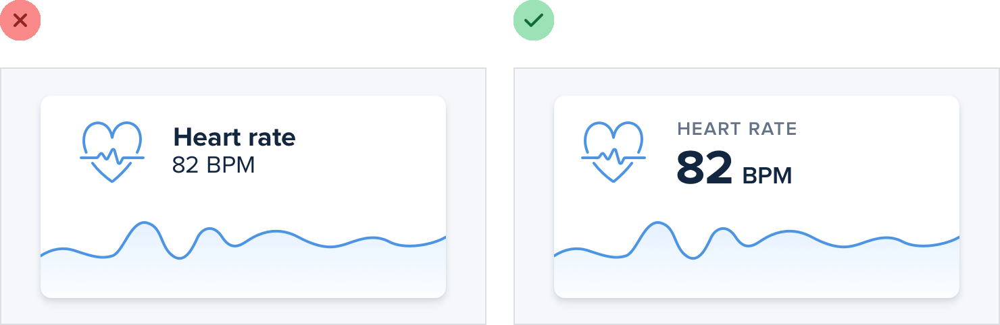

通过把标签调小、降低对比度、用更轻的字重，或者三者结合，来弱化它。

### 什么时候该强调标签

如果你设计的界面里，用户明确是在*找*标签，那强调标签而不是数据可能更合理。

信息密集的页面经常是这样，比如产品的技术规格页。

如果用户想查一部手机的尺寸，他大概会在页面上扫视“depth”这样的词，而不是“7.6mm”。

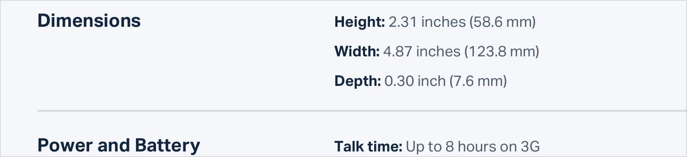

这种情况下也别把数据弱化得*太*狠，它依然是重要信息。给标签用深一点的颜色、给值用稍微浅一点的颜色，通常就够了。

## 把视觉层级和文档层级分开

做网页时使用语义化标签很重要，这意味着当你决定给界面某一部分加标题时，常用的是 h1、h2、h3 这类标题标签。

浏览器默认会给各级标题元素依次分配更小的字号，所以 h1 相当大，h6 相当小。这对文章、文档这类文档式内容有帮助，但在应用界面里，它容易诱导你做出糟糕的决定。

用 h1 标签给页面加上*Manage Account*这样的标题，从语义上完全说得通，但因为我们已经习惯认为 h1 就该很大，很容易掉进把这类标题做得过大的陷阱。

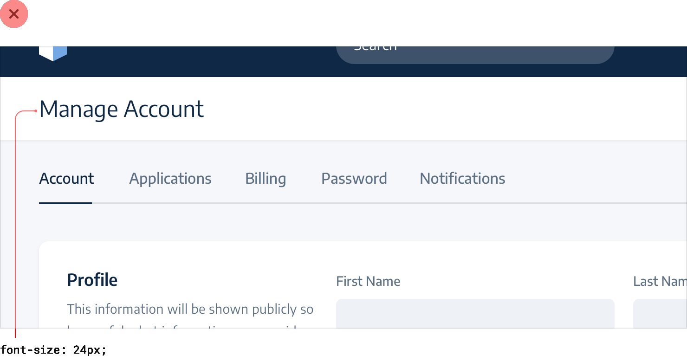

很多时候，区块标题更像是*标签*而不是标题——它们是辅助内容，不该抢走所有注意力。

通常那个区块里的*内容*才是重点，而不是标题。这意味着很多时候标题其实应该相当小：

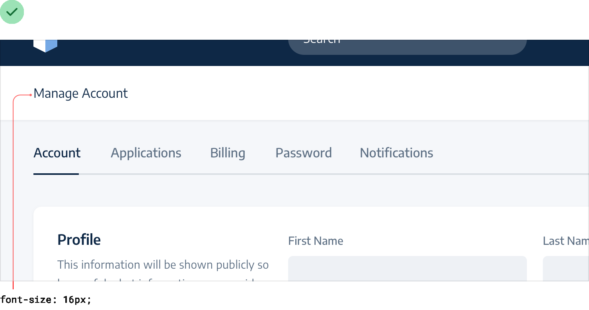

做到极致的话，你甚至可以在标记里保留区块标题以满足无障碍需求，但在视觉上*完全隐藏*它们，因为内容本身已经说明了一切。

别让所用的标签影响你如何给它设计样式——按语义来选标签，然后根据需要自由地给它设计样式，以做出最好的视觉层级。

## 平衡字重与对比度

粗体比常规体显得更突出，原因是粗体覆盖的面积更大——同样一块地方，用在文字上的像素比用在背景上的多。

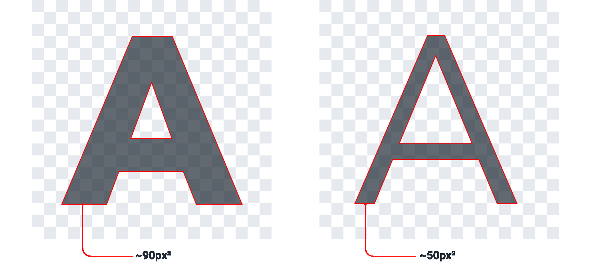

这有什么值得说的？因为面积和层级之间的关系，对界面里其他元素同样有影响。

### 用对比度补偿字重

理解这层关系很重要的一个场景，就是处理图标。

和粗体文字一样，图标*（尤其是实心图标）*通常相当“重”，覆盖的面积很大。结果就是，把图标放在文字旁边时，图标往往显得更突出。

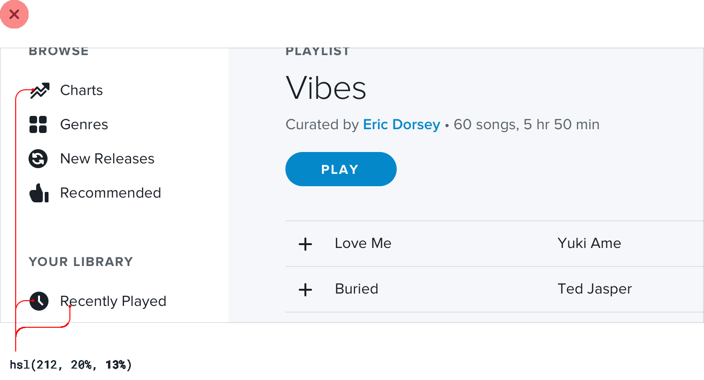

和文字不同，你没法改变图标的“字重”，所以要想平衡，就得用别的办法弱化它。

一个简单有效的办法是给图标一个更柔和的颜色，降低它的对比度。

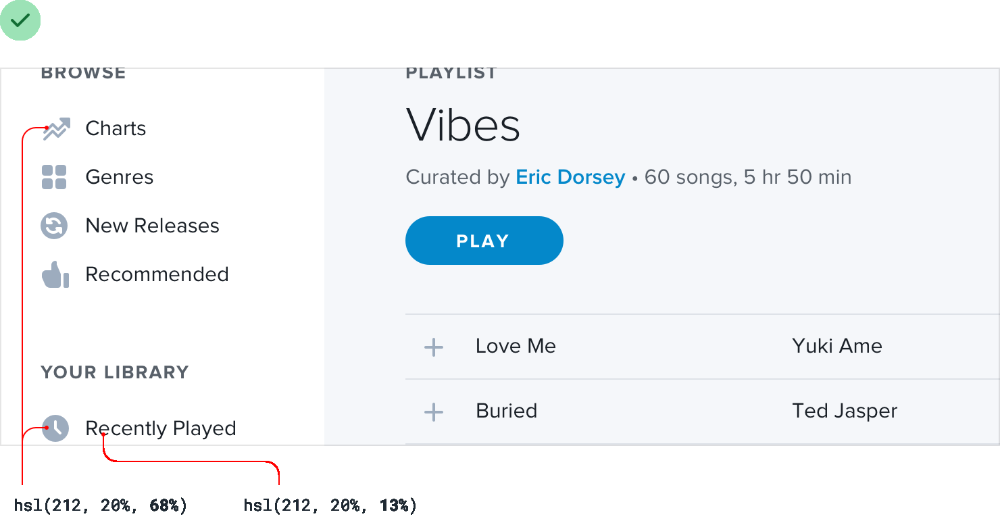

任何需要平衡不同重量元素的地方都适用。降低对比度就像加了一个配重，让更重的元素显得更轻，尽管它的重量并没有改变。

### 用字重补偿对比度

就像降低对比度能弱化重的元素一样，增加字重是给低对比度元素稍加突出的好办法。

当 1px 的细边框用柔和颜色太不明显、但把颜色加深又让设计显得生硬嘈杂时，这一招很有用。

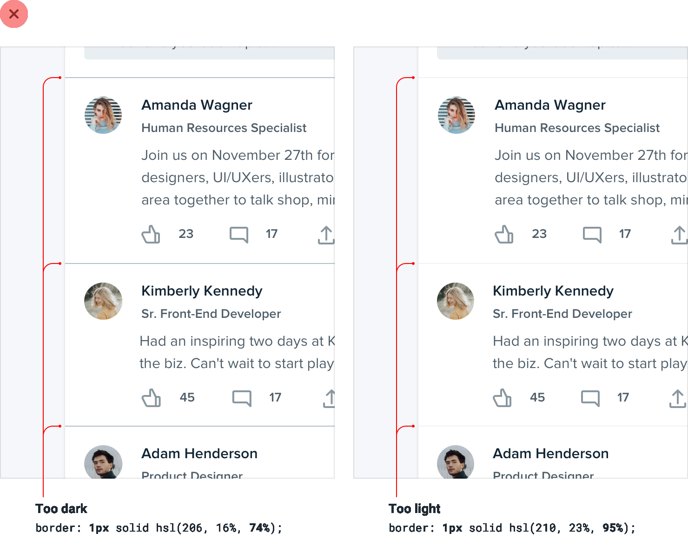

把边框加粗一点，让它在不失去柔和感的前提下更醒目：

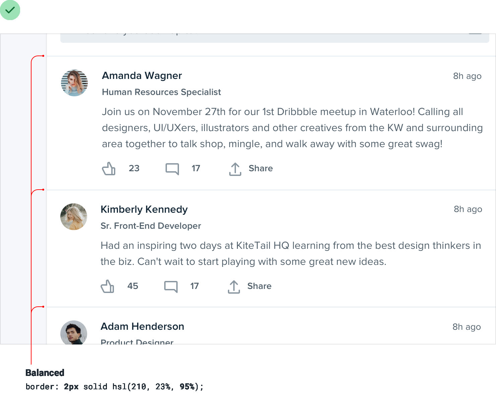

## 语义是次要的

当一个页面上有多个用户可执行的操作时，很容易掉进一个陷阱：纯粹按语义来设计这些操作。

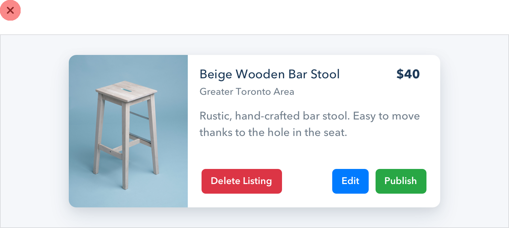

语义是按钮设计的重要一环，但这不意味着你可以不管层级。

页面上的每个操作都处在一座重要性金字塔的某个位置上。大多数页面只有一个真正的主要操作，几个不太重要的次要操作，以及少数很少用到的第三级操作。

设计这些操作时，把它们在层级中的位置传达出来很重要。

- **主要操作应当一眼可见。** 实心、高对比度的背景色在这里非常好用。

- **次要操作应当清晰但不抢眼。** 描边样式或对比度更低的背景色都是很好的选择。
- **第三级操作应当能被发现，但不打扰人。** 通常最好的做法是把它们做成链接的样子。

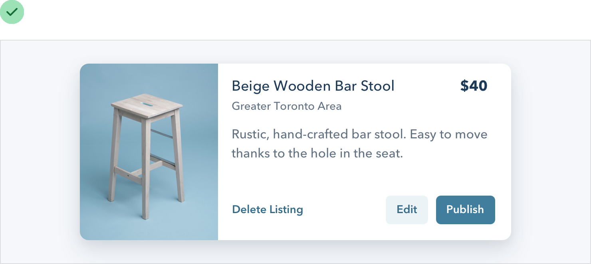

如果你按层级优先的思路来设计页面上的操作，得到的界面会清爽得多，传达信息也更清楚：

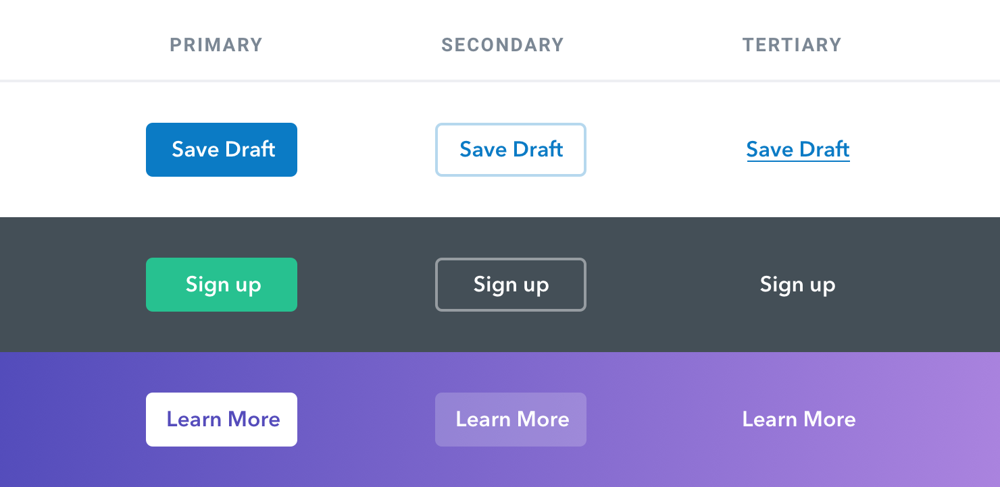

### 破坏性操作

破坏性强或后果严重，并不自动意味着按钮就该又大又红又粗。

如果破坏性操作不是页面上的主要操作，把它按次要或第三级按钮来处理可能更好。

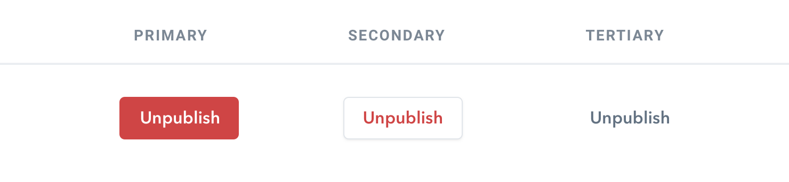

再配上一个确认步骤——那一步里破坏性操作才是主要操作——把又大又红又粗的样式用在那里。

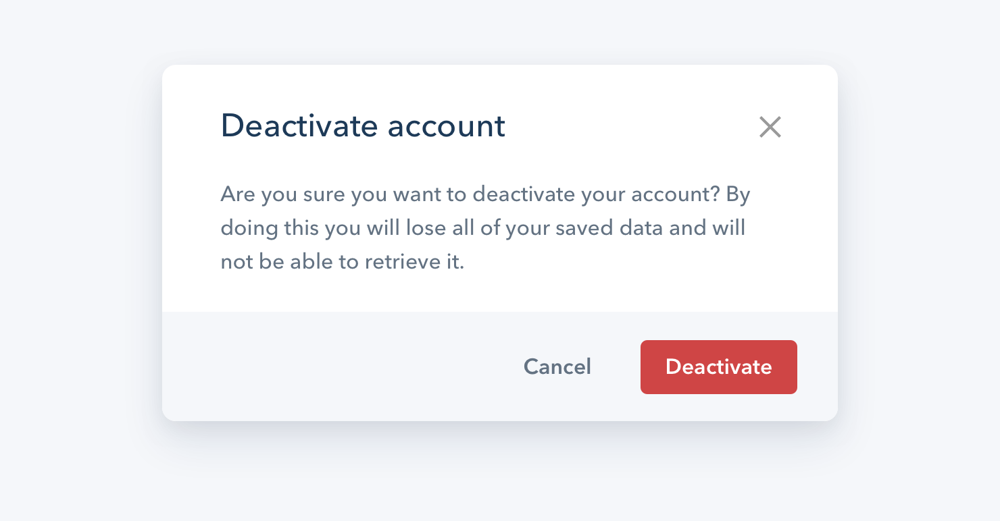
