## 一开始就把留白给足

让设计变干净最简单的办法之一，就是给每个元素多一点呼吸的空间。

听起来挺简单，对吧？那我们为什么通常不这么做？

### 留白应该是减出来的，不是加出来的

做网页设计时，留白几乎总是被*加*上去的——看着有点挤，就加一点外边距或内边距，直到顺眼为止。

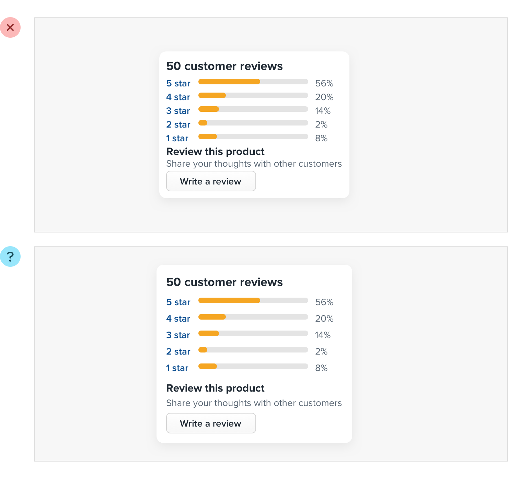

这种做法的问题是，元素只得到了“不至于*明显很糟*”所需的最低限度喘息空间。而要让一个东西真正*好看*，通常需要更多留白。

更好的做法是：一开始给它*多得多*的空间，然后再一点点减，直到效果让你满意。

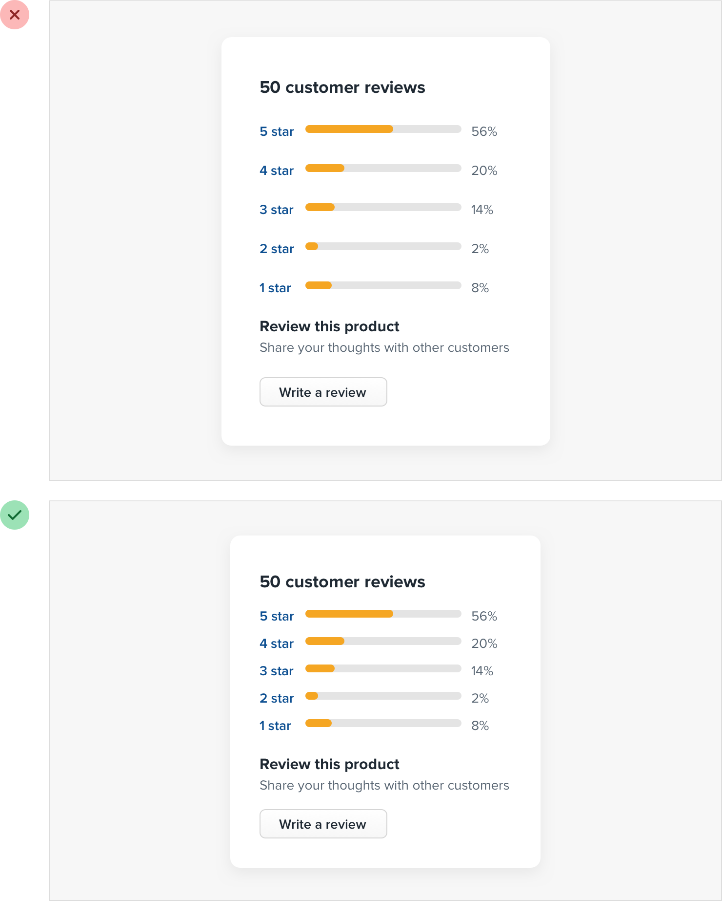

你可能会以为这样做最后留白会太多，但实践中，单独看某个元素时觉得“稍微多了一点”的程度，放到完整界面的语境里，往往更接近“刚刚好”。

### 紧凑界面也有它的用武之地

留白充足的界面几乎总是更干净、更简单，但确实有些场景下，设计得更紧凑才合理。

比如你要设计某种仪表盘，需要一次性看到大量信息，那么把信息挤在一起、让它们全都能塞进一屏，也许值得让界面显得更密一些。

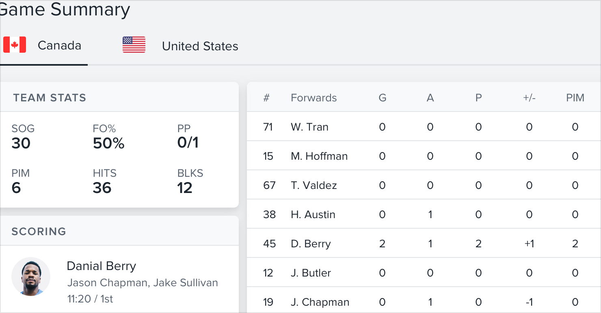

关键是要把它当成一个刻意的决定，而不是默认行为。需要减少留白的时候，信号往往比需要增加留白时明显得多。

## 建立间距与尺寸体系

给界面里的元素挑一个完美尺寸时，你不该在 120px 和 125px 之间纠结。

一像素一像素地试那些随手编出来的值，往好了说是严重拖慢你的速度，往坏了说，会做出难看又不一致的设计。

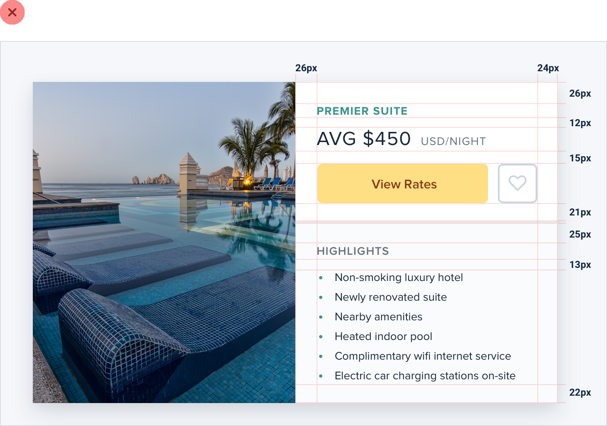

正确的做法是把自己限制在一组提前定好的、受约束的取值里。

### 线性的阶梯行不通

建立间距和尺寸体系，并不像*“确保一切都用 4px 的倍数”*那么简单——这种天真的做法并不会让你更容易在 120px 和 125px 之间做选择。

一个体系要真正有用，就必须考虑到相邻取值之间的*相对*差异。

在阶梯的小尺寸端*（比如图标的大小，或者按钮的内边距）*，几个像素就能带来很大差别。从 12px 跳到 16px，增幅是 33%！

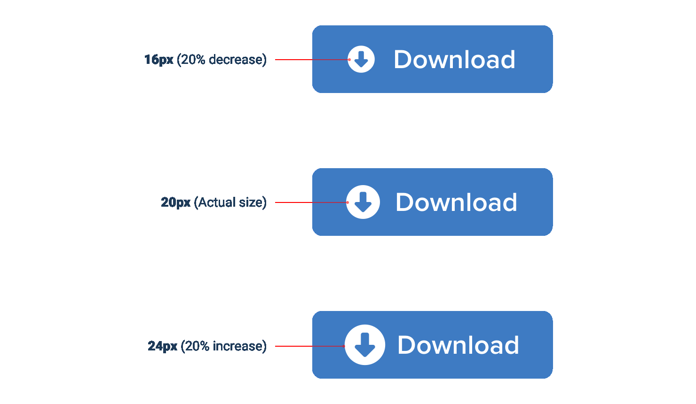

但在大尺寸端*（比如卡片的宽度，或者落地页主视觉区的纵向间距）*，几个像素基本看不出来。即便把卡片宽度从 500px 加到 520px，差别也只有 4%，比 12px 到 16px 那一跳的显著性低*八倍*。

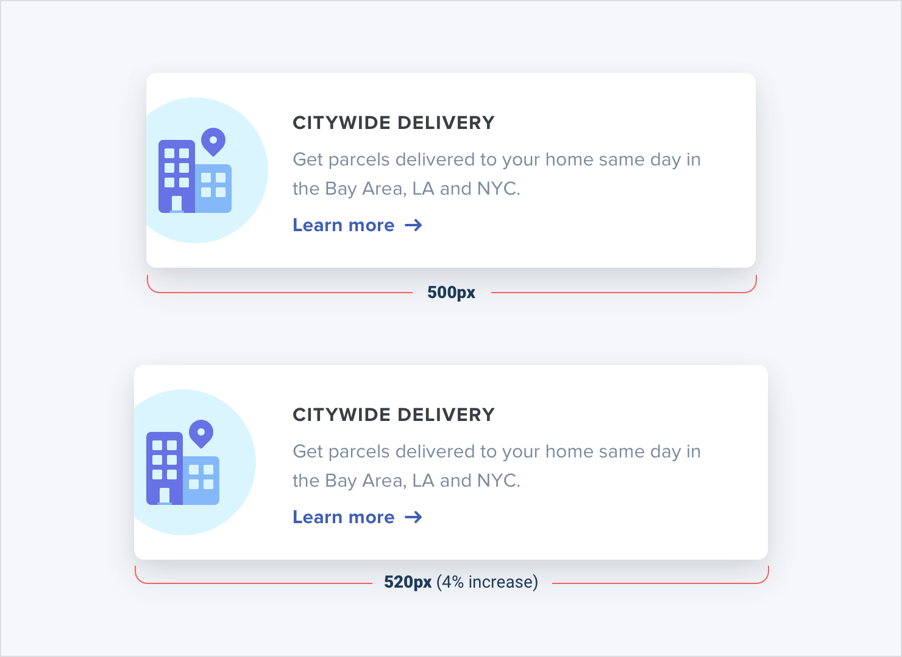

想让你的体系帮你轻松做尺寸决定，就要保证阶梯里任意两个取值之间的差距不低于约 25%。

### 定义这套体系

就像你不该在给元素定尺寸、微调元素间距时跟随手编的数值较劲一样，你也不该用随手编的数值来搭这套间距与尺寸阶梯。

一个简单的做法是先选一个合理的*基准*值，然后用它的因数与倍数搭出整套阶梯。

16px 是个很好的起点，因为它能整除得很干净，而且恰好是所有主流浏览器的默认字号。

阶梯小尺寸端的取值应该挨得比较近，越往上，彼此间隔越大。

下面是用这个思路搭出来的一套相当实用的阶梯：

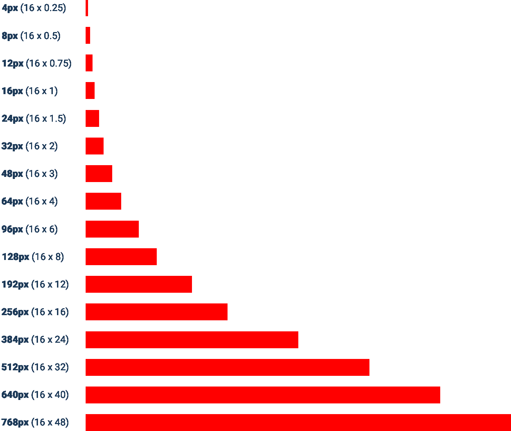

### 使用这套体系

一旦定好间距与尺寸体系，你会发现设计速度快得多，尤其是在浏览器里做设计*（输入数字比用鼠标拖拽更容易坚持一套体系）*。需要在元素下面加点空间？从阶梯里取一个值试试。还不够？下一个值大概就正好。

工作流的改善大概是最大的收益，但你也会开始发现，设计里有了一种以前没有的微妙一致性，整体看起来干净了一点点。

一套间距与尺寸体系能让你用更少的力气、更短的时间做出更好的设计。设计建议能带来的价值，大概也就到这个程度了。

## 你不需要把整个屏幕填满

还记得 960px 曾是桌面端设计事实上的布局宽度吗？如今你很难找到分辨率这么低的*手机*了。

所以，大多数人在高分辨率显示器上打开惯用的设计工具时，会给自己*至少* 1200–1400px 的画布，这一点都不奇怪。但你有这么大地方，不等于你就得用满。

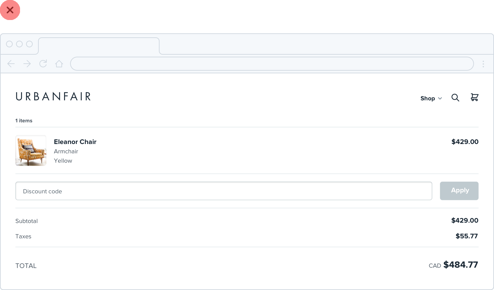

只需要 600px 就用 600px。把东西摊开、或者没必要地拉宽，只会让界面更难理解；而边缘多留一点空间，从来不会害了谁。

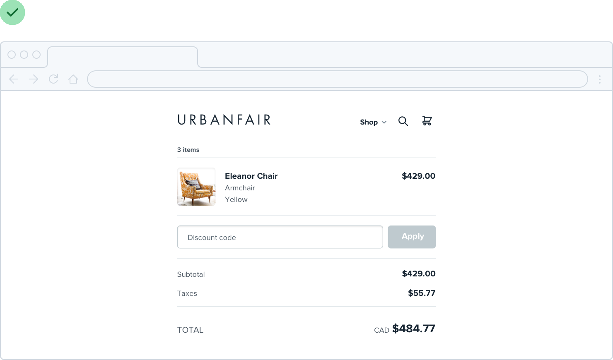

这一点同样适用于界面里的单个区块。你不需要因为别的东西（比如导航）是通栏的，就把*所有东西*都做成通栏。

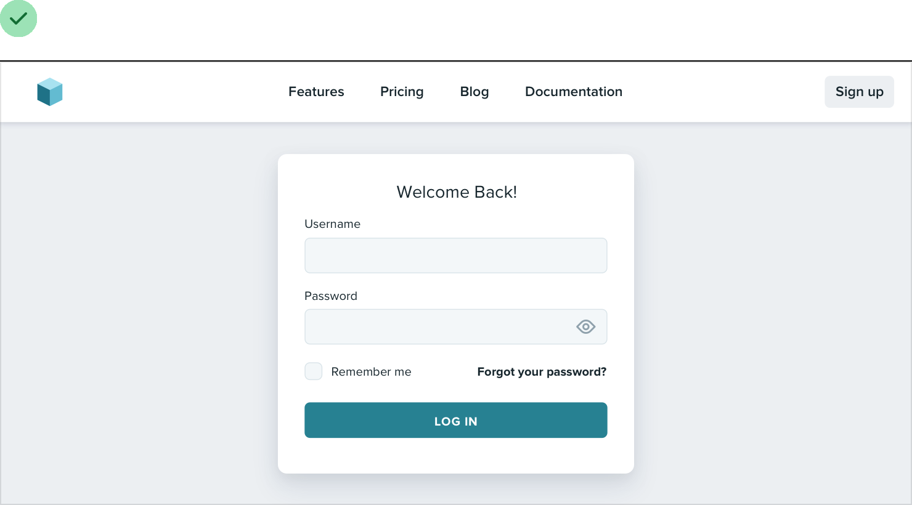

给每个元素它刚好需要的空间——别为了让某个东西和别的东西对上，就把它做得更差。

### 把画布缩小

如果你发现很难在大画布上设计一个小界面，那就把画布缩小！很多时候，约束是真实的时候，设计小东西反而更容易。

如果你在做响应式 Web 应用，试着从大约 400px 的画布开始，先设计移动端布局。

等移动端设计让你满意了，再把它挪到更大的屏幕上，调整那些在小屏上感觉像将就的地方。很可能你需要改的没你想的那么多。

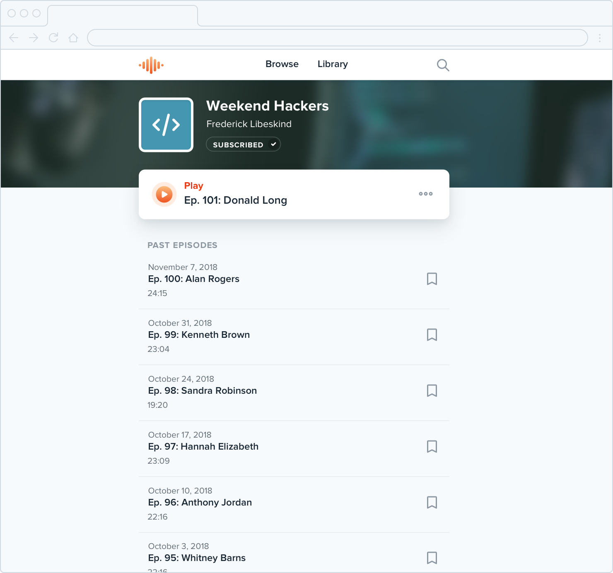

### 用分栏来思考

如果你设计的东西在较窄的宽度下效果最好，但放在一个整体很宽的界面里显得失衡，看看能不能把它拆成分栏，而不是简单把它加宽。

比如这个很窄的表单布局：

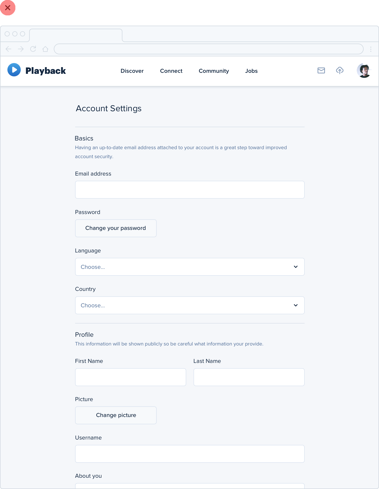

如果你想在不牺牲表单可用性的前提下更好地利用空间，可以把说明文字拆到一个单独的栏里：

这样设计会显得更平衡、更一致，又不必牺牲表单本身的最佳宽度。

### 别硬来

就像你不该操心填满整个屏幕一样，你也不该没必要地把所有东西都塞进一小块地方。

如果你需要很大的空间，那就用！只是别在不需要的时候觉得有义务把它填满。

## 栅格被高估了

用 12 栏栅格这类体系，是简化布局决策的好办法，能给设计带来一种让人满意的秩序感。

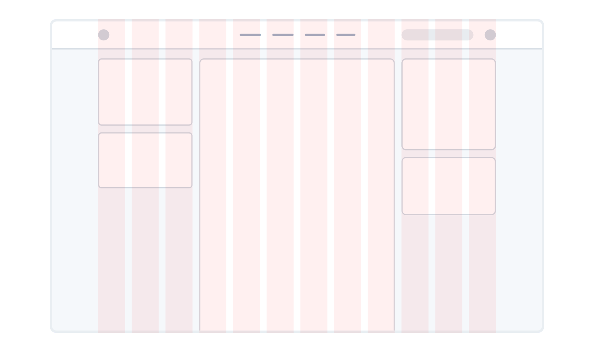

但栅格虽然有用，把*所有*布局决定都外包给栅格，弊大于利。

### 不是所有元素都该弹性伸缩

本质上，栅格体系就是让元素拥有弹性的、基于百分比的宽度，你在一组受约束的百分比里做选择。

比如在 12 栏栅格里，每一栏宽 8.33%。只要元素宽度是 8.33% 的某个倍数*（包括栏间距）*，它就算“在栅格上”。

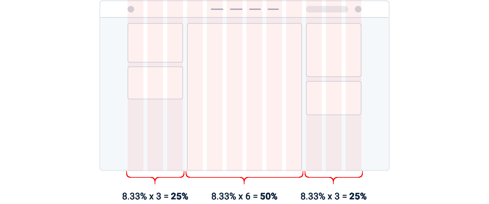

把栅格体系当宗教来信的问题在于，很多情况下元素用*固定*宽度远比用相对宽度合理。

比如传统的侧边栏布局。用 12 栏栅格体系，你可能会给侧边栏三栏宽（25%），给主内容区九栏宽（75%）。

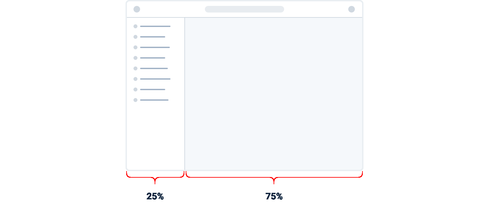

乍看没问题，但想想调整屏幕尺寸时会发生什么。

把屏幕加宽，侧边栏也跟着变宽，占掉了本来可以更有效利用在主内容区的空间。

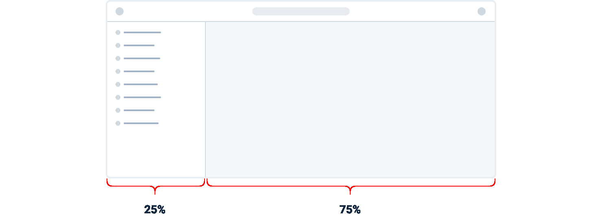

反过来，把屏幕收窄，侧边栏可能缩到低于它合理的最小宽度，导致文字换行别扭或者被截断。

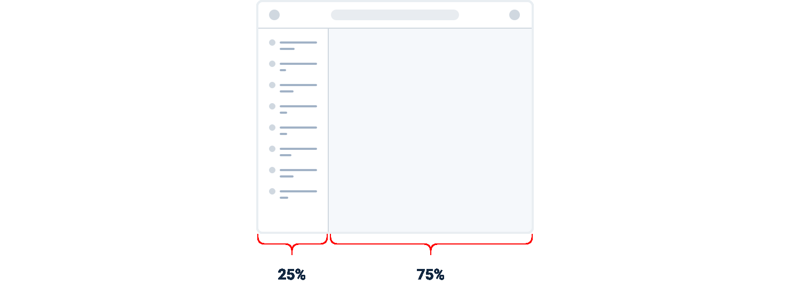

这种情况下，给侧边栏一个针对其内容优化过的固定宽度显然更合理。主内容区则可以弹性伸缩，填满剩下的空间，并用自己的*内部*栅格来排布子元素。

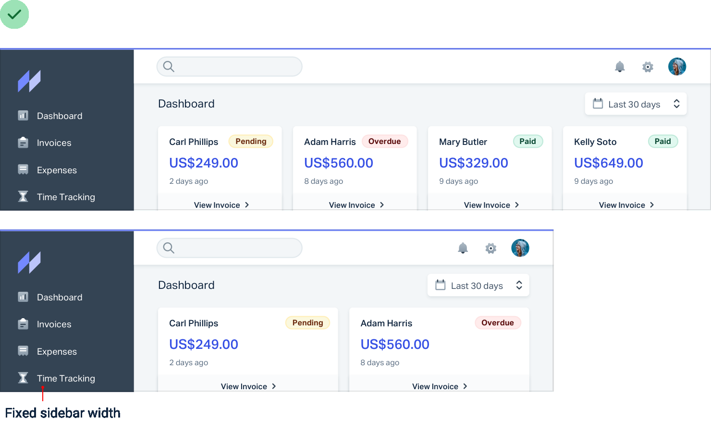

这在组件内部同样适用——除非你真的希望某个东西跟着缩放，否则不要用百分比来给它定尺寸。

### 不到万不得已，别缩小元素

假设你在设计一个登录卡片。占满整个屏幕宽度会很难看，于是你给它六栏宽（50%），两侧各留三栏的偏移。

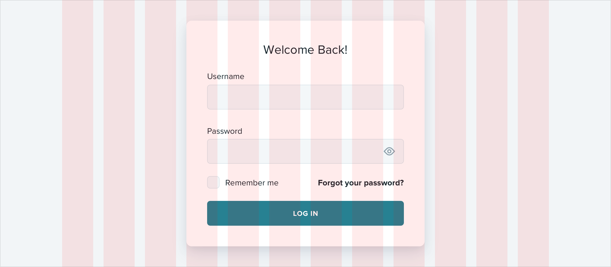

到了中等尺寸的屏幕上，你发现卡片有点窄，明明有地方可以放大，于是你在那个屏幕尺寸下把它改成八栏宽，两侧各留两栏空白。

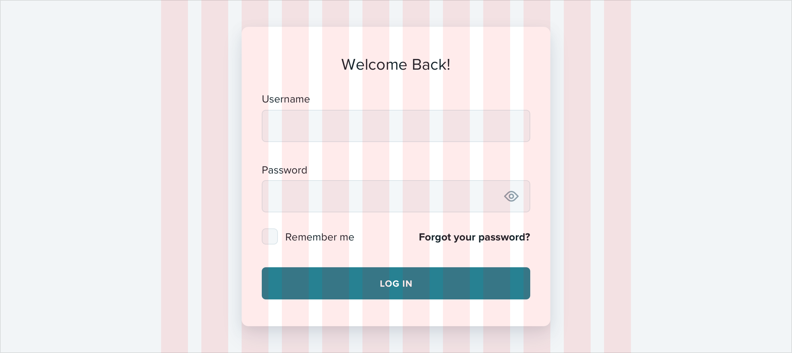

这种做法荒唐的地方在于，因为栏宽是弹性的，会存在一段屏幕尺寸区间，让登录卡片在中等屏幕上反而比在大屏幕上*更宽*：

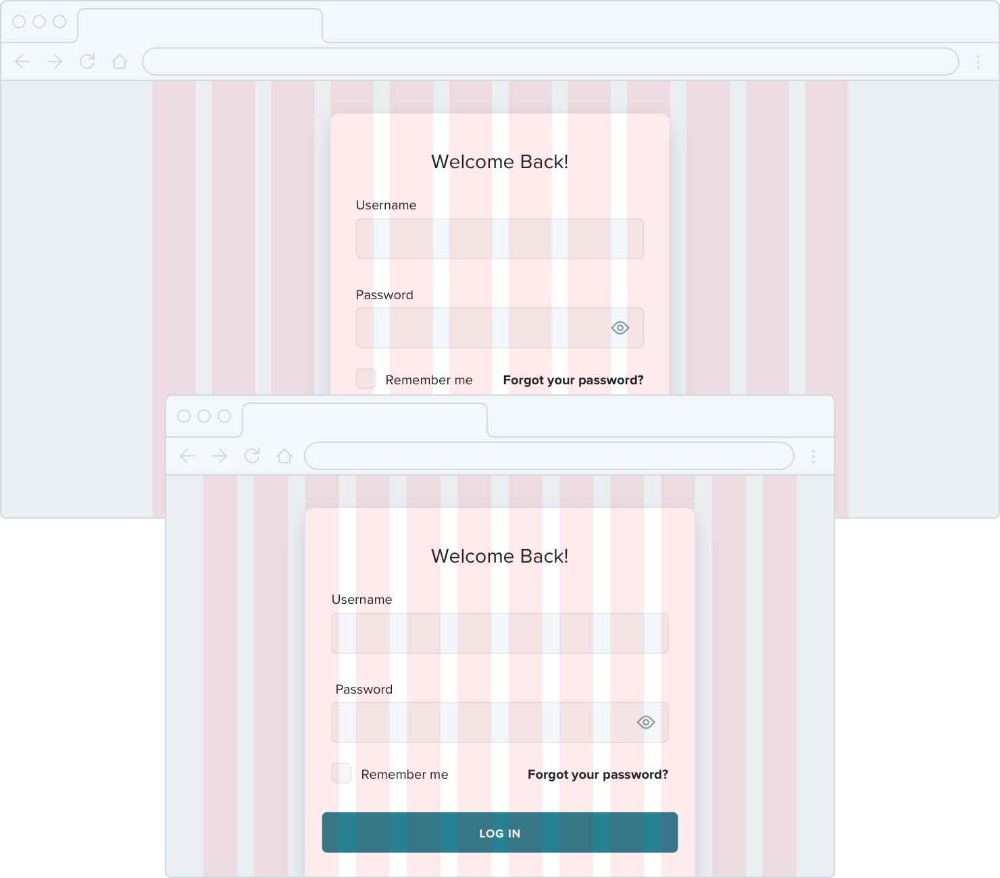

如果你知道 500px 是这个卡片的最佳尺寸，那么在有空间的情况下，它凭什么要变得比这更小？

与其按栅格来给这类元素定尺寸，不如给它们一个 max-width，让它们不至于过大，并且只有当屏幕比这个 max-width 还小时才强制它们缩小。

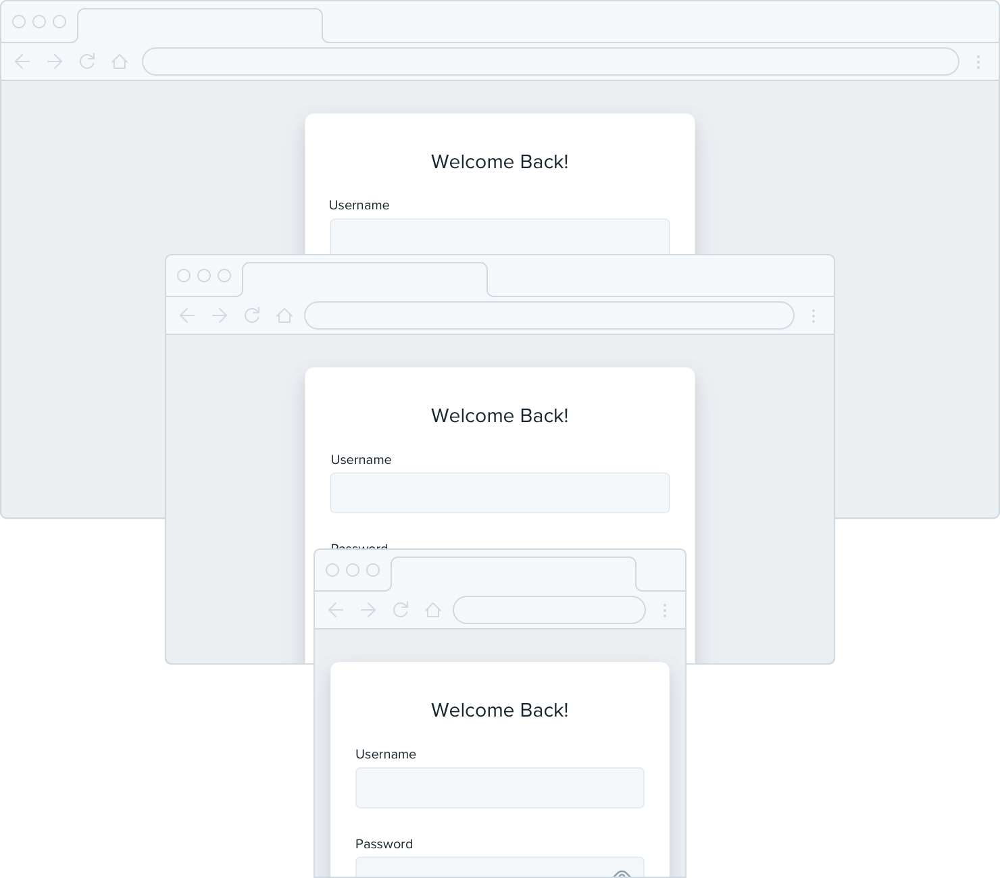

别做栅格的奴隶——给你的组件需要的空间，不到真正必要的时候不做任何妥协。

## 相对尺寸无法通用

很容易让人相信，界面里的每个部分都应该按彼此的相对关系来定尺寸：如果元素 A 在小屏上要缩小 25%，元素 B 也该缩小 25%。

比如你在为大屏设计一篇文章。正文是 18px，标题是 45px，你会很想用*2.5em*（即当前字号的 2.5 倍）来把这种关系固化下来。

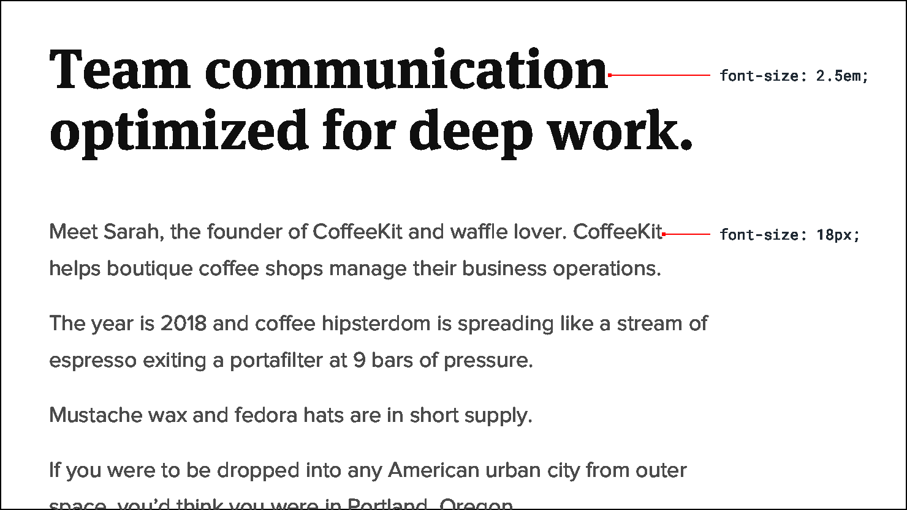

用*em*这类相对单位本身没错，但别以为这样定义出来的关系是恒定的——2.5em 在桌面端可能是完美的标题尺寸，但没人保证它在小屏上也合适。

假设你在小屏上把正文缩到 14px 以控制行长。标题继续用 2.5em，渲染出来就是 35px——对小屏来说大得离谱！

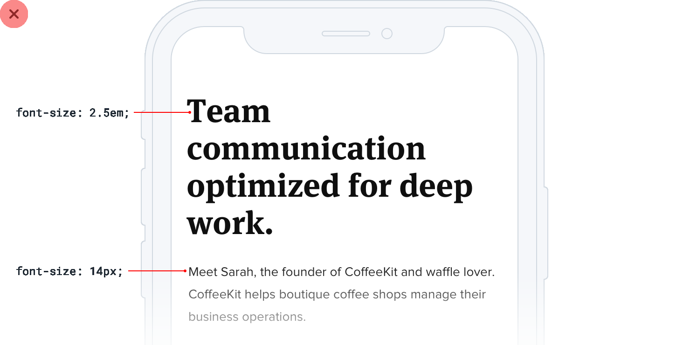

小屏上更合适的标题尺寸可能在 20px 到 24px 之间：

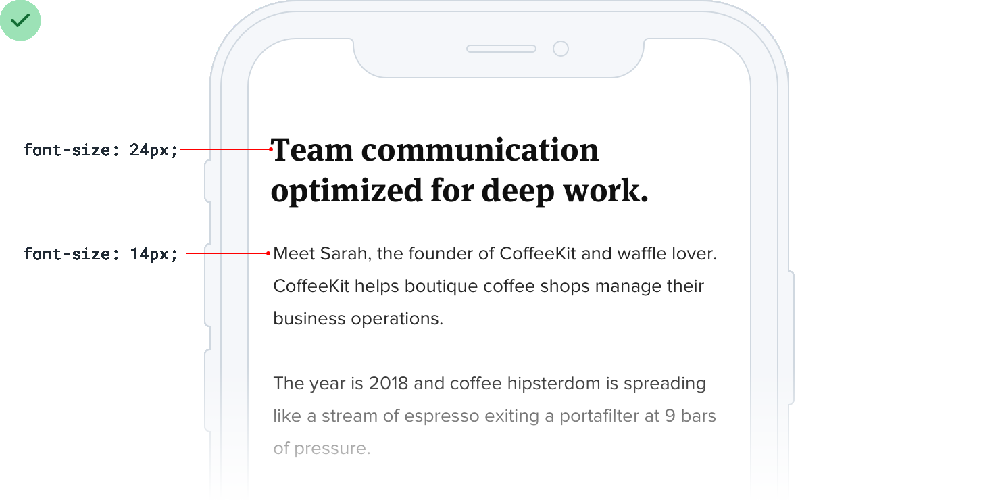

这只是 14px 正文的 1.5–1.7 倍——和桌面端合理的关系完全不同。这说明两者之间根本不存在什么固定关系，想把标题尺寸定义成正文的倍数也没什么实际好处。

一般规律是：在大屏上很大的元素，需要比本来就小的元素缩得*更快*——到了小屏幕上，小元素和大元素之间的差距应该没那么夸张。

### 元素内部的关系

各个东西应该独立缩放，这个想法不只适用于不同屏幕尺寸下的元素尺寸，也适用于单个组件自身的各项属性。

假设你设计了一个按钮：字号 16px，左右内边距 16px，上下内边距 12px：

和前面的例子很像，你会很想把内边距也定义成跟当前字号挂钩。这样想要更大或更小的按钮时，只要改字号，内边距就自动跟着变，对吧？

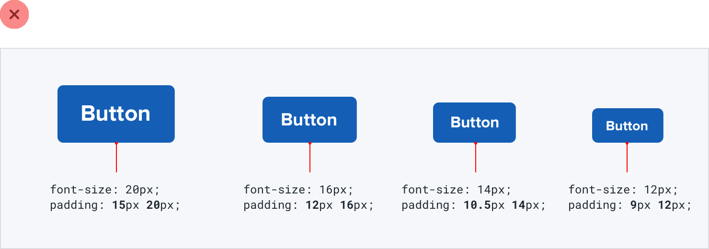

这确实管用——按钮*确实*能放大缩小，并且保持同样的比例。但这真是我们想要的吗？

对比一下这几个按钮：尺寸越大，内边距越宽松；尺寸越小，内边距收得越紧，而且幅度不成比例：

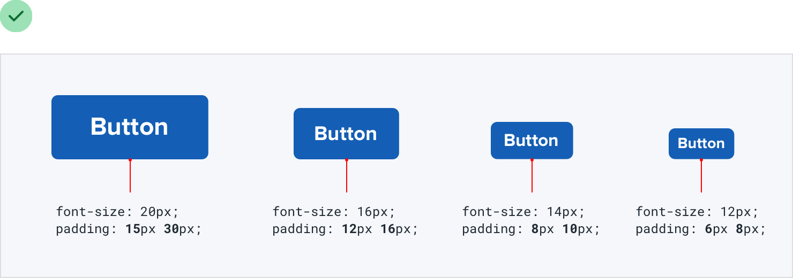

这里的大按钮*感觉上*真的是个大按钮，小按钮也真的像小按钮，而不是简单地把画面缩放了一下。

放下“一切都必须等比缩放”的执念——允许自己独立微调各个东西，会让为多种场景做设计轻松得多。

## 避免含糊的间距

当几组元素被明确分开时——通常是用边框或背景色——哪些元素属于哪一组一目了然。

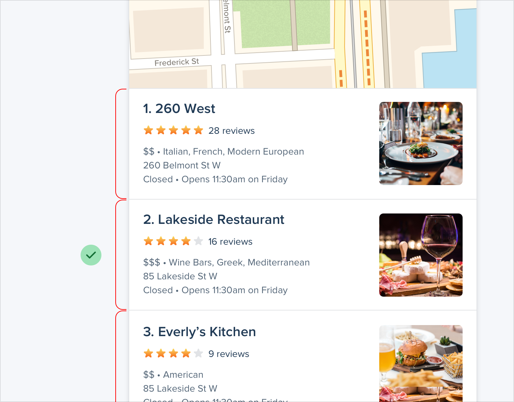

但没有可见分隔时，就不总是这么清楚了。

假设你在设计一个标签和输入框上下堆叠的表单。如果标签下方的外边距和输入框下方的外边距一样，表单里这组元素就不会显得明显“连在一起”。

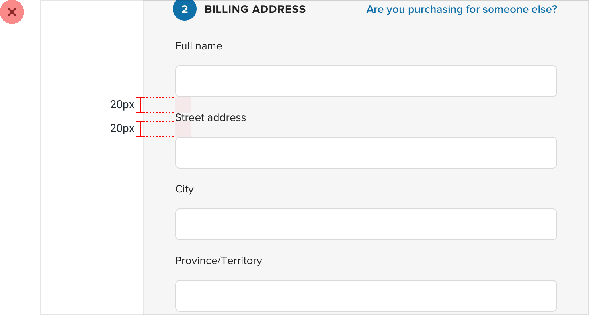

往好了说，用户得费更多力气去理解这个界面；往坏了说，就是不小心把数据填进了错误的字段。

解决办法是加大每两个表单组之间的间距，让哪个标签配哪个输入框一目了然：

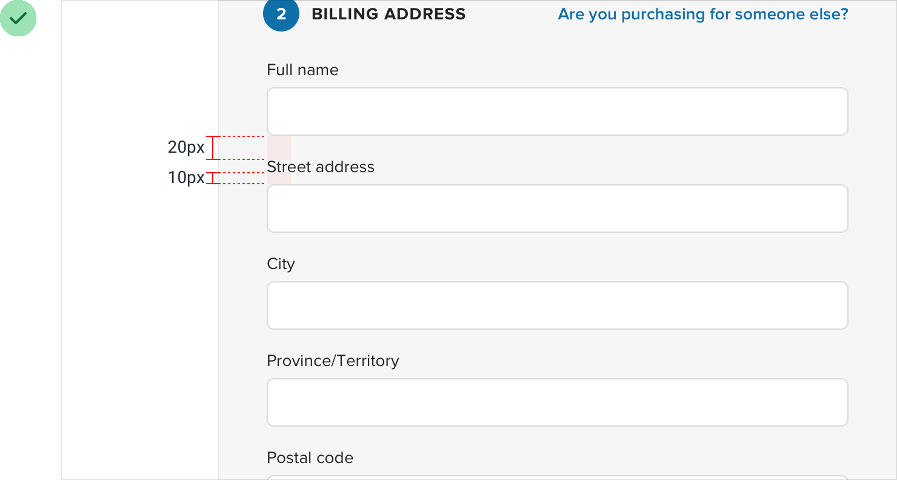

同样的问题也会出现在文章设计里，当区块标题上方空间不足时：

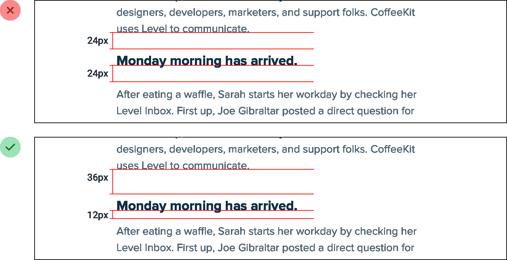

……也会出现在项目符号列表里，当条目之间的间距刚好等于单个条目的行高时：

需要操心的不只是纵向间距；横向排布的组件也很容易犯这个错：

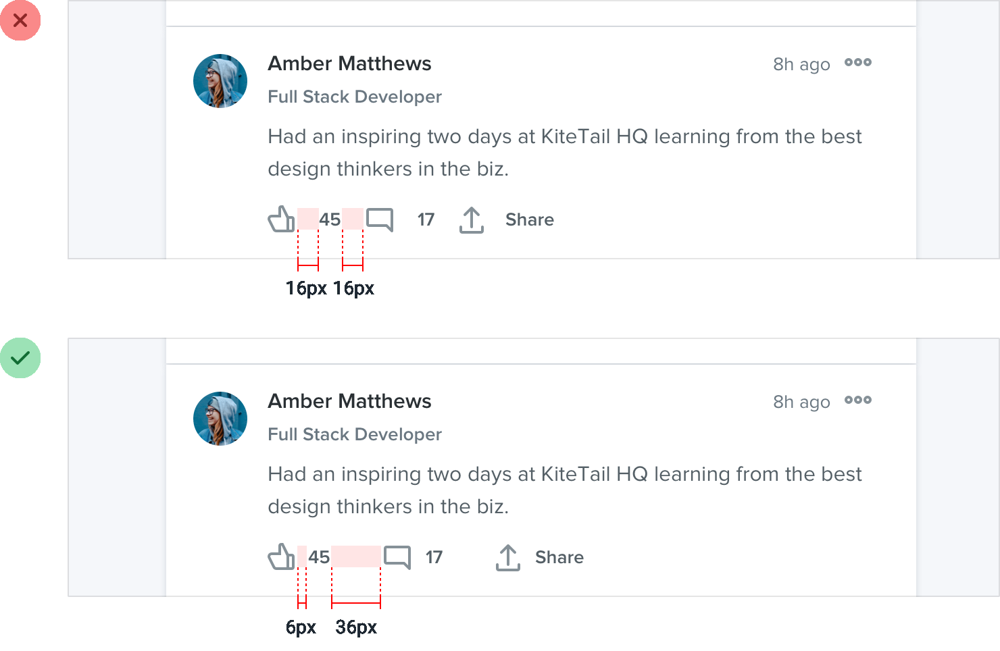

只要你依靠间距来把一组元素关联起来，就一定要保证这组元素*周围*的空间比组内的空间更大——让人难懂的界面，看起来总是更难看。
