## 建立一套字号阶梯

大多数界面用的字号都太多了。除非团队有一套严格的设计系统，否则你会发现从 10px 到 24px，每一个像素值都*在界面某处*被用到过，这并不罕见。

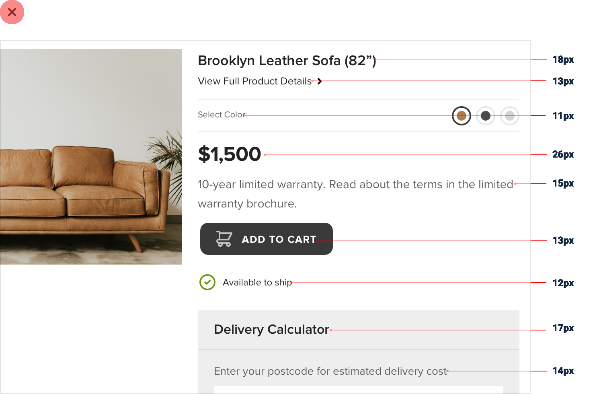

没有体系就选字号是个坏主意，原因有两个：

1. 它会让你的设计出现恼人的不一致。
2. 它会拖慢你的工作流。

那么该怎么定义一套文字体系？

### 选择一种阶梯

和间距、尺寸一样，线性的阶梯行不通。字号之间的跨度小，在阶梯底部才有用；但为一个大标题在 46px 和 48px 之间纠结，纯粹是浪费时间。

**模数阶梯**

一种做法是用一个*比例*来推算字号阶梯，比如 4:5*（“大三度”）*、2:3*（“纯五度”）*，或者干脆用“黄金比例”1:1.618。这通常被称为“模数阶梯”。

你先定一个合理的基准值*（16px 很常用，因为它是大多数浏览器的默认字号）*，乘以比例得到下一个值，再用比例乘*那个*值得到再下一个，如此递推：

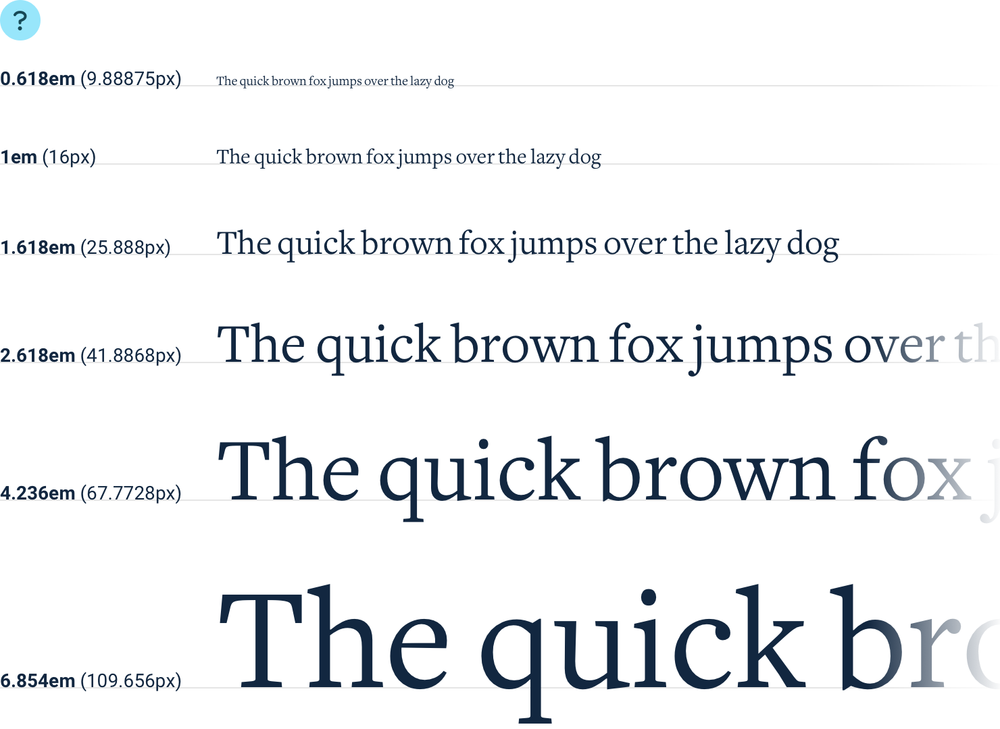

这种做法的数学纯粹性很吸引人，但实践中它并不完美，原因有几个。

1. **最后会得到小数。**

以 16px 为基准、4:5 为比例，阶梯里会出现一堆对不齐像素的尺寸，比如 31.25px、39.063px、48.828px 等等。各家浏览器处理亚像素取整的方式都略有不同，所以能避开小数尺寸就避开。

如果你确实想用这种办法，请在定义阶梯时自己把数值取整，以免在不同浏览器里出现差一个像素的问题。

2. **你通常需要更多尺寸。**

如果你是在给文章这类长篇内容定义字号阶梯，这种做法效果好；但在界面设计里，模数阶梯带来的跨度往往限制得*太*死了。

用*（取整后的）*3:4 阶梯，你会得到 12px、16px、21px、28px 这样的尺寸。表面上看起来限制不算大，但实践中你会希望 12px 和 16px 之间再有一个尺寸，16px 和 21px 之间也一样。

你可以用 8:9 这样更紧凑的比例，但到这一步，你其实只是在挑一个恰好符合你已知需求的阶梯而已。

**手工定制的阶梯**

做界面设计时，更实际的做法就是直接手动挑数值。这样你不必操心亚像素取整误差，而且尺寸有哪些完全由你掌控，不用把这件事外包给某个数学公式。

下面这套阶梯对大多数项目都很好用，而且和*《建立间距与尺寸体系》*那一节推荐的间距尺寸阶梯配合得很好：

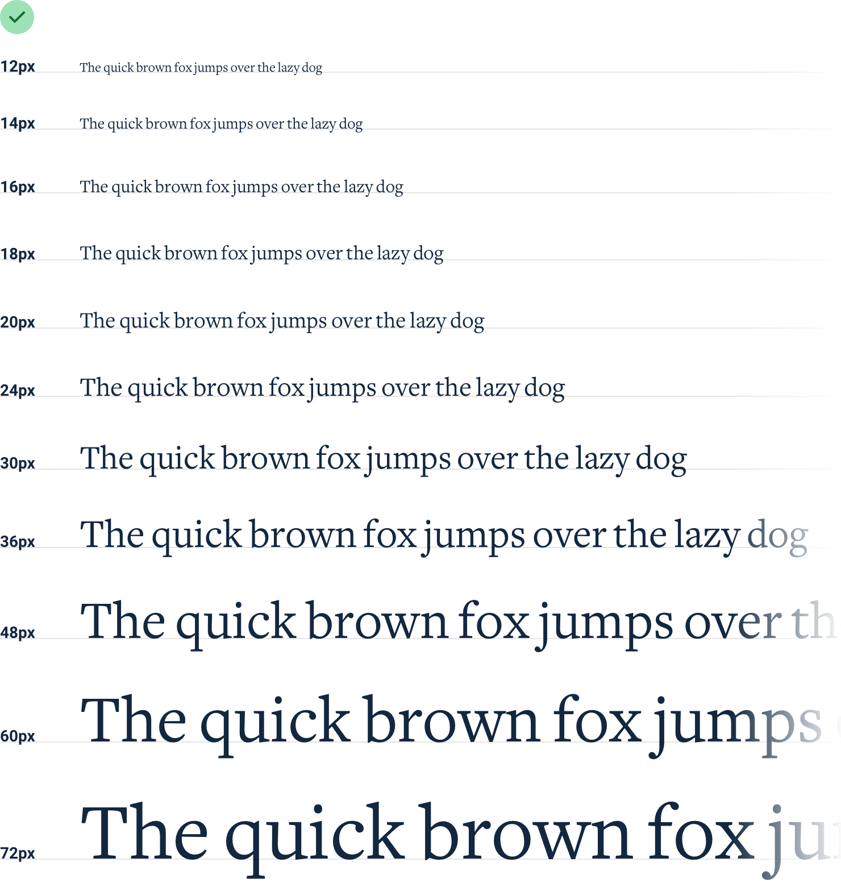

它的限制刚好足以加快你的决策，又不至于紧到让你觉得少了一个有用的尺寸。

### 别用 em 单位

搭字号阶梯时，别用*em*单位来定义尺寸。

因为*em*单位相对于当前字号，嵌套元素最终计算出来的字号往往根本不在你的阶梯里。

比如你定义了这样一套基于 em 的字号阶梯：

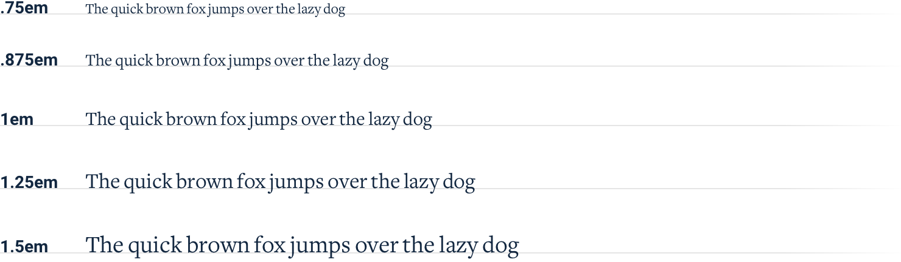

如果你给某个元素设了 1.25em*（默认情况下是 20px）*的字号，那么在这个元素内部，1em 就等于 20px。这意味着如果你给某个*嵌套*元素设 .875em，实际算出来的字号是 17.5px，而不是你阶梯里的任何一个值！

坚持用*px*或*rem*单位——这是唯一能保证你真的在遵守这套体系的办法。

## 用好字体

面对成千上万种字体，要分辨好坏是件让人望而生畏的事。

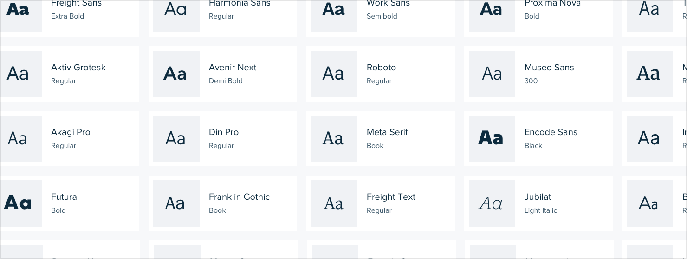

培养出能看出好字体所有细节的眼力，可能需要好几年。你大概没有好几年，所以这里有几个技巧，能让你立刻开始挑出高质量的字体。

### 稳一点

做界面设计，最保险的选择是相当中性的无衬线字体——想想 Helvetica 那种。

如果你实在不相信自己的品味，一个很好的选择是用系统字体栈：

`-apple-system, Segoe UI, Roboto, Noto Sans, Ubuntu, Cantarell, Helvetica Neue;`

这可能不是最有野心的选择，但至少你的用户已经看惯了。

### 忽略少于五种字重的字体

这*并不总是*成立，但总的来说，字重齐全的字体往往比字重少的字体做得更用心、更讲究细节。

很多字体网站*（比如 Google Fonts）*支持按“样式数量”筛选，这个数量既包括可用字重，也包括这些字重的斜体变体。

一个有效限制选项数量的办法，就是把它拉到 10 以上*（把斜体也算上）*：

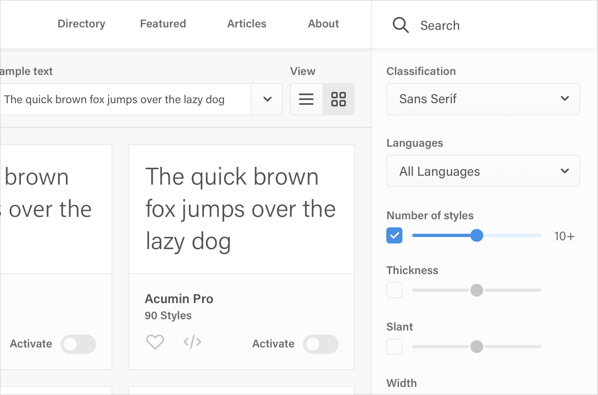

具体到 Google Fonts，这一下就砍掉了 85% 的选项，剩下的无衬线字体不到 50 款。

### 为易读性做优化

设计一款字族时，设计师通常有明确的用途。为标题设计的字体字距更紧、小写字母更矮*（x 高度更小）*；为小字号设计的字体则字距更宽、小写字母更高。

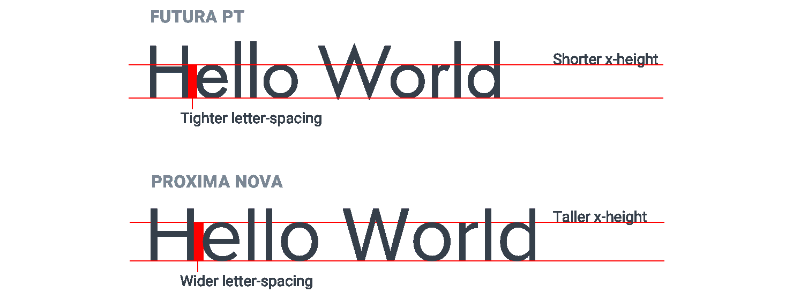

记住这一点：界面的正文不要用 x 高度小、字形压缩的字体。

### 相信大众的智慧

一款字体如果很流行，它大概就是好字体。大多数字体网站支持按热度排序，这也是限制选项的好办法。

当你要挑的不是那种中性的界面字体时，这招尤其管用。比如要挑一款有味道、有个性的漂亮衬线字体，其实挺难的。

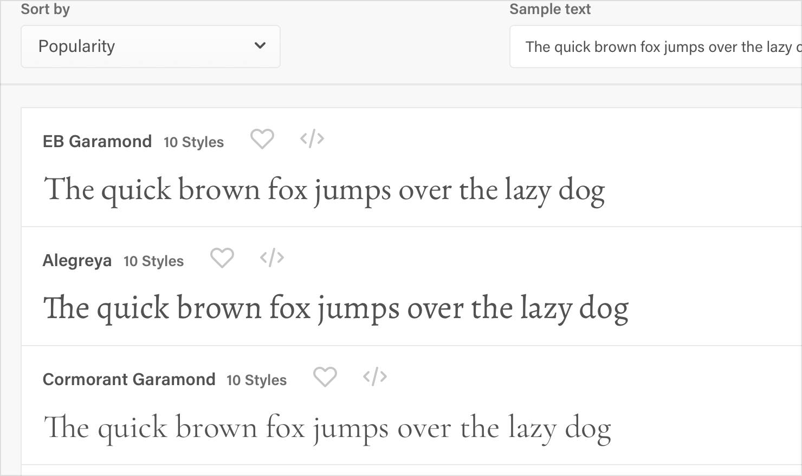

借助成千上万其他人的集体判断，就会容易很多。

### 从在意这件事的人那里“偷”

去研究一下你最喜欢的那些网站，看看它们用的是什么字体。

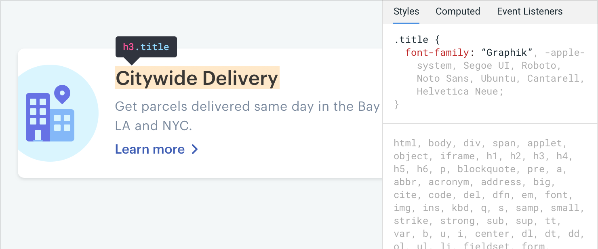

有很多优秀的设计团队，里面的人对字体排版都有*极其*强烈的看法，他们选的字体往往很棒，而用上面那些稳妥办法你也许永远找不到。

### 培养直觉

一旦你开始留意那些设计精良的网站上的字体排版，用不了多久，你就能很自然地判断一款字体是超赞还是糟糕。

你很快就会变成一个字体势利眼，但在那之前，上面这些建议足够你应付了。

## 控制好行长

给段落排版时，很容易犯一个错：让文字去迁就你的布局，而不是去创造最好的阅读体验。

这通常意味着过长的行，读起来更费劲。

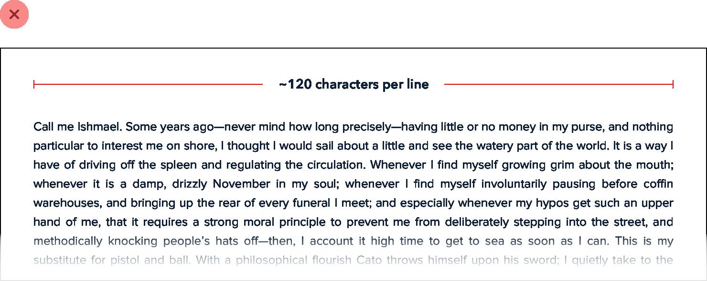

想获得最好的阅读体验，就让段落的宽度每行容纳 45 到 75 个字符。在网页上最简单的做法是用*em*单位，它相对于当前字号。宽度设在 20–35em 就能进入这个区间。

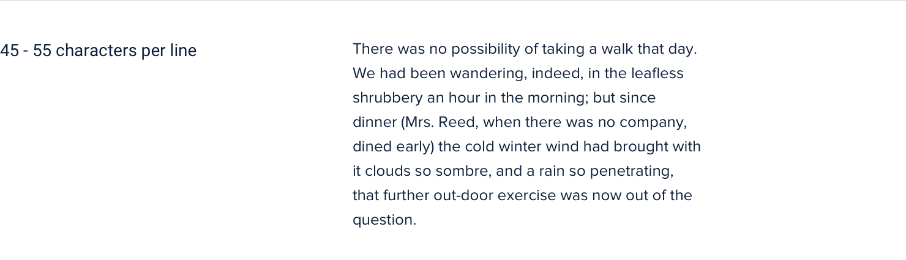

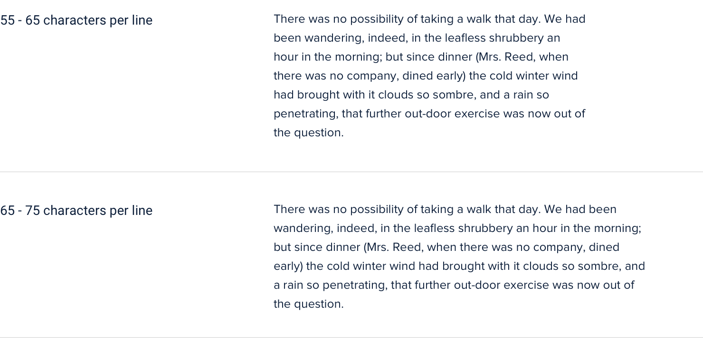

有时每行略多于 75 个字符也能用，但要意识到你已经进入高风险区——想稳妥就守在 45–75 这个范围里。

### 处理更宽的内容

如果段落文字要和图片或其他大组件混排，即使整个内容区需要更宽才能放下其他元素，段落宽度也仍然要限制。

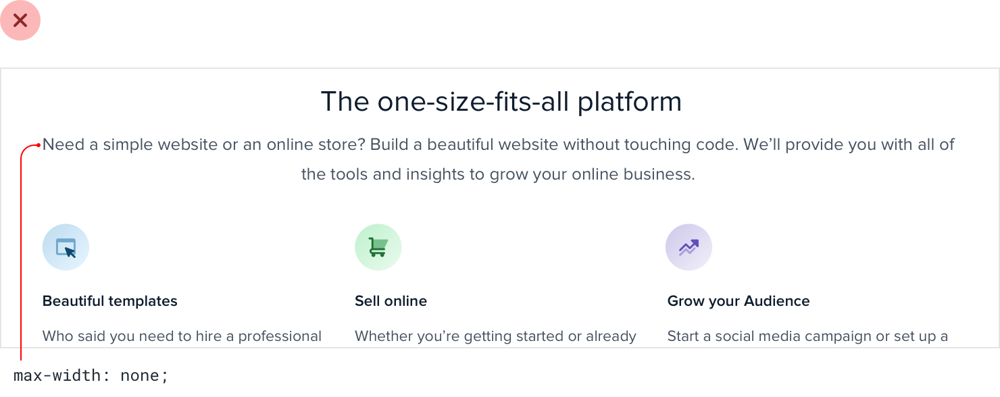

在同一个内容区里用不同宽度，乍看违反直觉，但结果几乎总是显得更精致。

## 对齐基线，而不是居中

很多情况下，在同一行里用多个字号来建立层级是合理的。

比如你在设计一个卡片，左上角是个大标题，右上角是一组较小的操作。

这样混用字号时，你的直觉可能是把文字垂直居中以求平衡：

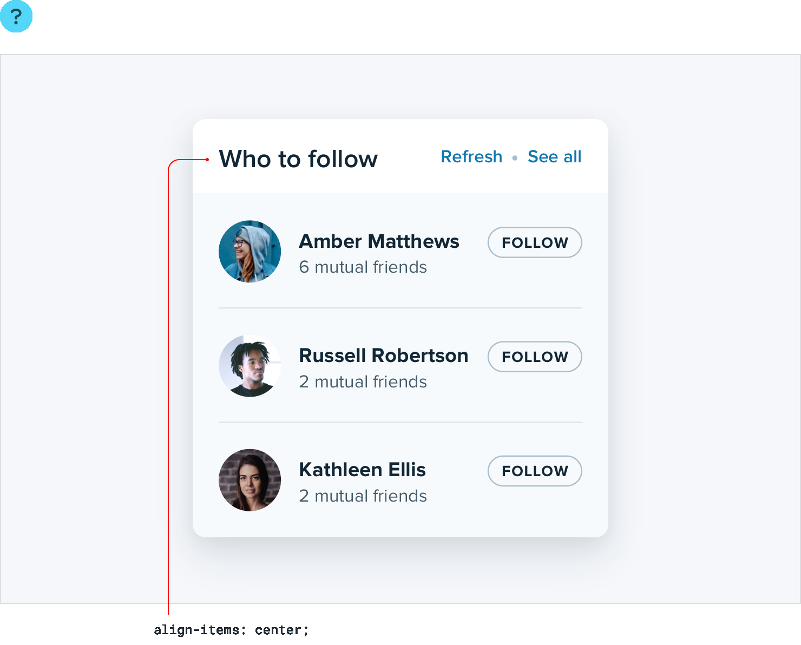

当不同字号之间隔得比较开时，它往往难看但还不足以引起你的注意；可文字挨得近时，这种别扭的对齐就很明显了：

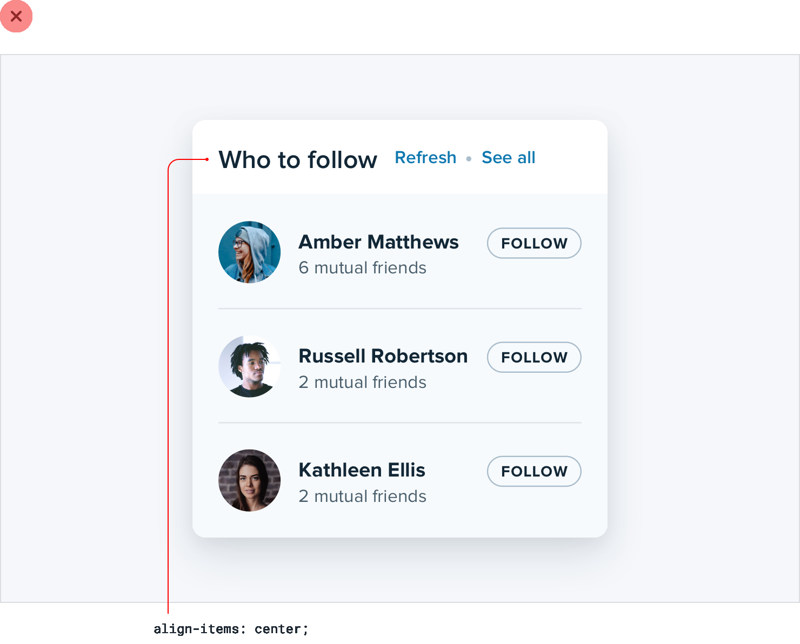

更好的做法是按*基线*对齐混用的字号，也就是字母所坐的那条假想线：

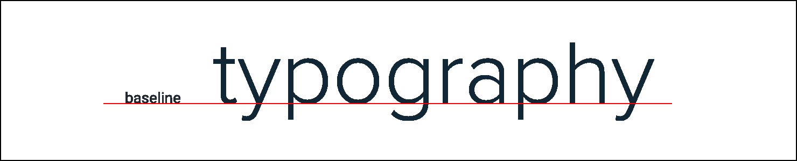

按基线对齐混用的字号，你利用的是眼睛本来就能感知的对齐参照。

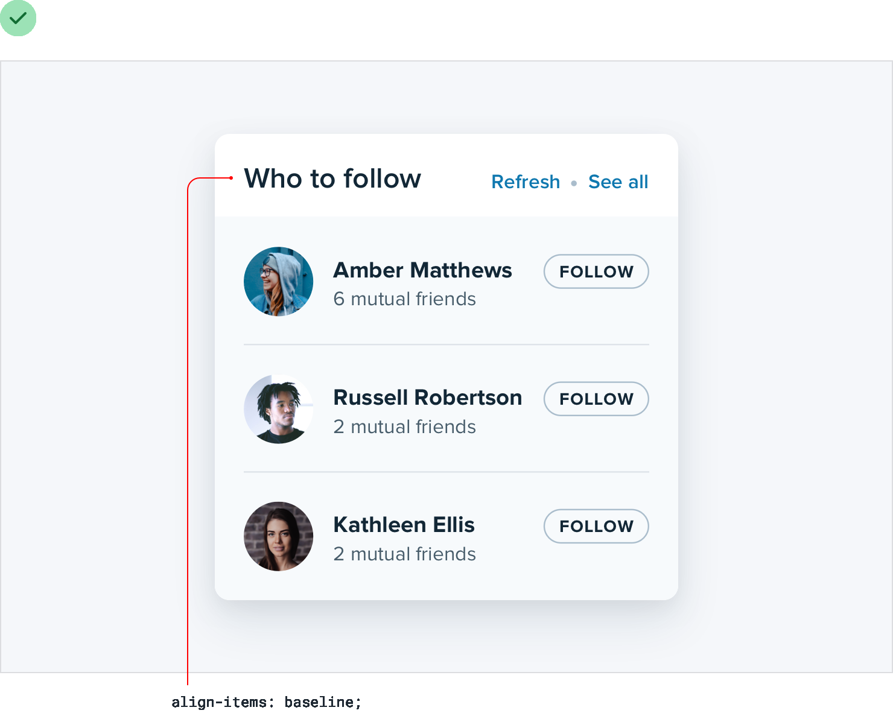

结果比把两段文字居中、再把基线错开要更简单、更清爽。

## 行高讲究比例

你可能听过这样的建议：从可读性角度看，行高大约 1.5 是个不错的起点。

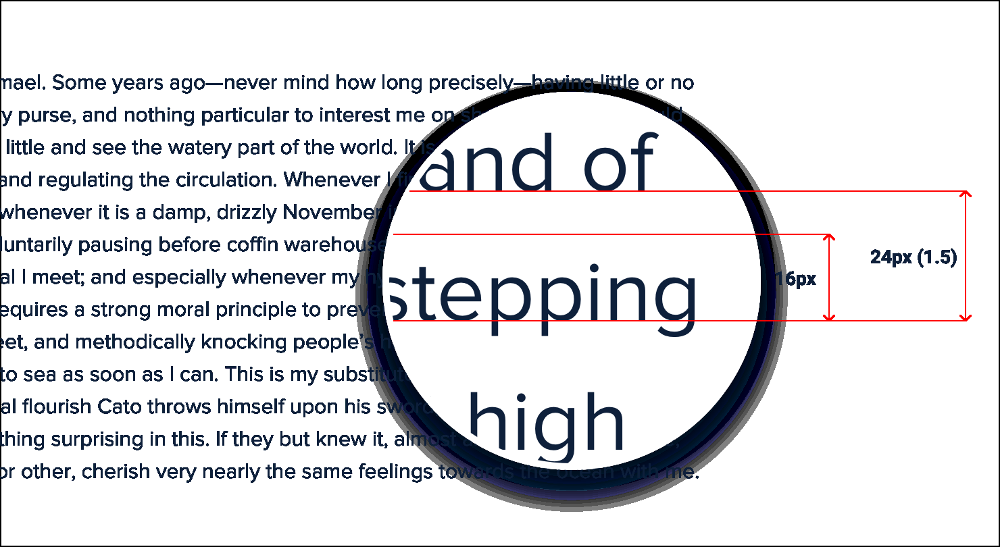

这话不能算错，但为你的文字挑一个合适的行高，比在所有场景下一律用同一个值要复杂一些。

### 考虑行长

我们之所以在行与行之间加空间，是为了让读者在文字换行时容易找到下一行。你有没有不小心把同一行读了两遍，或者漏掉了一行？那多半是行高太小了。

行与行挨得太紧时，你很容易在页面右侧读完一行，眼睛一路跳回左侧，却不确定该读哪一行。

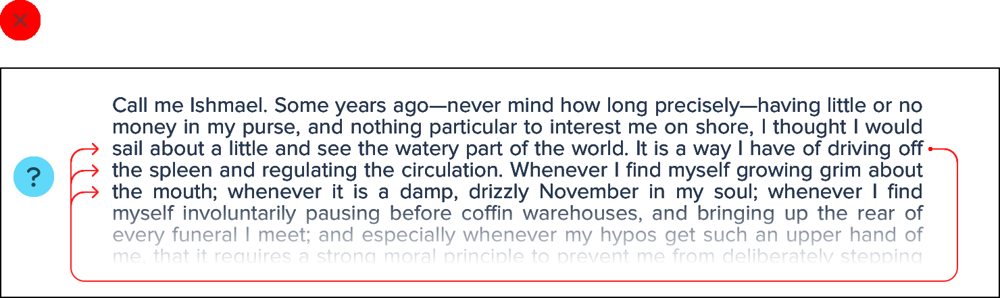

行越长，这个问题越严重。眼睛为了读下一行需要横向跳得越远，你就越容易串行。

这意味着行高和段落宽度应该成比例——窄的内容可以用 1.5 这种较小的行高，而宽的内容可能需要高达 2 的行高。

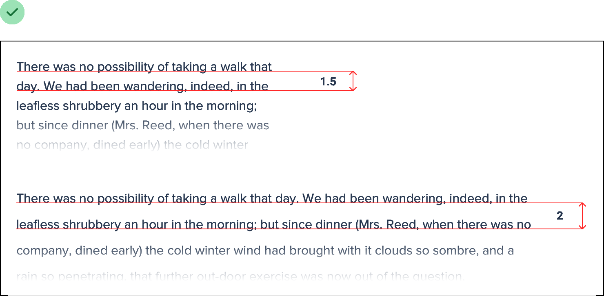

### 考虑字号

行长不是选择合适行高的唯一因素——字号也有很大影响。

文字小的时候，额外的行距很重要，因为它能让你的眼睛在换行时更容易找到下一行。

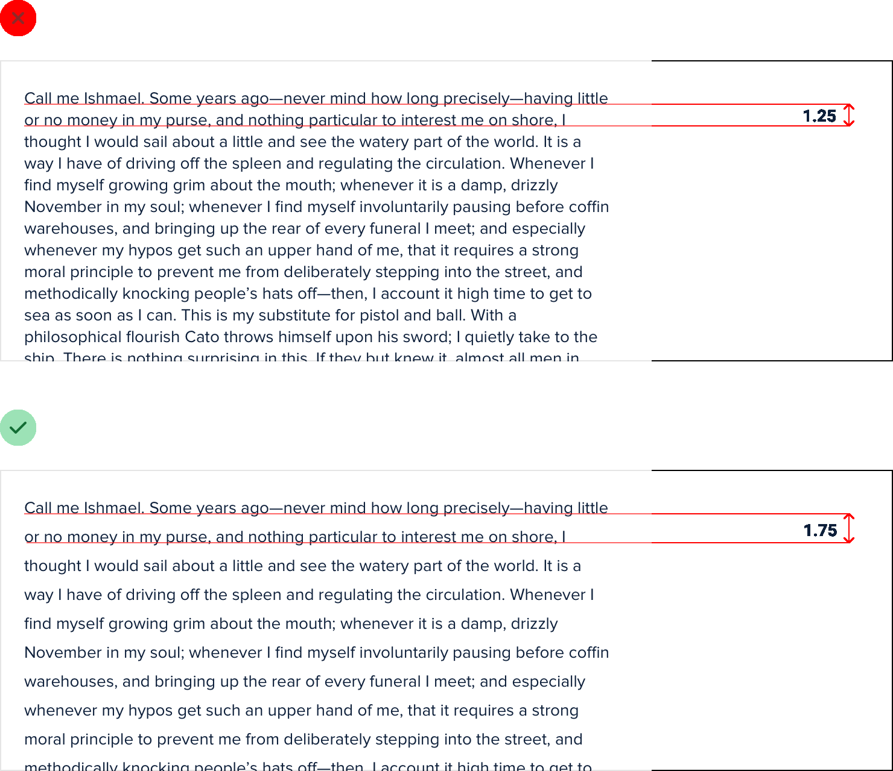

但文字变大之后，眼睛就不太需要帮忙了。这意味着对大标题来说，可能完全不需要额外行距，行高设为 1 就完全没问题。

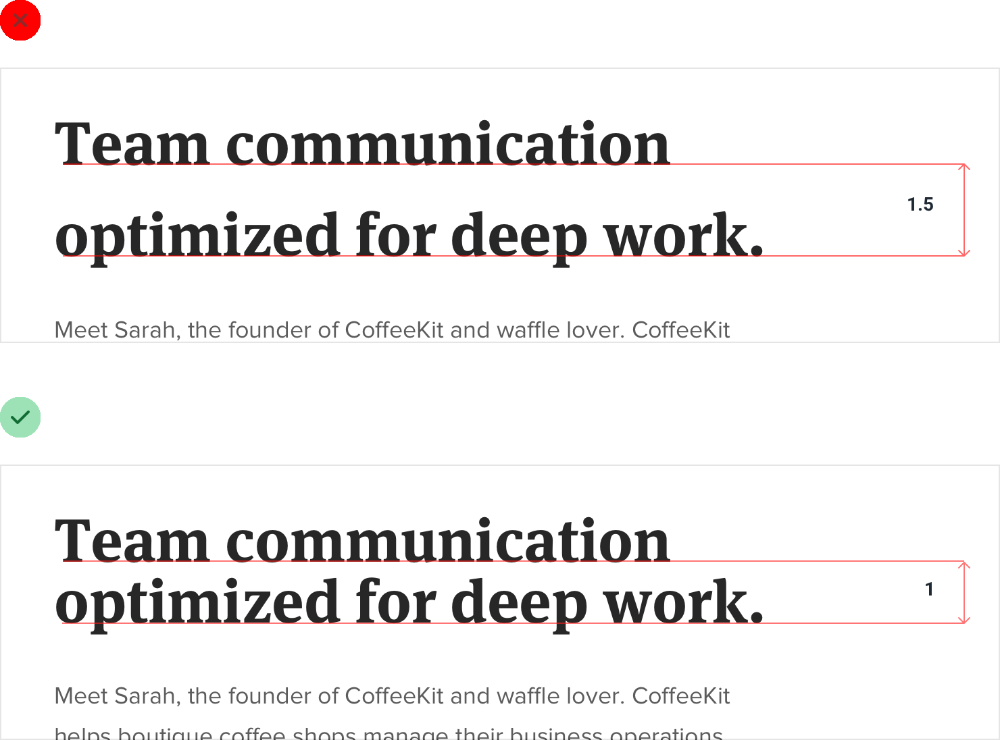

行高和字号成*反比*——小字用更大的行高，大字用更小的行高。

## 不是每个链接都需要颜色

当你要在一大段非链接文字里放一个链接时，确保这个链接足够突出、看起来能点是重要的。

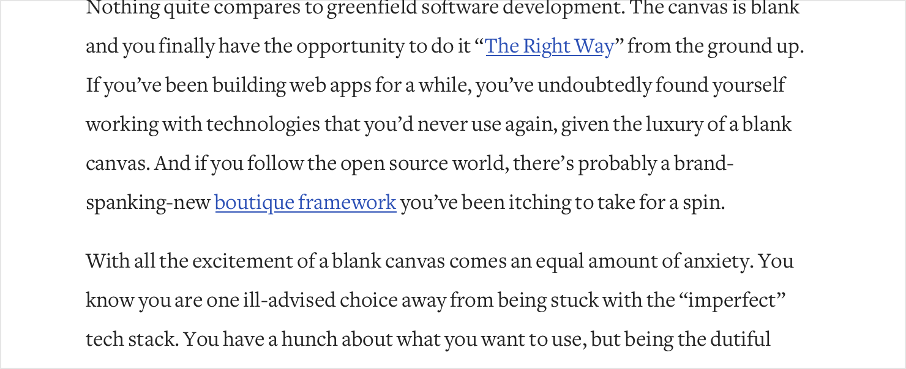

但如果你设计的界面里几乎所有东西都是链接，那种为让链接在段落中“跳出来”而设计的样式就会很压迫。

这时可以用更含蓄的方式强调大多数链接，比如只用更重的字重或更深的颜色。

有些链接甚至完全不需要默认就强调。如果界面里有那种非常边缘、不属于用户主要使用路径的链接，可以考虑*只在悬停时*加下划线或改变颜色。

那些想到要去试的用户仍然能发现它们，而它们也不会和页面上更重要的操作抢夺注意力。

## 对齐要以可读性为准

一般来说，文字的对齐方式应该和它所用语言的书写方向一致。对英文（以及大多数其他语言）来说，这意味着绝大多数文字都应该左对齐。

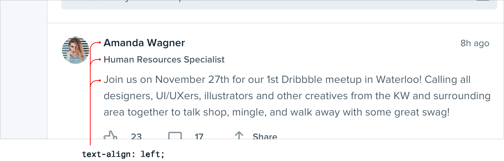

不过其他对齐方式也有用武之地，关键在于用得对。

### 长文本不要居中

居中对齐用在大标题或者独立成块的短文本上可以很好看。

但只要超过两三行，左对齐几乎总是更好看。

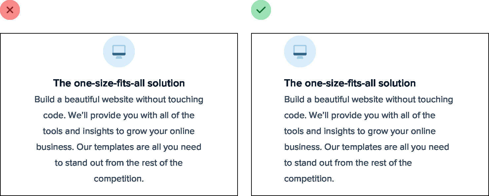

如果你有几块文字想居中，但其中一块太长了，最省事的解决办法是重写文案，把它缩短：

这不仅能解决对齐问题，还会让你的设计显得更一致。

### 数字右对齐

如果你设计的表格里有数字，就把它们右对齐。

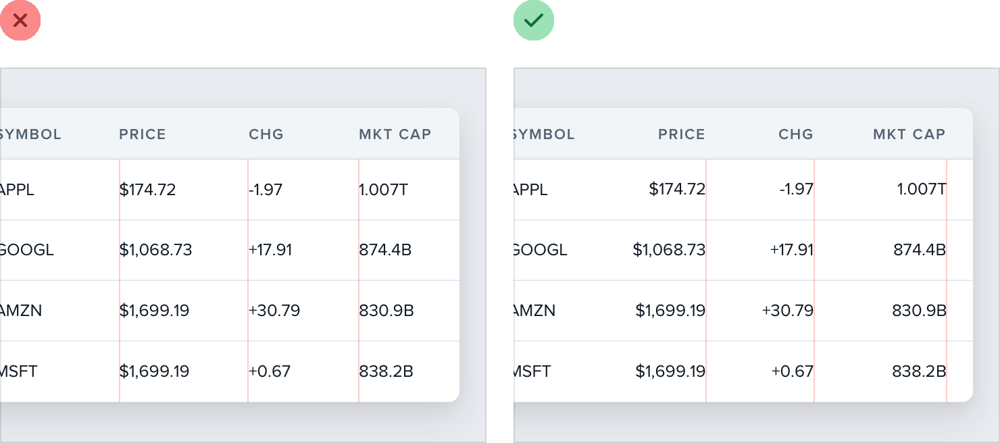

当一列数字的小数点都落在同一个位置时，扫一眼就能轻松比较。

### 两端对齐的文字要开启断词

两端对齐的文字在印刷品里很好看，在网页上想要更正式的观感时也能用；但如果不额外留意，它会在词与词之间留下很多难看的空隙：

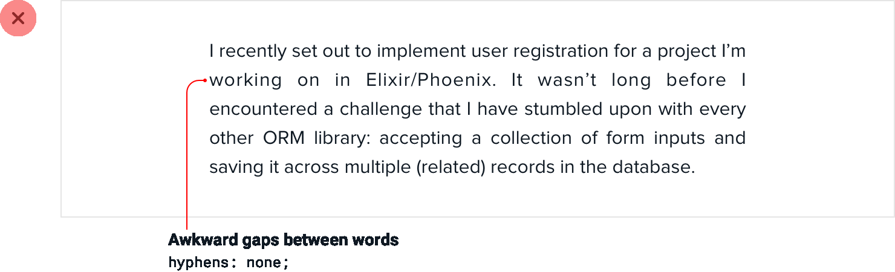

要避免这点，只要你用了两端对齐，就应该同时开启断词：

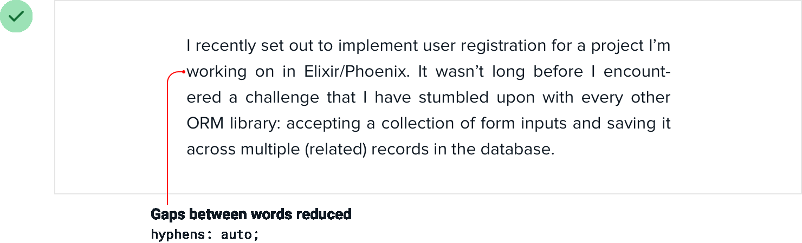

两端对齐最适合的场景是你想模仿印刷品的观感，比如线上杂志或报纸。即便在那样的场景下，左对齐的效果也很好，所以这纯粹是偏好问题。

## 有效使用字距

给文字排版时，人们会花很多功夫把字重、颜色和行高调到恰到好处，却容易忘记字距也是可以调的。

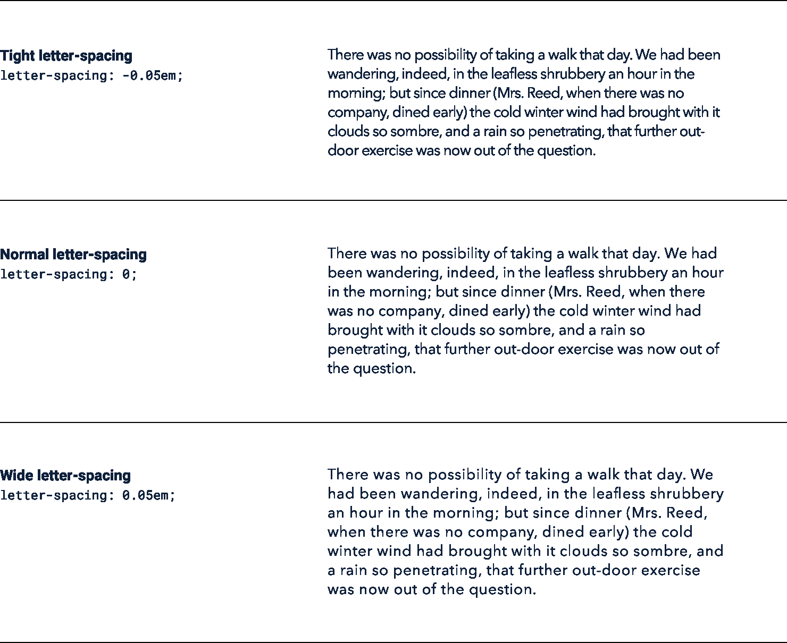

一般来说，你应该相信字体设计师，别去动字距。话虽如此，有两种常见情况，调一调能让你的设计更好。

### 收紧标题字距

设计一款字族时，设计师心里是有明确用途的。

像 Open Sans 这样的字族，哪怕在小字号下也要保持高可读性，所以它内置的字距比 Oswald 这种为标题设计的字族宽得多。

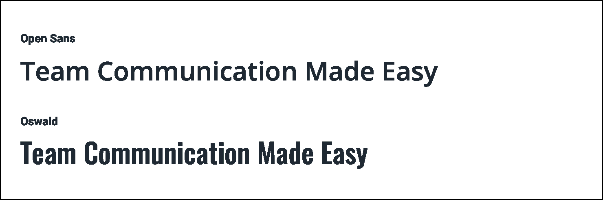

如果你想用字距较宽的字族来做大标题或标题，通常可以把字距调紧一点，来模仿专为大标题设计的字族那种紧凑感：

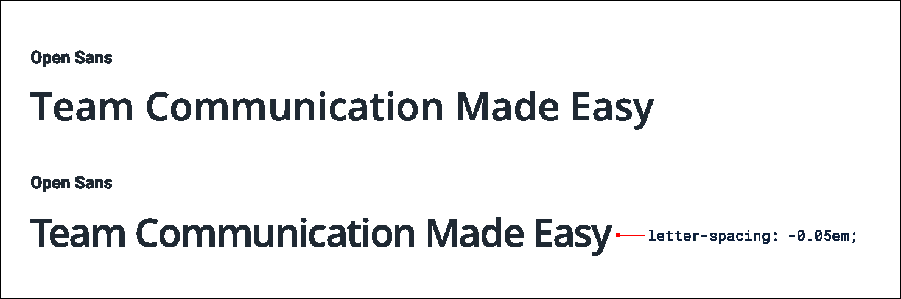

但别想着反过来做——专为标题设计的字体即便加大字距，也很少能在小字号下表现良好。

### 提升全大写文字的易读性

大多数字族的字距是针对常规的“句首大写”文本优化的——一个首字母大写，后面基本是小写。

小写字母在视觉上变化很多。像 *n*、*v*、*e* 这样的字母完全落在字体的 x 高度之内；*y*、*g*、*p* 则有*下伸部*，探到基线以下；而 *b*、*f*、*t* 有*上伸部*，向上延伸。

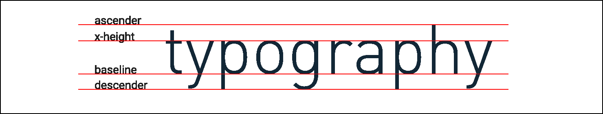

全大写文字就没这么丰富了。因为每个字母高度都一样，用默认字距常常会让文字更难读，因为字母之间可区分的特征变少了。

因此，把全大写文字的字距调大以提升可读性通常是合理的：

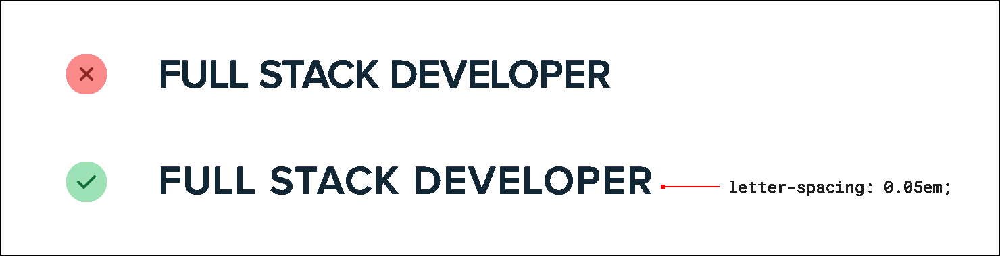
