## 把 hex 换成 HSL

hex 和 RGB 是网页上最常用的颜色表示方式，但它们并不是最好用的。

用 hex 或 RGB 表示时，视觉上非常接近的颜色在代码里看起来毫不相干。

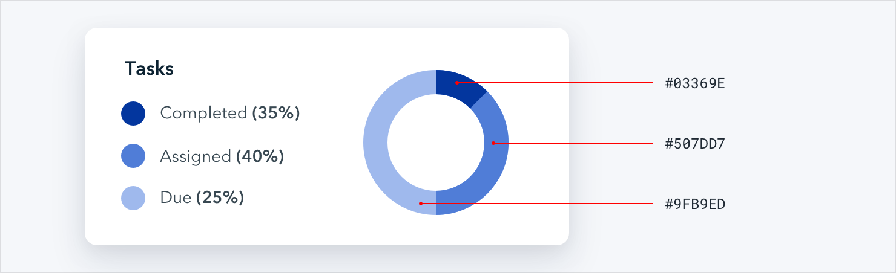

HSL 解决了这个问题，它用人类眼睛能直觉感知的属性来表示颜色：*色相*、*饱和度*和*明度*。

**色相**是颜色在色轮上的位置——正是这个属性让我们能把两种并不完全相同的颜色都认成“蓝色”。

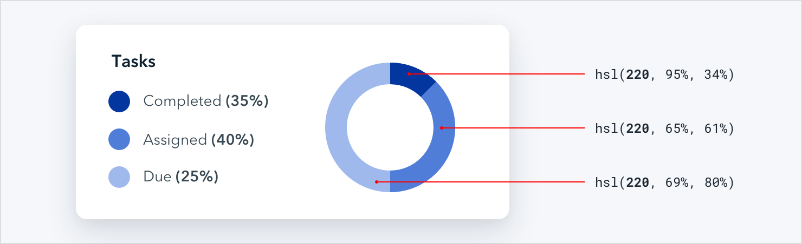

色相用角度来度量，0° 是红色，120° 是绿色，240° 是蓝色。

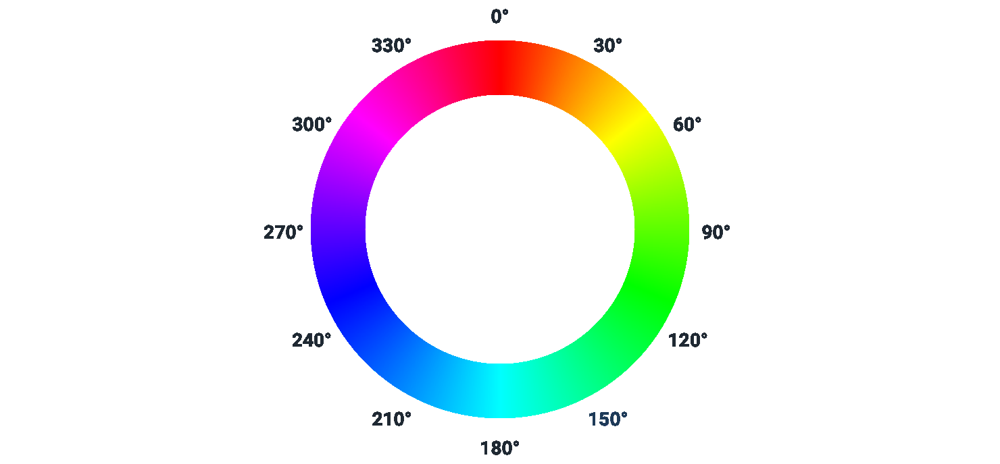

**饱和度**表示一种颜色看起来有多鲜艳、多浓烈。饱和度 0% 就是灰色（没有颜色），100% 则鲜活而浓烈。

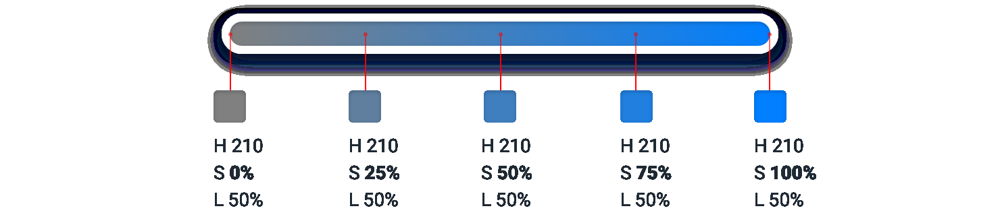

没有饱和度时，色相就失去了意义——饱和度为 0% 时转动色相，颜色根本不会改变。

**明度**就是字面意思——它衡量一种颜色有多接近黑色或白色。明度 0% 是纯黑，100% 是纯白，50% 则是该色相下最纯正的颜色。

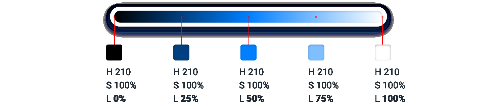

### HSL 与 HSB

别把 HSL 和 HSB 搞混——HSL 里的*明度*和 HSB 里的*亮度*并不是一回事。

在 HSB 里，亮度 0% 永远是黑色，但亮度 100% 只有在饱和度为 0% 时才是白色。当饱和度是 100% 时，HSB 里的 100% 亮度相当于 HSL 里 100% 饱和度、*50%* 明度。

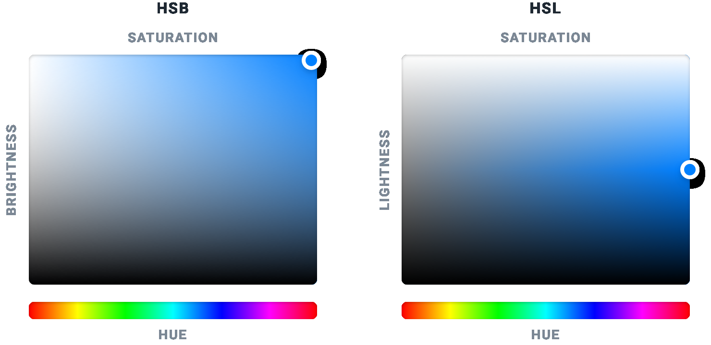

在设计软件里 HSB 比 HSL 更常见，但浏览器只认 HSL，所以如果你是为网页做设计，HSL 才是你的首选武器。

## 你需要的颜色比你以为的多

你用过那种配色生成器吗？选一个起始色，调几个选项，然后它赏给你五个“完美”的颜色，让你拿去搭网站。

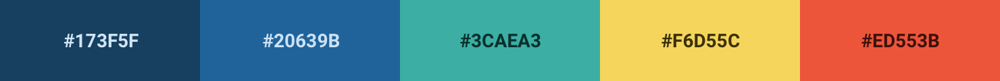

这种靠计算得出完美配色的思路极其诱人，但除非你希望自己的网站长成这样，它其实没什么用：

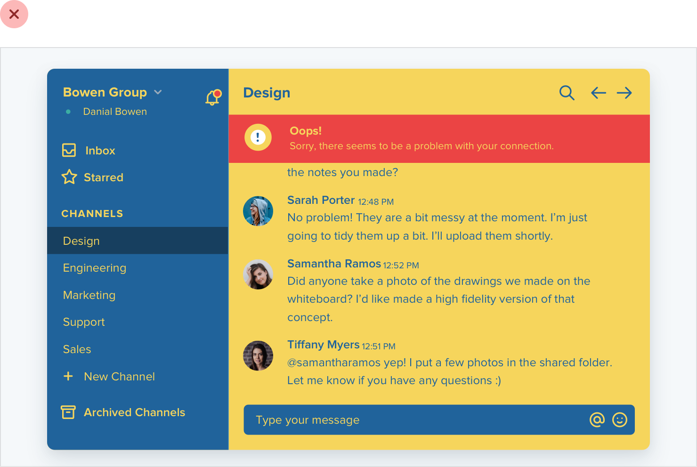

### 你真正需要的东西

只有五个十六进制色值，你什么都做不出来。要做出真东西，你需要一套丰富得多的颜色可供选择。

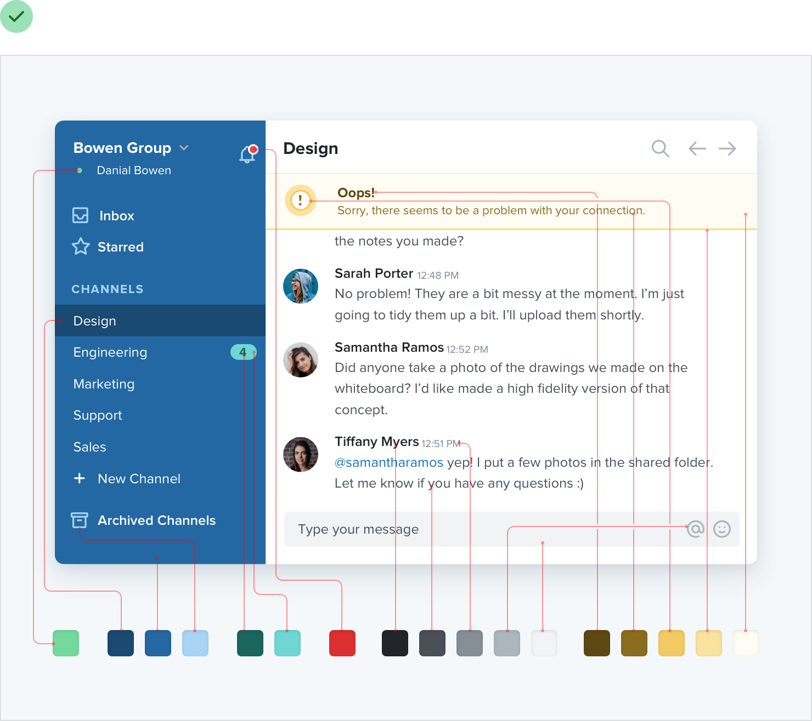

一套好的调色板可以分成三类。

**灰色**

文字、背景、面板、表单控件——界面里几乎所有东西都是灰的。

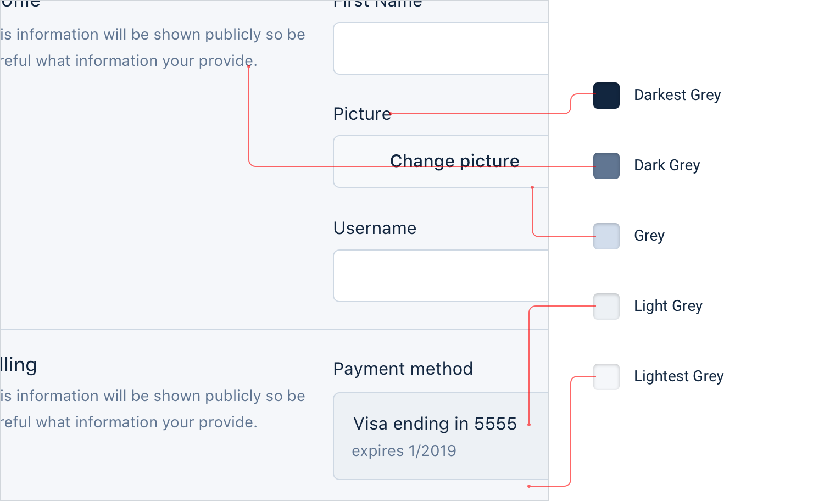

而且你需要的灰色比你以为的更多——三四个色阶听起来够用，但用不了多久，你就会希望有一个比 2 号色阶深一点、又比 3 号色阶浅一点的颜色。

实践中，你需要 8 到 10 个色阶可选（后面*《提前把色阶定好》*那一节会细讲）。不要多到让你在 77 号和 78 号色阶之间浪费时间，但也要足够多，好让你不必做太多妥协。

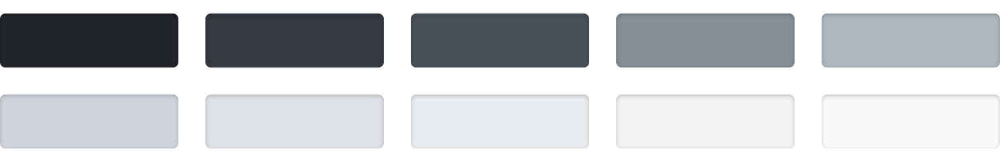

纯黑往往显得很不自然，所以从一个很深的灰色开始，一步步均匀地过渡到白色。

**主色**

大多数网站需要一个，*也许*两个颜色，用于主要操作、激活状态的导航元素等等。这类颜色决定了网站的整体观感——正是它们让人一想到 Facebook 就想到“蓝色”。

和灰色一样，你需要*5 到 10 个*深浅不同的色阶可选。

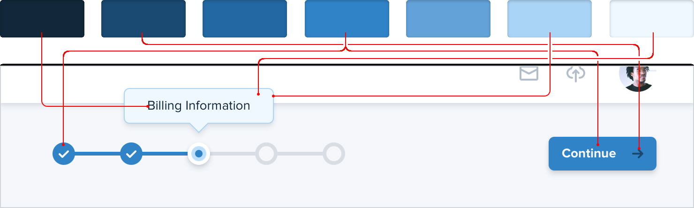

极浅的色阶很适合当作提示框之类的带色背景，而更深的色阶用在文字上效果很好。

**强调色**

除了主色，每个网站还需要几个*强调*色，用来向用户传达不同的信息。

比如你可能想用黄色、粉色或青色这类抓眼的颜色来突出一个新功能：

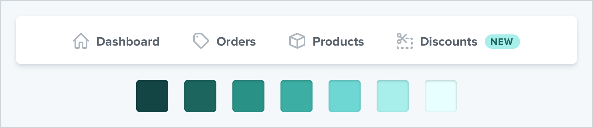

你可能还需要用颜色来强调不同的语义*状态*，比如用红色确认一个破坏性操作：

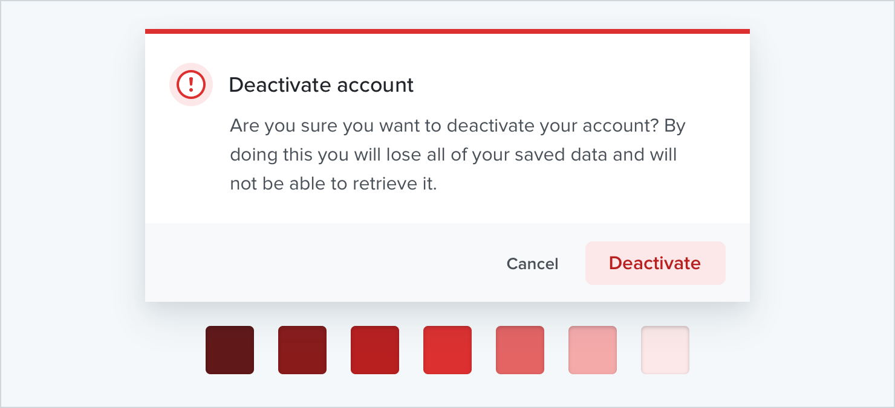

……用黄色表示警告信息：

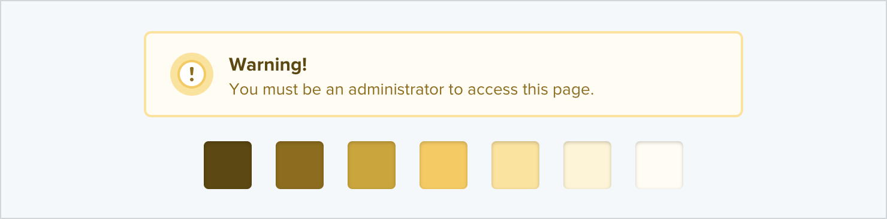

……或者用绿色突出一个向好的趋势：

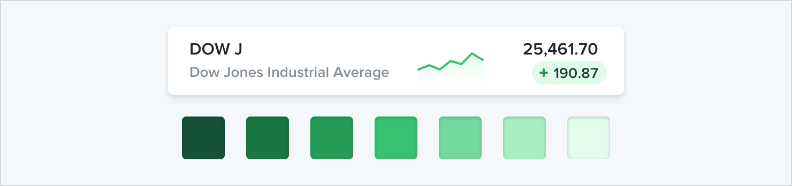

这些颜色你也会需要多个色阶，尽管它们在界面里应该用得相当克制。

如果你做的东西需要用颜色来区分或归类相似的条目（比如图表里的折线、日历里的事件，或者项目上的标签），你可能还需要更多强调色。

算下来，一个复杂的界面需要多达*十种*不同的颜色、每种再带*5 到 10 个色阶*，这并不罕见。

## 提前把色阶定好

当你需要为调色板里的某个颜色做一个更浅或更深的变体时，别耍小聪明用 CSS 预处理器里的 “lighten” 或 “darken” 这类函数临时算出色阶。那正是你最后拥有 35 个*略微*不同、却看起来一模一样的蓝色的原因。

正确的做法是提前定好一组固定的色阶，工作时从中挑选。

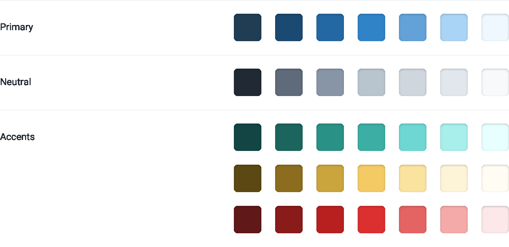

那到底该怎么搭出这样一套调色板？

### 先选基色

先为你想要的那套色阶挑一个*基*色——就是位于中间、深浅两头都围绕它生成的那个颜色。

这件事没有真正的科学方法，但对主色和强调色来说，一个好用的经验法则是：挑一个很适合当按钮背景的色阶。

要注意的是，这里没有什么“从 50% 明度开始”之类的规则——每种颜色的表现都略有不同，所以这一步只能靠你的眼睛。

### 找到两端

接下来，选出最深的色阶和最浅的色阶。这同样没什么科学可言，但想一想它们会被用在哪里、然后结合这个语境来选，会有帮助。

一个颜色最深的色阶通常留给文字，最浅的色阶则可能用来给某个元素的背景染色。

一个简单的提示框组件正好同时用到了这两种情况，所以很适合用来定这两个颜色。

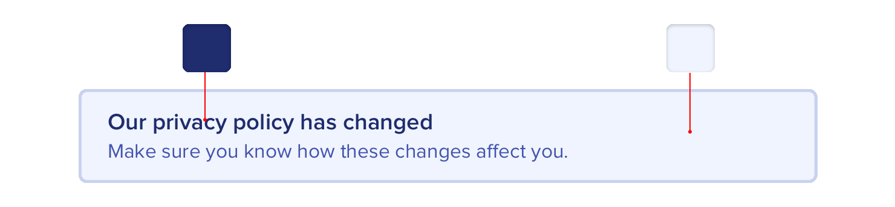

先选一个和你的基色色相相同的颜色，然后调饱和度和明度，直到你满意为止。

### 填补中间

有了基色、最深和最浅的色阶之后，你只需要把它们之间的空档补上。

对大多数项目来说，每种颜色至少需要 5 个色阶；如果不想觉得太受限制，大概得接近 10 个。

九个是个很好的数字，因为它容易等分，填补空档也更直接。我们就把最深的色阶叫作 *900*，基色叫 *500*，最浅的叫 *100*。

先挑出 *700* 和 *300*，也就是正好处在两段空档中间的色阶。你要让它们感觉是两侧色阶之间完美的折中。

这样阶梯上又多出四个空档（*800*、*600*、*400* 和 *200*），用同样的思路补上就行。

最后你会得到一组相当均衡的颜色，选项刚好够承载你的设计想法，又不会让人觉得受限。

### 灰色系怎么办？

灰色系的基色没那么重要，但除此之外流程完全一样。从两端开始，把中间补满，直到够用为止。

最深的灰色，就选一个适合项目里最深文字的色；最浅的灰色，就选一个适合做微妙灰白背景的色。

### 这不是科学

尽管很诱人，但你不能纯靠数学造出完美的调色板。

上面这种体系化的做法是个很好的起点，但需要的时候别怕做点微调。

一旦你真的开始在设计中用这些颜色，几乎不可避免地会想调整某个色阶的饱和度，或者把几个色阶调浅、调深。相信你的眼睛，别相信数字。

只是尽量别太频繁地添加*新*色阶。如果你不严格限制自己的调色板，那还不如干脆不要色彩体系。

## 别让明度毁掉你的饱和度

在 HSL 色彩空间里，颜色的明度越接近 0% 或 100%，饱和度的影响力就越弱——同样的饱和度，在 50% 明度下看起来比在 90% 明度下更有色彩感。

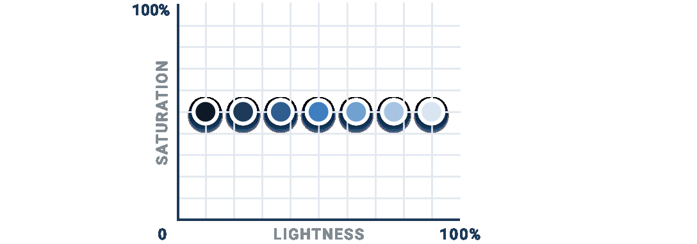

这意味着，如果你不想让某个颜色的浅色和深色色阶看起来发灰发白，就要在明度偏离 50% 时提高饱和度。

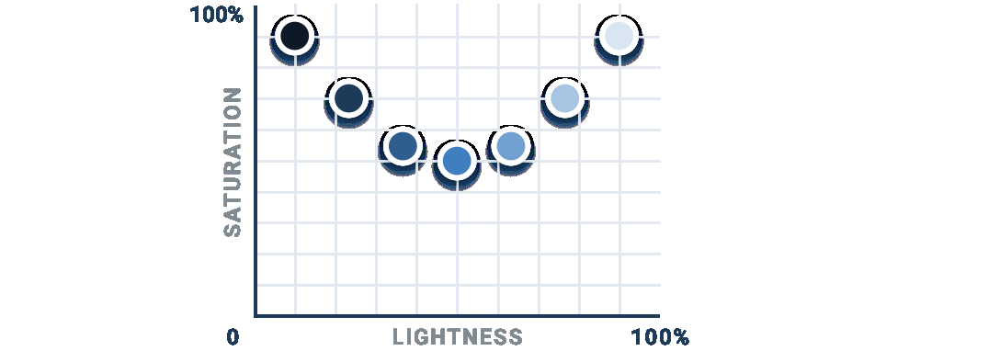

这种差别很细微，但这类小细节会累积起来，尤其是当一种颜色被用在大面积界面上时。

但如果你的*基*色本身饱和度就已经很高了呢？饱和度已经是 100% 了，还怎么提高？

### 利用感知亮度

你觉得这两个颜色哪个更亮？

黄色，对吧？但事实上，这两个颜色在 HSL 意义上的“明度”完全相同：

那我们为什么会觉得黄色更亮？因为由于人眼感知颜色的方式，每个色相都有其固有的*感知*亮度。

把颜色的 RGB 分量代入下面这个公式，就能算出它的感知亮度：

对色轮上不同色相取样，都取 100% 饱和度和 50% 明度，我们就能大致看出各个色相的感知亮度分布：

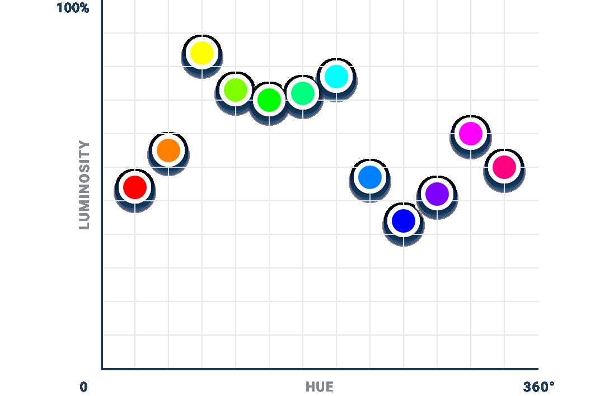

不出所料，黄色的感知亮度比蓝色高。但有意思的是，感知亮度并不是从最深色相到最浅色相线性变化的——它有三个局部最低点（红、绿、蓝）和三个局部最高点（黄、青、品红）。

### 通过旋转色相来改变亮度

表面上，这只是关于颜色的一件有趣的事。但当你意识到怎么把它用到设计里时，事情就真正有意思了。

通常你想改变一个颜色看起来的深浅时，调的是*明度*分量：

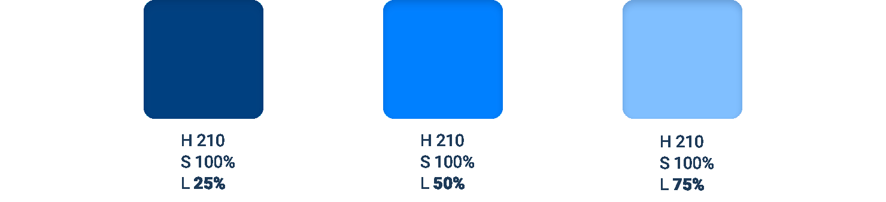

这确实能让颜色变浅或变深，但你往往会损失掉一些颜色的*浓烈感*——颜色还会显得更接近白或黑，而不只是变浅或变深。

因为不同色相的感知亮度不同，另一种改变颜色亮度的办法就是*旋转它的色相*。

想让颜色更亮，就把色相朝最近的亮色相旋转——60°、180° 或 300°。

想让颜色更暗，就把色相朝最近的暗色相旋转——0°、120° 或 240°。

在为黄色这类浅色做调色板时，这一招特别有用。随着明度降低，把色相逐渐往橙色转，深色色阶就会显得温暖而饱满，而不是发闷发褐：

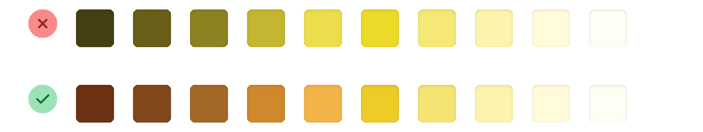

当然，你也可以把两种办法结合起来，一部分亮度靠调色相得到，一部分靠调明度得到。

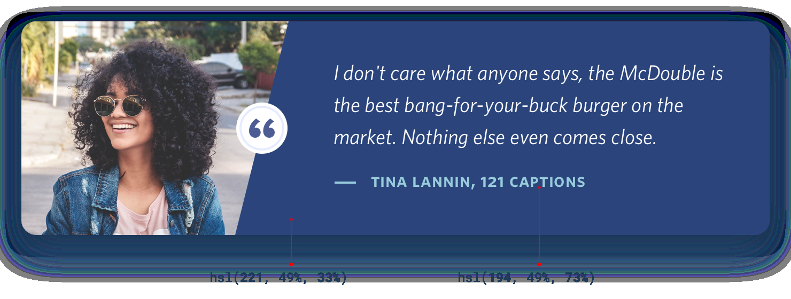

这是在不妨碍颜色浓烈感的前提下改变亮度的好办法，但只适合小剂量使用。色相旋转不要超过 20–30°，否则看起来会变成一个完全不同的颜色，而不只是变浅或变深。

## 灰色不一定是灰的

按定义，纯正灰色的饱和度是 0%——它里面根本不含任何真正的*颜色*。

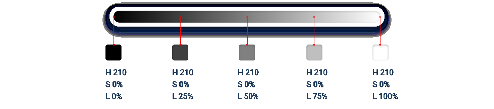

但实践中，很多我们*认为*是灰色的颜色，其实饱和度相当高：

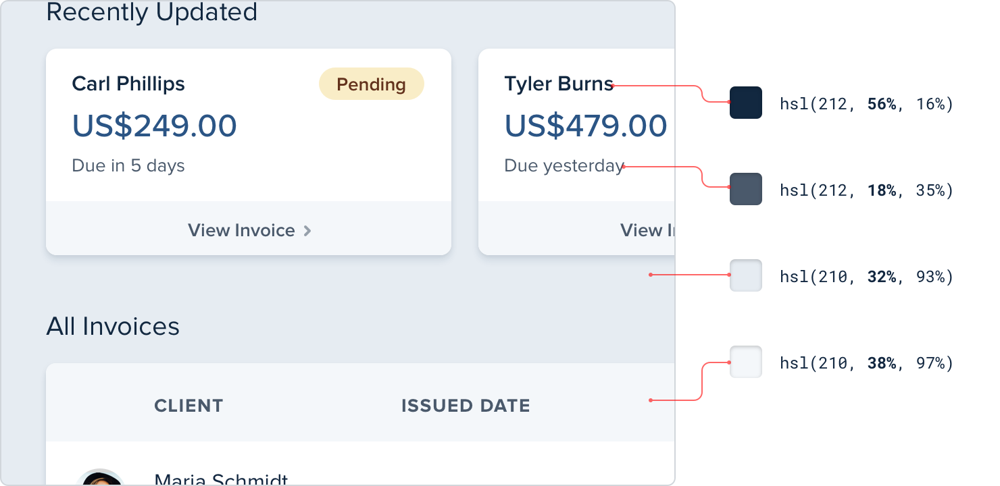

正是这种饱和度，让一些灰色显得冷，另一些灰色显得暖。

### 色温

如果你买过灯泡，就一定面临过这个选择：发出偏黄光线的“暖白”灯泡，还是发出偏蓝光线的“冷白”灯泡。

在用户界面里给灰色加饱和度，原理是类似的。

如果你想让灰色显得冷，就给它加一点蓝色：

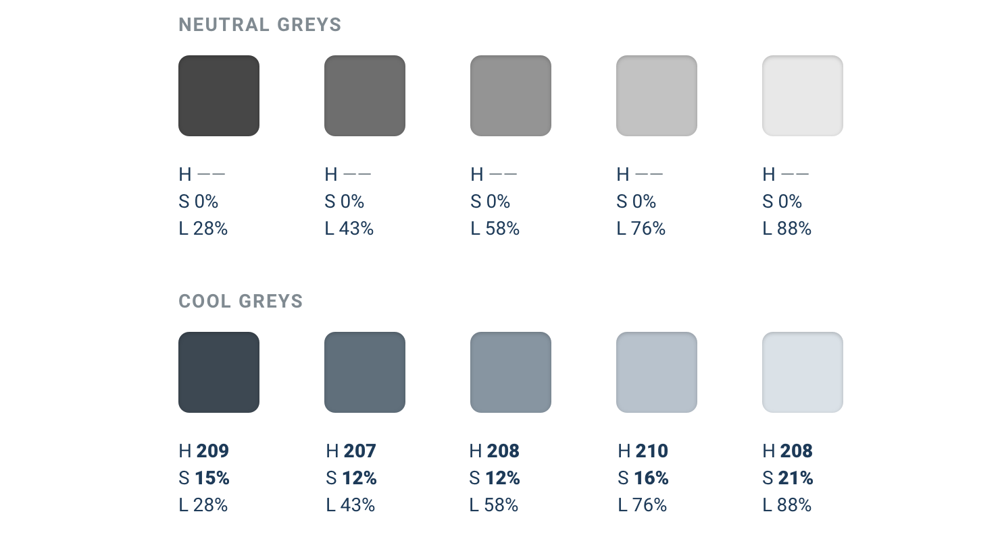

想让灰色显得暖，就给它加一点黄色或橙色：

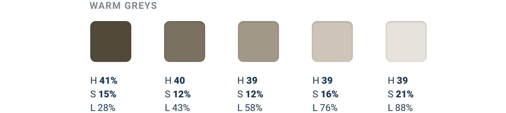

为了保持色温一致，别忘了给更浅和更深的色阶也提高饱和度。否则相比接近 50% 明度的灰色，那些色阶会显得发灰发白。

灰色要加多少饱和度完全由你决定——只想稍稍偏一点，就加一点点；想让界面强烈地偏向某一边，那就加足。

## 无障碍不等于难看

为了确保设计具备无障碍性，《网页内容无障碍指南》（WCAG）建议：正文文字*（大约 18px 以下）*的对比度比值至少达到 4.5:1，更大的文字至少达到 3:1。

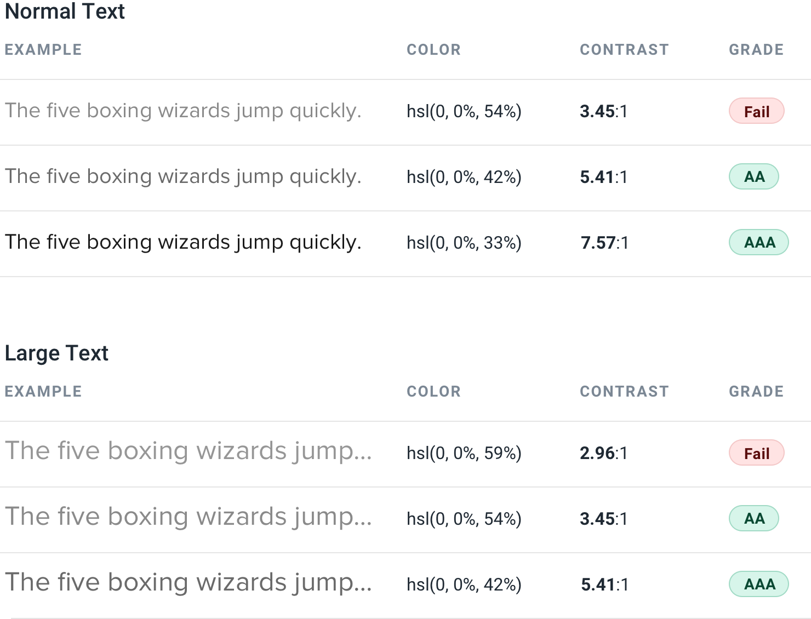

在典型的*浅色背景配深色文字*场景下，满足这个建议相当容易，但一旦涉及彩色，事情就棘手多了。

### 把对比关系反过来

在彩色背景上用白色文字时，你会惊讶地发现，颜色往往要深到什么程度才能满足 4.5:1 的对比度比值。

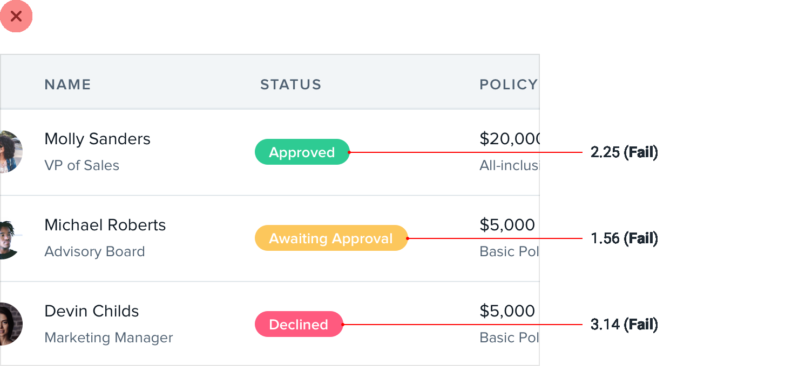

当这些元素本来不该是页面焦点时，这会造成层级问题——深色背景会牢牢抓住用户的注意力。

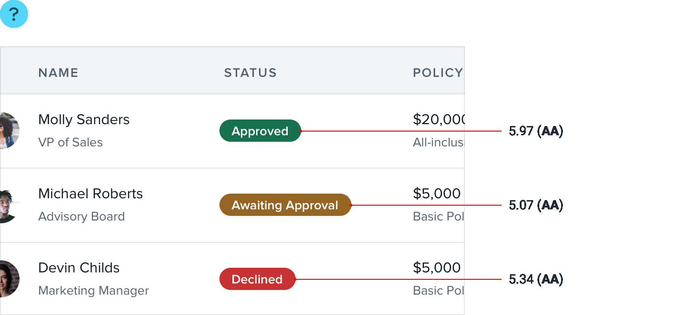

要解决这个问题，你可以*把对比关系反过来*。别用深色背景配浅色文字，而是用浅色背景配深色文字：

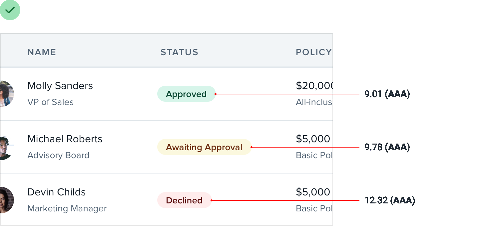

颜色依然在，依然为文字提供支持，但它远没有那么咄咄逼人，也不会和页面上的其他操作抢戏。

### 旋转色相

比彩色背景配白色文字更难的，是*彩色*背景配*彩色*文字。如果你想给深色面板里的次要文字挑一个颜色，就会遇到这种情况。

如果你从背景色出发，只调整明度和饱和度，你会发现很难在不变得很接近纯白的情况下达到建议的对比度比值。

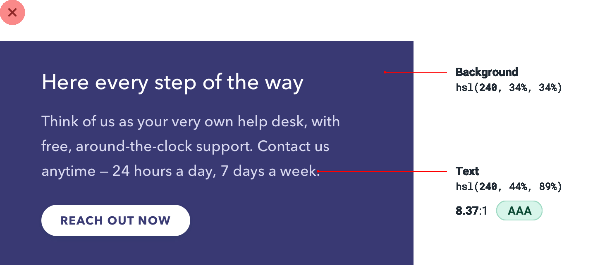

你不想让主要文字和次要文字看起来一样，那还能怎么办？

既然有些颜色比另一些更亮，那么在不变得更接近白色的前提下提高对比度的一个办法，就是把色相*朝更亮的颜色旋转*，比如青色、品红或黄色。

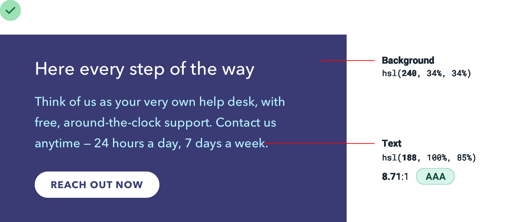

这样既能让文字达到无障碍要求，又能保住它的色彩。

## 不要只靠颜色

颜色是强化信息、让它更易懂的绝佳手段，但注意别*只*依赖它，否则色盲用户会很难理解你的界面。

拿这些指标卡片来说。按这个设计，红绿色盲的人无法轻易判断某个指标是变好了还是变差了：

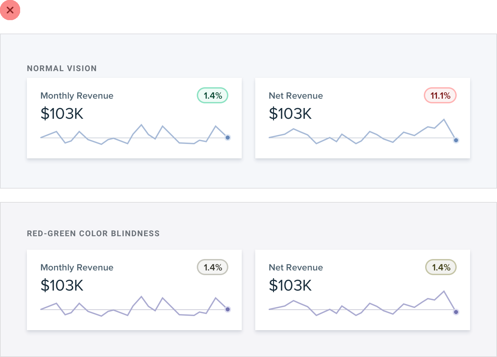

一个简单的解决办法是用别的方式也传达这层信息，比如加上图标来表明变化是正向还是负向。

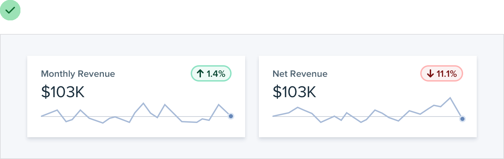

那像图表这种每条趋势线用不同颜色的情况呢？

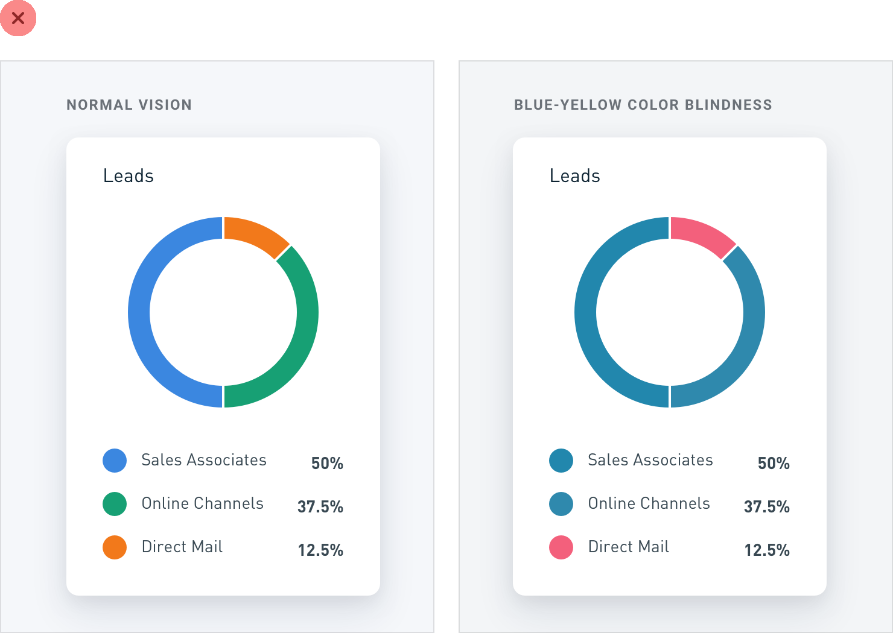

这种场景下，试着依靠*对比*，而不是用完全不同的颜色。对色盲的人来说，分辨明暗比分辨两种不同的颜色容易得多。

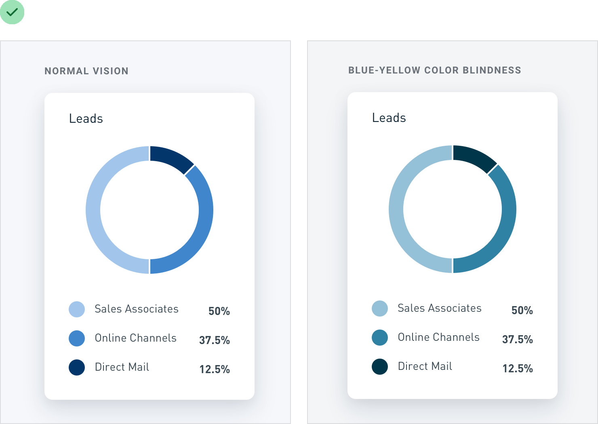

永远用颜色去支撑你的设计已经在表达的东西，绝不要把它当作唯一的表达方式。
