## 用好照片

照片不行，整个设计就毁了，哪怕其他部分都做得很好。

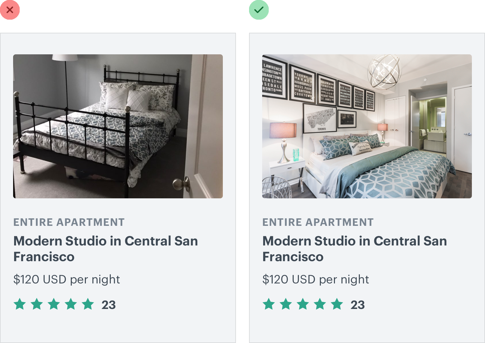

如果你的设计需要摄影图片，而你又不是什么摄影高手，只有两条路：

1. **请一位专业摄影师。**

如果你需要非常特定的照片，就交给专业人士。拍出好照片靠的不只是昂贵的相机，还有布光、构图、色彩——这些技能要练很多年。

2. **用好图库里的照片。**

如果你需要的照片比较通用，图库资源多的是，花钱就能买到很好的照片。甚至还有 Unsplash 这样的网站，免费提供漂亮的摄影图片。

不管怎样，都别用占位图做设计，然后指望回头用手机随便拍几张替换上去。这从来行不通。

## 文字需要稳定的对比度

有没有试过往一张大主视觉图上放标题，结果发现无论文字用什么颜色，都还是看不清？

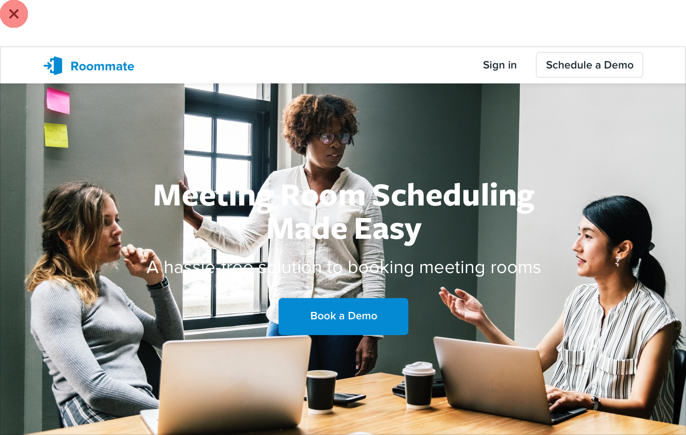

因为问题不在文字，而在图片。

### 背景图片的麻烦

照片的动态范围可以很大，有很多很亮的区域，也有很多很暗的区域。白字在暗处看着很清楚，一到亮处就消失了。深色文字在亮处很清楚，一到暗处就没了。

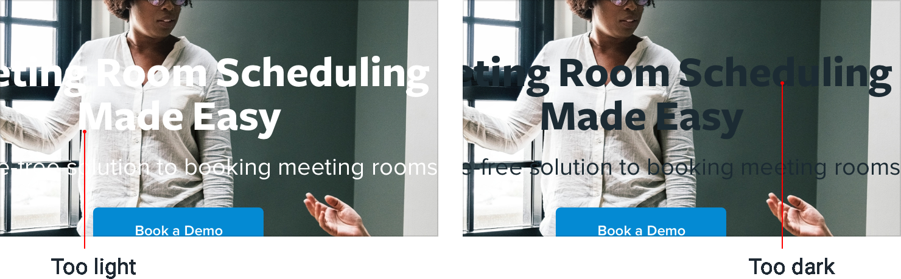

要解决这个问题，你得*降低*图片的动态范围，让文字和背景之间的对比度更稳定。

### 加一层蒙版

提高文字整体对比度的一个办法，是在背景图上叠一层半透明蒙版。

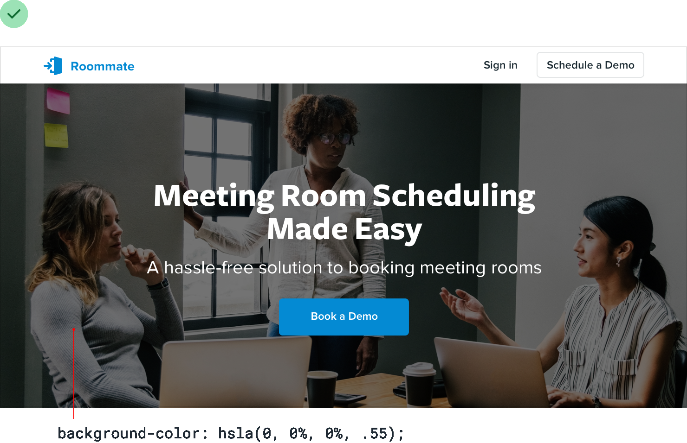

黑色蒙版能压暗亮部，让浅色文字更突出；白色蒙版能提亮暗部，让深色文字更突出。

### 降低图片对比度

用蒙版要付出一个代价：你把*整张*图片都调亮或调暗了，而不只是有问题的那些区域。

想要更精细的控制，另一个办法是降低图片本身的对比度：

降低对比度会改变整张图片给人的明暗感受，所以记得调整亮度来补偿。

### 给图片着色

让文字在图片上更突出的另一个办法，是给图片加上单一的颜色。

有些修图软件自带这个功能，如果你的软件没有，可以分三步做出这个效果：

1. **降低图片对比度**，让明暗先平衡一些。
2. **降低图片饱和度**，去掉原有的颜色。
3. **叠一层纯色填充**，用“multiply”混合模式。

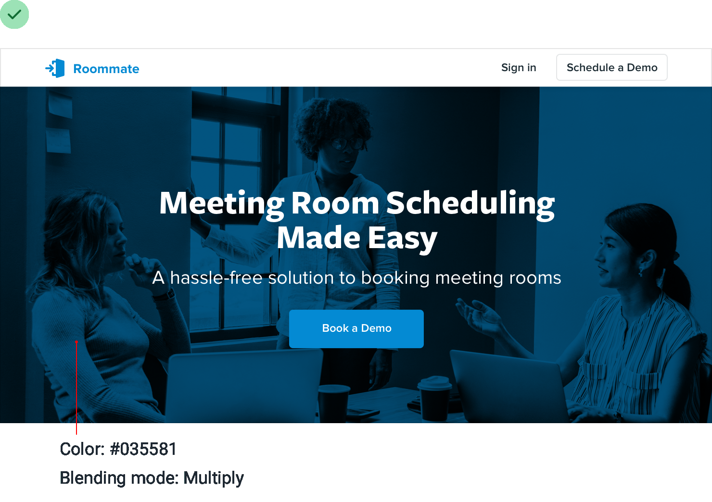

这也是让背景图和现有品牌色更搭的好办法。

### 给文字加阴影

如果你想保留背景图更多明暗变化，文字阴影是个好办法，可以只在你最需要的地方提高对比度。

你要的是更像一层淡淡的光晕，而不是真正的阴影，所以用大的模糊半径，不要加任何偏移。

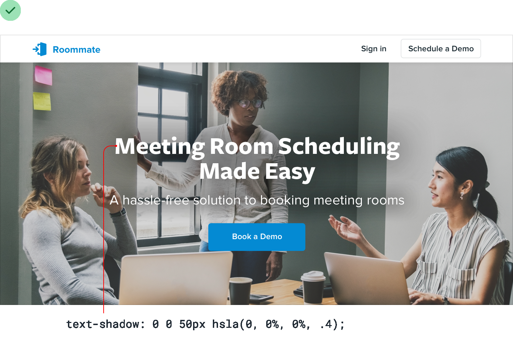

降低整张图片的对比度仍然是个好主意，但配合文字阴影之后，就可以少降一些。

## 每张图都有它该有的尺寸

大家都知道，把位图放大到超过原始尺寸是坏主意——图片立刻就会发虚，失去清晰度。

但缩放上的坑不止这一处，哪怕你觉得自己已经很稳妥了。

### 别放大图标

如果你在做的东西正需要一些大图标*（比如落地页上的“功能”区块）*，你可能会下意识地打开最喜欢的 SVG 图标集，把尺寸调到够用为止。

它们毕竟是矢量图，放大之后质量不会变差，对吧？

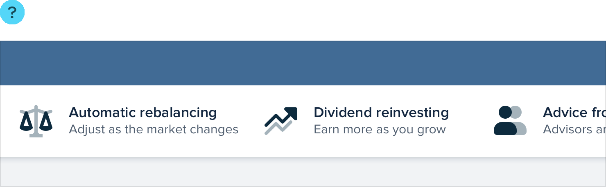

矢量图放大的确不会降低质量，但那些按 16–24 像素画出来的图标，放大到原尺寸的 3 倍或 4 倍之后，怎么看都不专业。它们细节不够，而且总显得格外“笨重”。

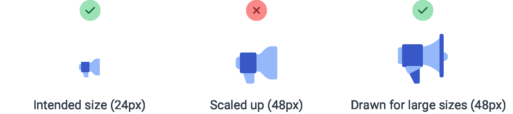

如果你手头只有小图标，试试把它们装进另一个形状里，再给这个形状一个背景色：

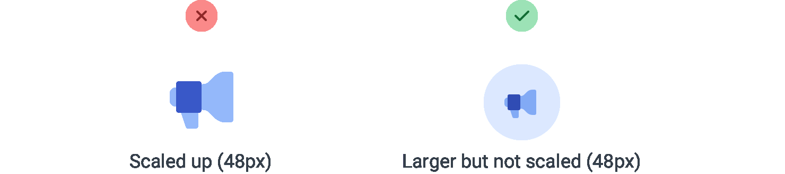

这样图标本身就能更接近它该有的尺寸，同时又能占满更大的空间。

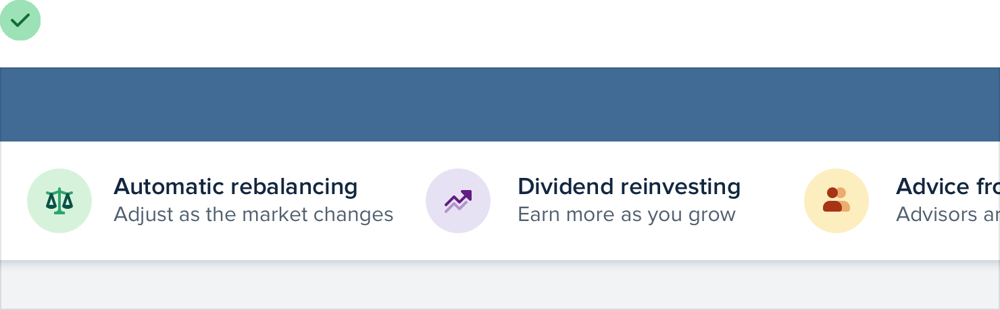

### 别缩小截图

假设你想在同一个功能页上放一张应用的截图。

如果你截了一张全尺寸的图，再缩小 70% 让它塞进去，最后得到的是一张硬要把过多细节塞进极小空间的图。

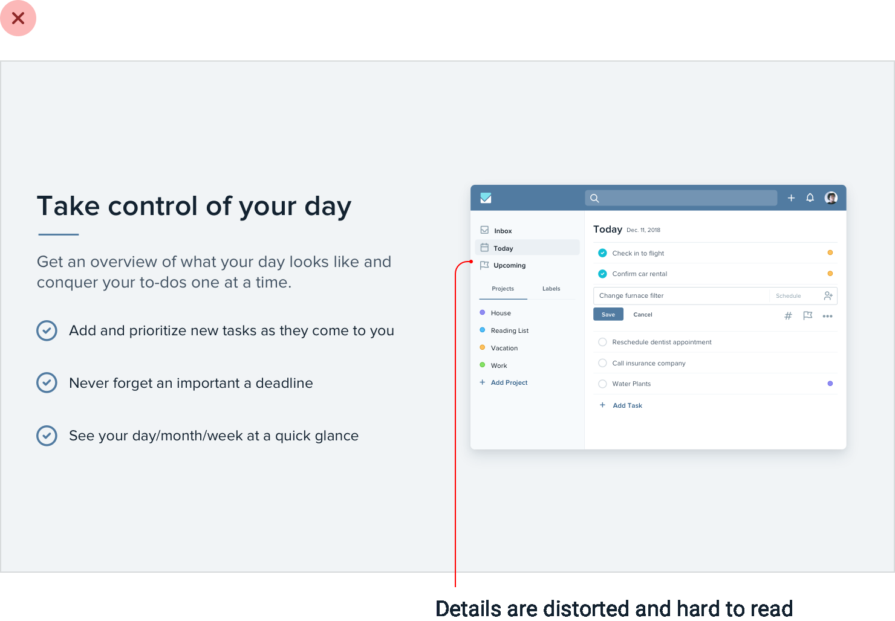

应用里 16 像素的字，到了截图里就变成 4 像素，访客只能把眼睛凑到离屏幕两英寸的地方使劲看，想弄清楚那堆文字到底写了什么。

如果你要在设计里放一张细节丰富的截图，就在更小的屏幕尺寸下截图*（比如平板布局）*，并且给它留出足够大的空间，这样就不必缩得太小：

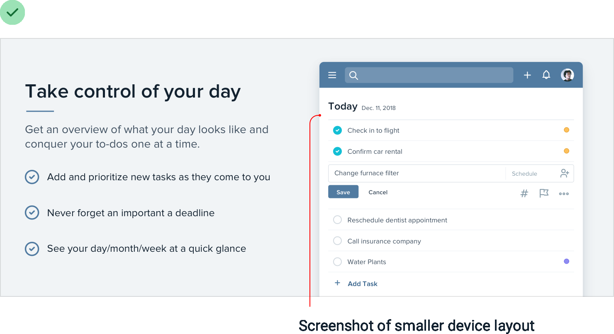

或者考虑只截一部分，这样用更小的空间就能展示，也不必缩放：

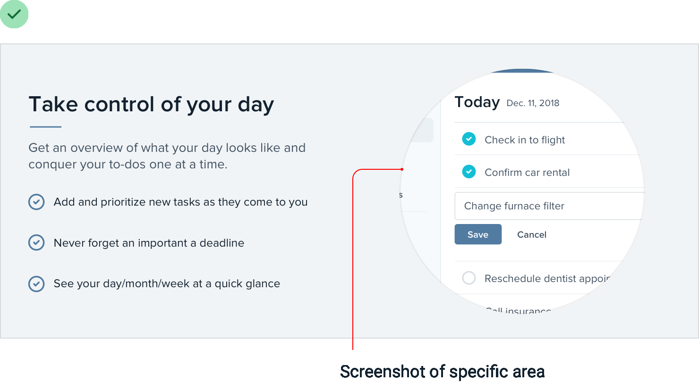

如果实在要把整个应用的截图塞进很小的空间，试试画个简化版界面，去掉细节，把小字换成简单的线条：

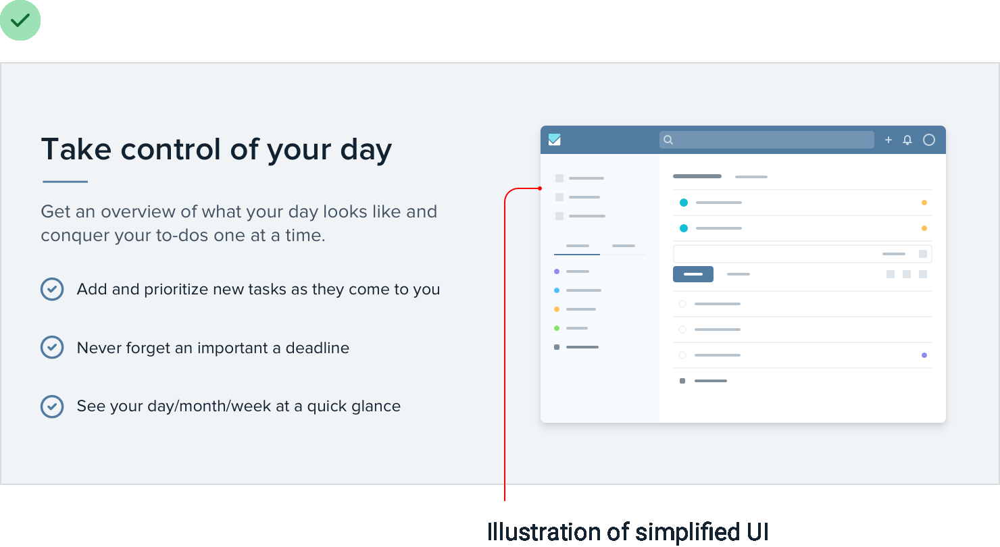

这样依然能传达整体的设计，又不会引诱访客去辨认那些细节。

### 图标也别缩小

按 16 像素画的图标放大后会显得笨重，同样，本来用于大尺寸的图标缩小后也会变得毛糙、发虚。

最极端的例子是 favicon，也就是浏览器标签页里标题旁边那个小图标。

把一个按 128 像素画的 logo 缩到 favicon 的尺寸，浏览器拼命想在 16 像素见方的小格子里渲染出全部细节，结果只会是一团糊：

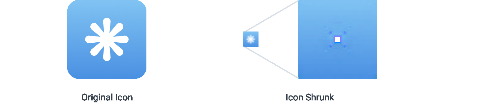

更好的做法是按目标尺寸重画一版极简的 logo，把取舍握在自己手里，而不是交给浏览器：

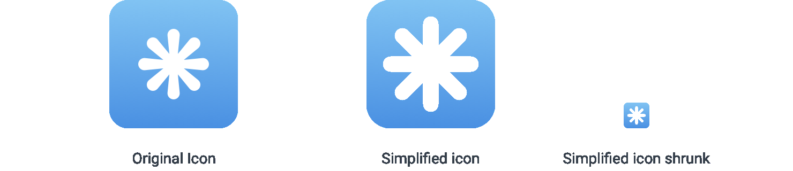

## 当心用户上传的内容

一旦要依赖用户上传的图片，你就没法从容地调对比度、细抠颜色，或者裁出完美的构图。

你总会在某种程度上受制于用户，但还是有*几件*事可以做，保证他们上传的内容不会彻底毁掉你的设计。

### 控制形状和尺寸

按图片原始宽高比展示用户上传的图，很容易把布局搞乱，尤其是屏幕上同时有很多图的时候。

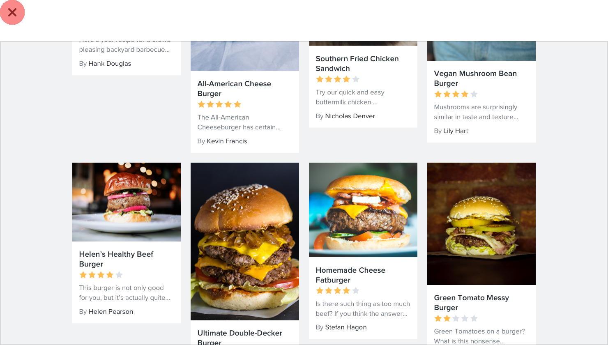

与其让用户随意破坏页面结构，不如把他们的图片居中放进固定尺寸的容器里，超出部分裁掉。

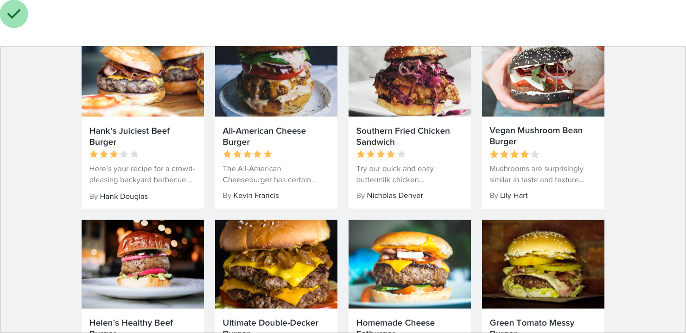

现在用 CSS 做这件事很简单：把图片设成背景图，再把 `background-size` 属性设为 `cover`。

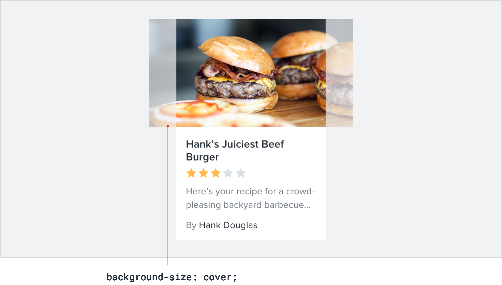

### 防止背景渗色

当用户提供的图片背景色和你的界面背景色相近时，图片和背景会渗到一起，图片就失去了形状。

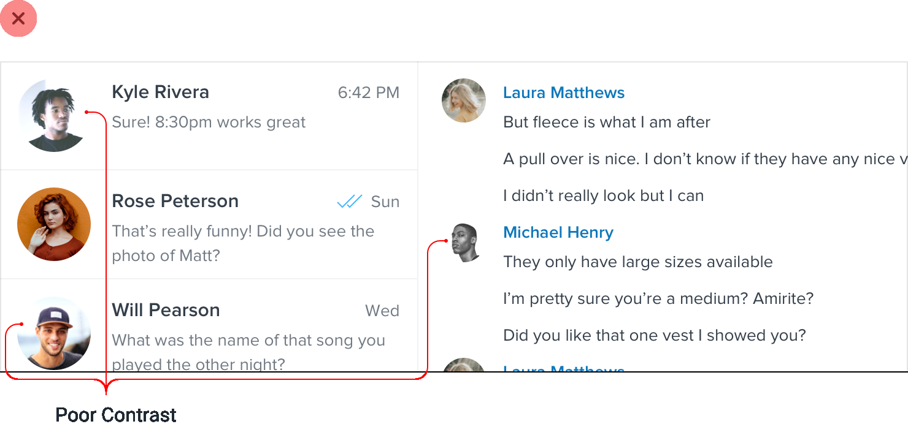

别急着用边框解决，试试加一层轻微的内阴影：

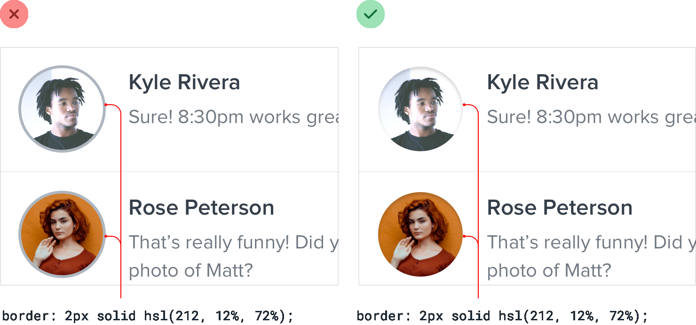

边框经常和图片里的颜色打架，而大多数人几乎注意不到那层阴影的存在。

如果你不喜欢内阴影带来的轻微“凹陷”感，用半透明的内边框也很好。

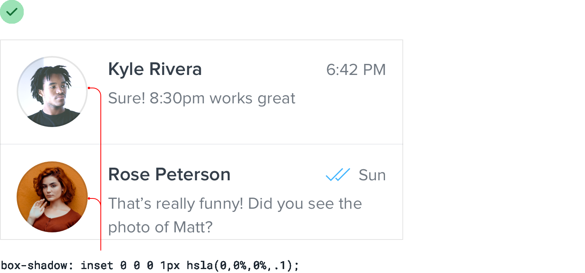
