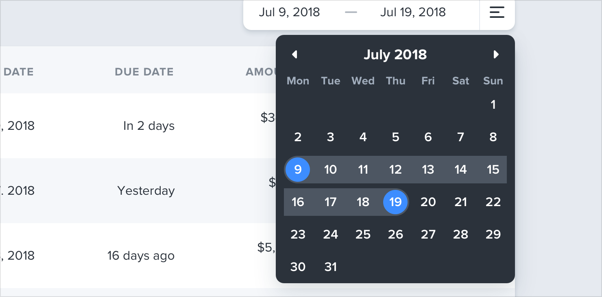
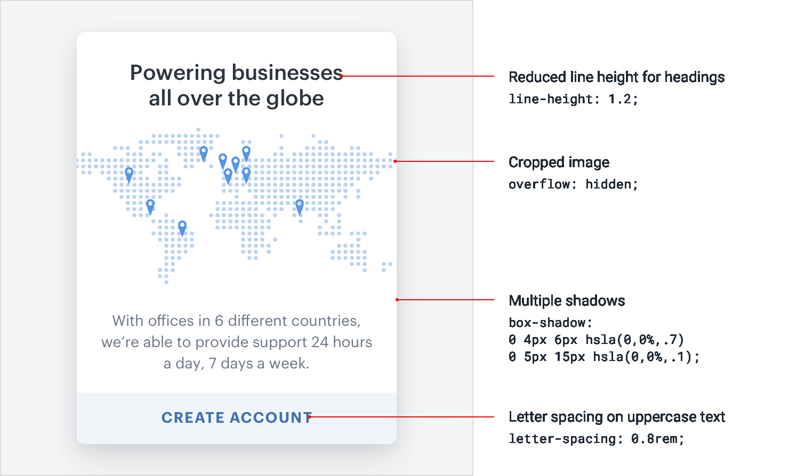

## 持续进阶

希望读完这本书，你对自己做出漂亮东西的能力更有信心了，不再需要依赖设计师。虽然我们已经尽力把能想到的好点子都塞了进来，但永远还有更多东西可学。

下面两种做法最能帮你继续打磨技能，给工具箱添上新工具。

### 留意那些你不会做出的决定

每次遇到自己很喜欢的设计，问自己一句：

*“这位设计师有没有做什么我根本想不到的事？”*

也许是他们把日期选择器的背景色做了反转：

……也许他们把按钮放进了文本输入框里，而不是放在外面：

……或者只是给大标题用了两种不同的字体颜色：

留意这些反直觉的决定，是发现新点子的好办法，你可以把它们用到自己的设计里。

### 重建你最喜欢的界面

要发现那些让设计显得精致的细节，最好的办法就是从头把那个设计重新做一遍，*不去偷看开发者工具*。

当你想弄明白自己的版本为什么和原版不一样时，你会自己摸索出这些技巧：“给标题减小行高”“给全大写文字加字距”“把多层阴影叠起来”。

带着审慎的眼光持续研究那些启发你的作品，接下来很多年里你都会不断学到新的设计技巧。

— Adam Wathan & Steve Schoger
